# Flyary

Dein Flugbuch. Dein Fortschritt. Deine nächsten Flüge.

Benutzerhandbuch für Pilotinnen und Piloten · Version 1.6 · 6. Oktober 2026

Dieses Handbuch begleitet dich vom ersten Login bis zur laufenden Pflege deines Flugbuchs. Es beschreibt die Pilotensicht der App. Die Administration einer Flugschule und interne Schülerdossiers sind nicht Gegenstand dieses Handbuchs.

Die Abbildungen zeigen die tatsächliche Flyary-Oberfläche im hellen Design bei einer Smartphone-Bildschirmgrösse von 390 × 844 Pixeln. Namen, Flüge, Termine und Werte sind fiktive Beispieldaten. Ein Bild zeigt jeweils einen einzelnen mobilen Bildschirmausschnitt. Für Inhalte weiter unten scrollst du in der App. Browserrahmen und Betriebssystem-Statusleiste können auf deinem Gerät anders aussehen.

**Neu in Version 1.6:** Aktualisierte mobile Oberfläche und neu aufgenommene Bildschirmansichten. Kapitel 03 erklärt den Ausbildungsfortschritt auf Home, Kapitel 14 das Kontrollblatt nach Ausbildungsstufen und Kapitel 16 Ausbildung, Brevets und weitere Ausbildungsziele im Profil. Kapitel 18 beschreibt PDF, CSV, Excel und das ZIP-Archiv. Anmeldung und Ersteinrichtung sind an die aktuelle Pilotphase angepasst.

## 01 · So verwendest du dieses Handbuch

### Schnell zum passenden Thema

| Dein Anliegen | Kapitel |
| --- | --- |
| Ich verwende Flyary zum ersten Mal. | 02 und 03 |
| Ich möchte einen Flug erfassen. | 04 bis 06 |
| Ich suche einen Eintrag oder will ihn korrigieren. | 07 |
| Ich möchte einen Flug teilen oder den Feed bedienen. | 09 und 10 |
| Ich will mich für einen Termin anmelden. | 11 |
| Ich suche einen Start- oder Landeplatz. | 12 |
| Ich möchte meinen Lernfortschritt dokumentieren. | 14 |
| Ich will Flüge importieren oder exportieren. | 17 und 18 |
| Etwas funktioniert nicht wie erwartet. | 20 |
| Ich möchte eine Flugvorlage verwenden. | 23 |
| Ich möchte Orte aus einer Datei importieren. | 24 |
| Ich möchte Nachrichten lesen oder jemandem schreiben. | 25 |
| Ich möchte Material kaufen, verkaufen oder suchen. | 26 |
| Ich möchte Schulflüge ins Flugbuch übernehmen. | 27 |
| Ich suche Rückmeldungen und Bewertungen meiner Fluglehrer. | 11 und 14 |
| Ich benötige einen Ausbildungsnachweis der Schule. | 18 |

**Neu in Version 1.4.** Beschrieben sind die freigegebenen Rückmeldungen aus dem Flugtag-Cockpit, Fluglehrerbewertungen im Training und die Übernahme von Schulflügen ins persönliche Flugbuch. Kapitel 18 erklärt den Unterschied zwischen deinem Flugbuchexport und dem Ausbildungsnachweis der Schule. Die Abbildungen wurden für Version 1.6 neu aufgenommen.

**Seit Version 1.3.** Kapitel 26 erklärt den Marktplatz: Material suchen, Inserate erstellen, Interessierte kontaktieren, Verkäufe abschliessen und bewerten. Auch die Marktplatzansichten wurden neu aufgenommen; die Beispieldaten behalten ihre September-Termine.

**Seit Version 1.2.** Die Terminansicht mit Reitern, der gemeinsame Nachrichteneingang, Gruppenchats und Direktnachrichten sind beschrieben. Hinzu kommen Antworten, Reaktionen, Bearbeiten eigener Nachrichten, Kanalsuche, Benachrichtigungseinstellungen und die manuelle App-Aktualisierung. Alle Bildschirmansichten wurden mit dem aktuellen App-Stand neu aufgenommen.

**Leseschlüssel.** Fett gedruckte Begriffe bezeichnen Bedienelemente, beispielsweise **Mehr**, **Weiter** oder **Speichern**. Ein Weg wie **Mehr → Einstellungen** bedeutet: zuerst Mehr öffnen, danach Einstellungen wählen. Nummerierte Listen beschreiben eine Reihenfolge. Hinweise erklären Besonderheiten, die für das Ergebnis wichtig sind.

**Nicht jede Seite sieht bei allen Personen gleich aus.** Ausbildungsstand, Gruppenmitgliedschaften, vorhandene Daten und Berechtigungen beeinflussen die Anzeige. Eine noch leere Flugliste ist deshalb kein Fehler. Ein Rollenumschalter erscheint nur bei entsprechendem Schulzugang. Für dieses Handbuch verwendest du den Pilotenbereich.

**Speichern funktioniert je nach Bereich unterschiedlich.** Ein Flugformular wird mit einer Schaltfläche gespeichert. Sterne im Training speichern beim Antippen; Lernnotizen in der Detailansicht beim Verlassen des Textfeldes. Sprache und Erscheinungsbild ändern sich unmittelbar. Achte auf die Anleitung beim jeweiligen Arbeitsschritt und auf Rückmeldungen der App.

**Durchgängiges Beispiel.** Alex Beispiel fliegt am 22. September vom Niederbauen nach Emmetten. Der Flug dauert 48 Minuten und wird anschliessend dokumentiert. Die Beispielwerte veranschaulichen Eingaben; sie beschreiben keine aktuellen Bedingungen eines Fluggebietes.

## 02 · Konto und erster Einstieg

### Anmelden und Zugang erhalten

Flyary verwendet die Anmeldung mit Google. Öffne die App und wähle **Mit Google anmelden**. Verwende bei späteren Besuchen dasselbe Google-Konto, damit du dein bestehendes Flugbuch wiederfindest. Ein separates Flyary-Passwort wird nicht angelegt.

Während der Pilotphase benötigst du eine Einladung. Öffne einen erhaltenen Schul- oder persönlichen Einladungslink möglichst vor der Anmeldung; Flyary führt dich anschliessend zum Beitritt zurück. Ein neues Google-Konto allein schaltet den Zugang nicht frei.

Ohne Einladung gelangst du zum Wartebereich. Dort kannst du dich für die Pilotphase vormerken beziehungsweise eine erhaltene Einladung verwenden. Einen Platz als Testpilot kannst du auch auf der Flyary-Webseite anfragen. Besitzt du bereits einen Zugang, ist keine zweite Registrierung nötig.

### Die Ersteinrichtung sinnvoll durchführen

Beim ersten Besuch kann ein Begrüssungsdialog erscheinen. Er unterscheidet zwischen selbstständigem Pilot, Schüler einer Schule und Schulteam. Mit **Später** kannst du ihn schliessen und die Funktionen über **Mehr** öffnen.

- **Schüler:** Profil prüfen, Kontrollblatt ansehen und einen Schultermin auswählen. Deinen Ausbildungsstand pflegt die Schule.
- **Pilot:** Profil und Schirm ergänzen, Orte anlegen und den ersten Flug erfassen. Vorhandene Flüge kannst du über Excel übernehmen oder XContest im Profil verbinden.
- **Schulteam:** Die Schule öffnen, Einladungen und Zertifikate prüfen. Die Schulabläufe stehen im Betriebshandbuch.

Ist dein Ausbildungsstand noch unbekannt, fragt Home einmal **Bist du Schüler oder Pilot?**. Wähle den tatsächlich zutreffenden Stand. Weitere Angaben findest du im Profil unter **Ausbildung und Brevets** (Kapitel 16).

### Verwendung über das App-Symbol

Je nach Browser und Gerät wird Flyary als installierbare Web-App angeboten. Nutze die Installationsfunktion deines Browsers, wenn du Flyary vom Startbildschirm aus öffnen möchtest. Bezeichnung und Verfügbarkeit hängen vom Gerät ab. Die Bedienung innerhalb von Flyary bleibt weitgehend gleich.

Ein installiertes Symbol ist keine zusätzliche Datensicherung. Online gespeicherte Flüge gehören zu deinem Konto; lokale Entwürfe und noch nicht synchronisierte Einträge liegen zunächst auf dem verwendeten Gerät. Kapitel 19 erklärt den Unterschied.

## 03 · Orientierung und persönliche Startseite

### Die fünf Einstiege unten am Bildschirm

| Einstieg | Wofür du ihn verwendest |
| --- | --- |
| Home | Nächste Termine, Kennzahlen, Saisonziele und letzte Flüge |
| Feed | Geteilte Aktivitäten und Community-Beiträge |
| + | Einen neuen Flug erfassen |
| Flüge | Dein persönliches Flugbuch durchsuchen und öffnen |
| Mehr | Termine, Orte, Profil, Training, Statistiken, Gruppen und Einstellungen |

Die untere Navigation bleibt in vielen Ansichten sichtbar. Innerhalb einer Detailseite führt der Pfeil oben zurück. Wenn du weit unten auf einer langen Seite bist, scrolle nach oben, um Titel und Hauptaktionen wieder zu erreichen.

Das **Nachrichtensymbol** oben auf Home und im Feed öffnet deine Chats. Du findest sie auch unter **Mehr → Nachrichten**. Die Glocke im Feed zeigt dagegen Aktivitäten wie Reaktionen und Kommentare; sie ist nicht der Chat-Eingang.

### Home richtig lesen

Die Startseite zeigt deinen Namen mit Profilbild, nächste Termine, Ausbildungsfortschritt und Saisonwerte. Sie setzt sich aus deinen Daten zusammen. Termine erscheinen nur, wenn sie für dich verfügbar sind. Saisonwerte beziehen sich auf das angezeigte Jahr; eine zusätzlich angezeigte Gesamtzahl kann deshalb höher sein. Fehlende Flugzeiten oder Strecken beeinflussen die Summen: Ein Flug mit leerem Zeitfeld trägt keine nachgetragene Schätzung zur Flugzeit bei.

Als Schüler zeigt **Ziel: Pilot** erfüllte Anforderungen und den nächsten offenen Punkt. Die Karte öffnet das Training. Als Pilot erscheint eine Zielkarte, wenn du im Profil ein weiteres Ausbildungsziel gewählt hast; ohne Ziel wird sie ausgeblendet.

Tippe einen Termin oder einen letzten Flug an, um die Details zu öffnen. Über **Ziel hinzufügen** legst du einen angebotenen Zieltyp und einen Zielwert fest. Prüfe die Einheit: Ein Ziel in Stunden ist etwas anderes als eine Anzahl Flüge. Die Fortschrittsanzeige richtet sich nach den erfassten Daten.

Du kannst eine Terminkarte auf Home nach links wischen, um sie dort auszublenden. Die Meldung bietet **Rückgängig** an. Unter **Mehr → Termine** bleibt der Anlass sichtbar; das Ausblenden meldet dich nicht vom Termin ab.

**Praxisbeispiel:** Alex hat acht Flüge dokumentiert und sich zwanzig Flüge als Ziel gesetzt. Die Zielkarte zeigt den erreichten Anteil. Ein neuer gespeicherter Flug kann diesen Fortschritt verändern. Ein blosser Formularentwurf zählt noch nicht als abgeschlossener Flugbucheintrag.

::: schritte Deine Startseite nutzen
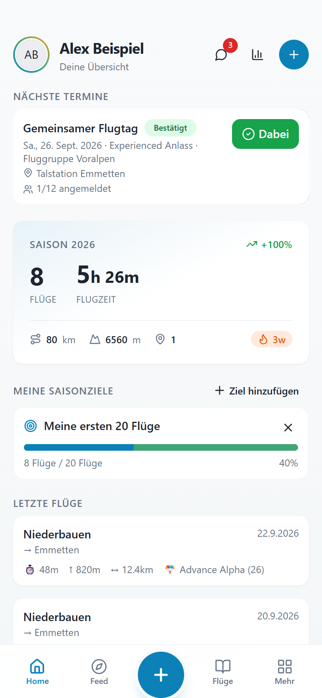

1. Öffne **Home** unten links. Oben steht dein Pilotenname; darunter erscheinen deine nächsten Termine.

2. Tippe auf eine **Terminkarte**, um Treffpunkt, Anmeldestatus und weitere Angaben zu lesen.

3. Prüfe unter **Saison** deine Fluganzahl und Flugzeit. Die Werte beruhen auf den gespeicherten Flügen.

4. Tippe bei **Meine Saisonziele** auf **Ziel hinzufügen**, wenn du ein persönliches Ziel erfassen möchtest.

5. Tippe auf einen Eintrag unter **Letzte Flüge**, um dessen Flugansicht zu öffnen. Mit dem grossen **+** unten beginnst du einen neuen Flug.
:::

::: schritte Eine Funktion über Mehr öffnen
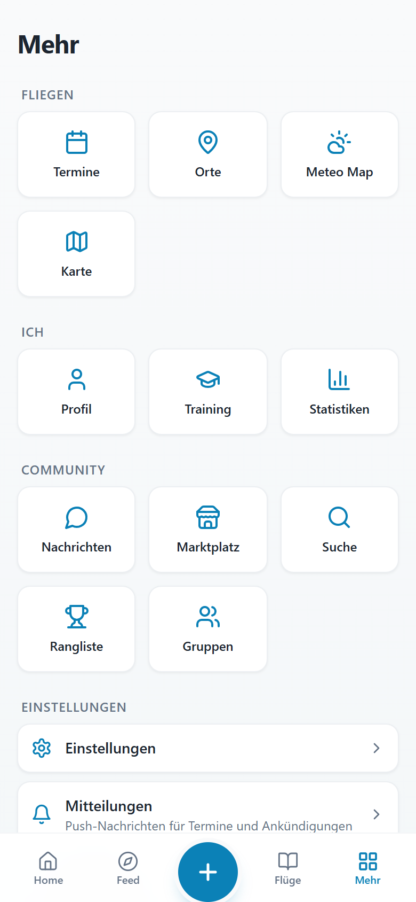

1. Tippe unten rechts auf **Mehr**.

2. Wähle unter **Fliegen** beispielsweise **Termine**, **Orte**, **Meteo Map** oder **Karte**.

3. Unter **Ich** erreichst du **Profil**, **Training** und **Statistiken**.

4. Unter **Community** findest du **Nachrichten**, **Marktplatz**, **Suche**, **Rangliste** und **Gruppen**.

5. Scrolle bei Bedarf zu **Einstellungen**, **Mitteilungen** oder **Feedback**. **Mitteilungen** führt zur Einrichtung von Push-Nachrichten.
:::

## 04 · Einen Flug erfassen: Grunddaten

**Weg:** Zentrales **+** oder **Flüge → Neuer Flug**.

**Schon von der Schule erfasst?** Prüfe zuerst einen angebotenen Hinweis **Ins Flugbuch übernehmen** auf Home, im Flugbuch oder im neuen Flugformular. Damit kannst du Schulflüge übernehmen oder mit vorhandenen Einträgen verknüpfen, statt sie doppelt zu erfassen. Kapitel 27 beschreibt den Ablauf.

Die Neuerfassung führt durch drei Schritte: **Flug**, **Details** und **Medien**. Mit **Weiter** wechselst du zum nächsten Abschnitt, mit **Zurück** zum vorherigen. Weiterblättern speichert noch keinen vollständigen Flug auf dem Server.

### Welche Angaben bedeuten was?

| Feld | Eingabe und Kontrolle |
| --- | --- |
| Datum | Tatsächlicher Flugtag; in der Neuerfassung erforderlich |
| Schirm | Verwendetes Modell; bei mehreren Schirmen den Standard prüfen |
| Startplatz | Gespeicherter Ort, an dem du gestartet bist |
| Landeplatz | Gespeicherter Ort, an dem du gelandet bist |
| Flugart | **Übungshang**, **Höhenflug** oder **Nicht angegeben**; für Ausbildungszählungen bewusst setzen |
| Gruppe | Bewusste Zuordnung zu einer deiner Gruppen |
| SHV Soloflug | Vor dem Pilotenbrevet angebotene Kennzeichnung; keine automatische Schulbestätigung |

**Ausbildungsabhängige Felder:** **SHV Soloflug** erscheint bei Schülern beziehungsweise noch unbekanntem Stand und bei bereits so markierten Flügen. Tandemfelder werden unter anderem bei Tandembrevet, Tandem-Ausbildungsziel, Tandemschirm oder schon markiertem Tandemflug angeboten. Prüfe vor dem Erfassen deinen Stand im Profil.

**Wenn ein Ort fehlt:** Lege ihn über die angebotene Ortsfunktion oder unter **Mehr → Orte** an. Prüfe Koordinaten und Ortstyp, bevor du ihn wiederverwendest. Wähle keinen nur ungefähr passenden Ort, um das Formular schneller abzuschliessen.

**Zwischenstand:** Flyary kann Texteingaben und den aktuellen Schritt eines neuen Fluges lokal wiederherstellen. Das hilft bei einer Unterbrechung, ersetzt aber nicht das Speichern. Ausgewählte lokale Dateien gehören nicht zu diesem Textentwurf.

::: schritte Schritt 1 · Grunddaten eintragen
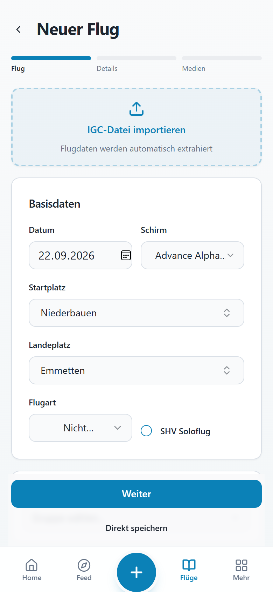

1. Öffne über **+** einen neuen Flug. Kontrolliere oben, dass **Flug** ausgewählt ist.

2. **Pflicht: Datum.** Tippe auf das Datumsfeld und wähle den tatsächlichen Flugtag. Im Beispiel ist das der 22.09.2026.

3. **Empfohlen: Schirm.** Wähle deinen Schirm aus der Liste. Hinterlegte Schirme pflegst du unter **Profil**.

4. **Empfohlen: Startplatz und Landeplatz.** Wähle im Beispiel **Niederbauen** und **Emmetten**. Fehlende Orte legst du zuerst unter **Mehr → Orte** an.

5. **Optional:** Aktiviere **SHV Soloflug** nur, wenn es auf den Eintrag zutrifft. Scrolle zur **Gruppe**, wenn der Flug einer Gruppe zugeordnet werden soll.

6. Tippe unten auf **Weiter**. Du gelangst zu **Details**; der Flug ist dadurch noch nicht gespeichert.
:::

::: schritte Schritt 1 ergänzen · Eine Gruppe auswählen
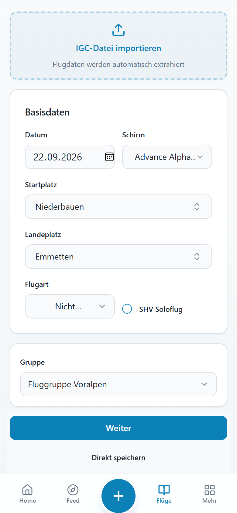

1. Bleibe im neuen Flug im Schritt **Flug** und scrolle unter Start- und Landeplatz.

2. Öffne das Auswahlfeld **Gruppe**. Es enthält die für dich verfügbaren Gruppen.

3. Wähle die passende Schule oder Fluggruppe. Für einen rein persönlichen Eintrag ist eine Gruppenzuordnung nicht erforderlich; für das Teilen über die Feed-Aktion wird sie benötigt.

4. Prüfe die Auswahl, bevor du mit **Weiter** zu den Details wechselst. Eine Gruppe auszuwählen veröffentlicht den Flug noch nicht.

5. Wenn die gewünschte Gruppe fehlt, prüfe zuerst deinen Beitritt unter **Mehr → Gruppen**.
:::

## 05 · Flugdetails und IGC-Import

::: schritte Schritt 2 · Flugwerte und Kommentar ergänzen
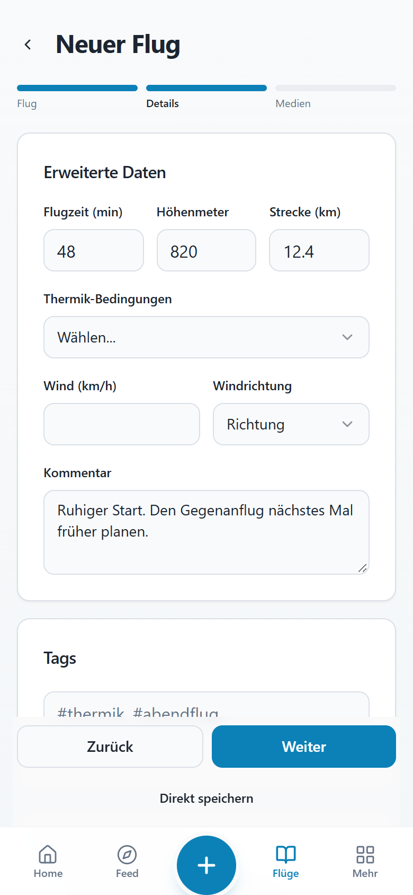

1. Öffne im Flugformular **Details**. Diese Zusatzangaben sind optional; trage nur nachvollziehbare Werte ein.

2. Erfasse **Flugzeit (min)**, **Höhenmeter** und **Strecke (km)**. Im Beispiel: **48**, **820**, **12.4**. Die Einheiten stehen direkt am Eingabefeld.

3. Wähle **Thermik-Bedingungen**, wenn du sie dokumentieren möchtest. Ergänze gegebenenfalls Windgeschwindigkeit und Richtung.

4. Schreibe im Feld **Kommentar**, was du beobachtet oder gelernt hast. Dieser Text kann später auch im Feed erscheinen.

5. Scrolle zu **Tags** und gegebenenfalls den trainierten Manövern. Wähle nur Übungen aus, die zu diesem Flug gehören.

6. Tippe auf **Weiter**, um Fotos oder Videos hinzuzufügen. Ohne Medien kannst du auch **Direkt speichern** verwenden.
:::

### Flugwerte nachvollziehbar erfassen

Im Schritt **Details** ergänzt du die Werte, die du später auswerten möchtest. Lasse unbekannte Werte lieber leer, statt sie zu erraten. Ein leeres Feld und eine ausdrücklich eingetragene Null haben unterschiedliche Bedeutung.

| Angabe | Beispiel | Worauf du achtest |
| --- | --- | --- |
| Flugzeit | 48 Minuten | Minuten eingeben, nicht 0,8 Stunden |
| Höhenmeter | 820 | Einheit und Herkunft des Wertes prüfen |
| Strecke | 12,4 km | Aufgezeichnete oder nachvollziehbare Strecke verwenden |
| Thermik | Auswahl aus der App | Beobachtete Situation dokumentieren |
| Wind | Richtung und Geschwindigkeit | Einheit im Formular beachten |
| Kommentar | Beobachtungen zum Flug | Konkret notieren, was gut war und was du üben willst |

Wenn Start- und Landeplatz mit Höhenangaben vorliegen, kann Flyary ohne IGC-Datei einen Höhenwert aus der Höhendifferenz vorschlagen. Das ist nicht automatisch der gesamte im Flug erarbeitete Höhengewinn. Kontrolliere vorgeschlagene Werte mit deiner Aufzeichnung.

Ein hilfreicher Kommentar beschreibt einen konkreten Ablauf: «Startcheck vollständig, Gegenanflug zu spät begonnen; vor dem nächsten Flug Landeeinteilung besprechen.» Solche Notizen sind später nützlicher als ein allgemeines «gut». Ergänze angebotene Tags und Lerninhalte passend zum tatsächlichen Flug.

### IGC-Datei übernehmen

1. Öffne im ersten Erfassungsschritt den IGC-Import.
2. Wähle eine passende **.igc**-Datei aus deiner Aufzeichnungs-App oder den Dateien des Smartphones.
3. Warte auf die Rückmeldung, dass die Datei gelesen wurde.
4. Prüfe Datum, Flugzeit, Orte und berechnete Werte. Ergänze Angaben, die nicht erkannt wurden.
5. Speichere den Flug und kontrolliere anschliessend, ob der Track in der Detailansicht verfügbar ist.

Eine IGC-Datei liefert Flugwerte und Trackpunkte. Sie ersetzt weder die Prüfung deiner Eingaben noch die Wahl der richtigen Gruppe. Erscheint eine Fehlermeldung beim Hochladen des Tracks, kann der Flug bereits gespeichert sein. Öffne zuerst das Flugbuch, bevor du denselben Flug erneut anlegst.

### Eine IGC-Datei aus Android mit Flyary teilen

1. Installiere Flyary als Web-App über einen unterstützten Browser auf deinem Android-Gerät und öffne die aktuelle App einmal mit Internetverbindung.
2. Öffne die gewünschte IGC-Aufzeichnung beispielsweise im Dateimanager oder in deiner Aufzeichnungs-App. Wähle **Teilen → Flyary**.
3. Melde dich bei Bedarf an. Flyary führt dich zum neuen Flug und liest die übergebene Datei ein.
4. Prüfe Datum, Dauer, Track sowie Start- und Landeplatz. Ergänze Schirm, Gruppe und weitere Angaben und speichere den Flug ausdrücklich. Das Teilen allein legt noch keinen Flug an.

Es wird eine Datei bis 20 MiB übernommen. Erscheint Flyary nicht im Teilen-Menü, kontrolliere Installation und App-Stand; alternativ wähle die Datei direkt im Flugformular. Meldet Flyary, dass die Datei nicht angekommen ist, teile sie erneut oder lade sie im Formular hoch. Die Übergabe ist ein einmaliger Zwischenspeicher, kein Archiv. Bewahre das Original auf. Diese Anleitung betrifft die installierte Web-App; daraus folgt keine Zusage für jeden Browser oder die native Android-App.

### Automatisch vorgeschlagene Start- und Landeplätze prüfen

Beim IGC-Import in einen neuen Flug ergänzt Flyary noch leere Ortsfelder anhand des ersten und letzten Trackpunkts. Ein eigener Ort passenden Typs innerhalb von 300 Metern hat Vorrang. Andernfalls sucht Flyary einen offiziellen Platz innerhalb von 500 Metern und übernimmt ihn bei einem Treffer in deine Orte. Bereits ausgewählte Plätze bleiben stehen.

Kontrolliere beide Vorschläge: Der Beginn einer Aufzeichnung muss nicht genau am Start liegen, und benachbarte Startplätze können nahe beieinanderliegen. Ohne passenden Treffer wählst du die Orte selbst. Ein übernommener offizieller Ort kann bereits in deiner Ortsliste stehen, bevor du den Flug speicherst.

## 06 · Fotos, Videos und Speichern

**Weg:** Neuer Flug → Schritt **Medien**.

Fotos und Videos ergänzen den Flugbucheintrag. Speichere verlässliche Flugdaten und füge Medien gezielt hinzu. Ein Bild vom Startplatz oder einer besonderen Situation hilft später beim Wiedererkennen des Fluges.

### Hinweise zum Ablauf

Für direkte Video-Uploads prüft Flyary aktuell eine maximale Dauer von 60 Sekunden und eine maximale Dateigrösse von 50 MB. Unterstützte Formate sind MP4, QuickTime und WebM; die Verarbeitung hängt auch von Browser und Codec ab. Wird ein Video abgewiesen, kürze oder exportiere es passend und versuche es erneut.

### Speichern und Ergebniskontrolle

Öffne den Flug im Flugbuch. Stimmen Datum und Orte? Sind die Bilder vorhanden? Ist ein importierter Track sichtbar? Eine Upload-Fehlermeldung bedeutet nicht zwangsläufig, dass der ganze Flug fehlt. Bei einer unterbrochenen Verbindung kann ein Teil bereits gespeichert worden sein.

**Direkt speichern** in einem früheren Schritt ist die Abkürzung für einen zunächst einfachen Eintrag. Später kannst du über **Bearbeiten** Details ergänzen. Das Veröffentlichen im Feed ist eine gesonderte Entscheidung; Kapitel 09 erklärt sie.

**Lokale Dateien:** Der lokale Formularentwurf speichert nicht automatisch die ausgewählten Foto-, Video- oder IGC-Dateien. Für einen vollständigen Medien-Upload benötigst du eine Verbindung. Bewahre Originaldateien auf, bis du das Ergebnis kontrolliert hast.

::: schritte Schritt 3 · Medien wählen und Flug speichern
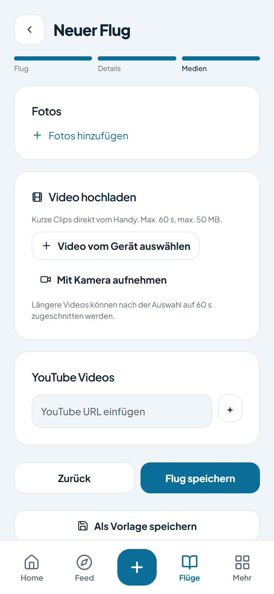

1. Öffne den Schritt **Medien**. Fotos, Videos und YouTube-Links sind optional.

2. Mit **Fotos hinzufügen** wählst du Bilder vom Gerät. Kontrolliere deine Auswahl vor dem Speichern.

3. Für einen Clip verwende **Video vom Gerät auswählen** oder **Mit Kamera aufnehmen**. Beachte die angezeigten Grenzen: 60 Sekunden und 50 MB.

4. Für YouTube füge die Adresse ins Feld **YouTube URL einfügen** ein und bestätige mit **+**. Mit **+** kannst du mehrere Links nacheinander ergänzen. Prüfe die Adressen vor dem Speichern.

5. Tippe auf **Flug speichern** und warte auf die Rückmeldung. Prüfe anschliessend die Flugansicht.

6. **Als Vorlage speichern** legt eine wiederverwendbare Grundkonfiguration an. Es ersetzt das Speichern des Flugs nicht; siehe Kapitel 23.
:::

## 07 · Flugbuch durchsuchen und pflegen

**Weg:** **Flüge** in der unteren Navigation.

Das Flugbuch ist deine zentrale Übersicht. Die Liste zeigt eigene Flüge chronologisch. Ein Eintrag mit wenigen Daten ist trotzdem ein Flugbucheintrag; fehlende Werte werden nicht durch eine Schätzung der App ersetzt.

::: schritte Einen Flug finden und öffnen
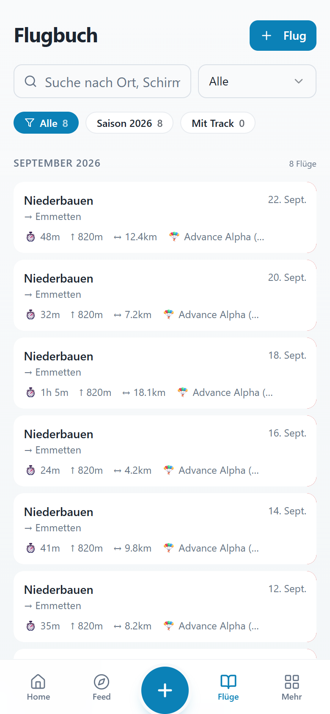

1. Tippe in der unteren Navigation auf **Flüge**.

2. Gib oben einen Suchbegriff ein, etwa **Niederbauen**. Die Suche hilft dir beim Eingrenzen der Liste.

3. Nutze bei Bedarf die Filter für Gruppe, **Alle**, **Saison** oder **Mit Track**. Entferne einen Filter, wenn ein erwarteter Flug fehlt.

4. Vergleiche Datum, Start- und Landeplatz sowie die Kurzwerte in der Ergebniszeile.

5. Tippe auf den passenden Eintrag. Die vollständige Flugansicht wird geöffnet; ihre Funktionen sind in Kapitel 08 beschrieben.
:::

### Hinweise zum Ablauf

**Wenn ein Eintrag fehlt:** Entferne zuerst Suche und Filter. Ein Flug ohne IGC-Track erscheint nicht in einer Auswahl, die nur Flüge mit Track zeigt. Prüfe ausserdem Datum, Konto und bei Offline-Erfassung den Synchronisationsstatus.

## 08 · Die Flugansicht im Detail

**Weg: Flüge → gewünschten Eintrag antippen.** Die Flugansicht bündelt den gespeicherten Flug. Sie unterscheidet sich vom Erfassungsformular und von der gekürzten Darstellung im Feed.

::: schritte Gespeicherte Flugdaten kontrollieren
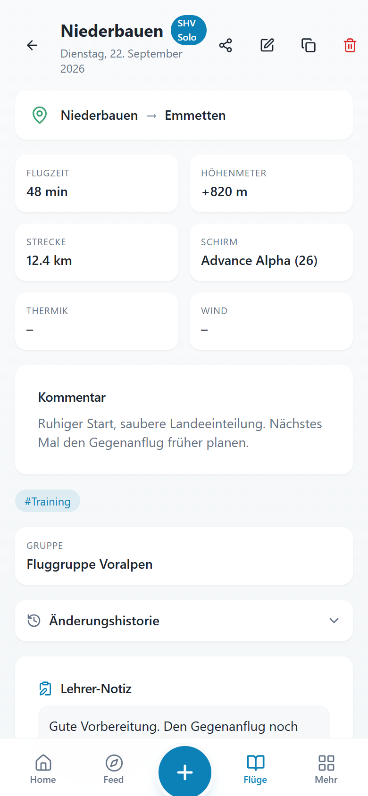
> Beispiel ohne hinterlegten Track und ohne Kartenkoordinaten. Bei vollständigen Ortsdaten erscheint zusätzlich eine Karte.

1. Öffne einen Flug aus deinem **Flugbuch**. Kontrolliere Titel, Flugdatum sowie Start- und Landeplatz.

2. Lies die Kacheln mit **Flugzeit**, **Höhenmeter**, **Strecke**, **Schirm**, Thermik und Wind. Ein Strich bedeutet, dass für diesen Wert keine entsprechende Angabe angezeigt wird.

3. Zum Korrigieren tippe oben auf das **Stiftsymbol**. Ändere die betroffenen Felder und speichere den Flug erneut.

4. Das **Kopiersymbol** erzeugt einen neuen Eintrag aus dem bestehenden Flug. Prüfe das Datum und die übernommenen Werte; Medien und Track sind gesondert zu kontrollieren.

5. Das **Teilen-Symbol** erstellt beziehungsweise verwendet einen Freigabelink. Der **Papierkorb** löscht den Flug nach Rückfrage. Verwende ihn nur für einen tatsächlich zu entfernenden Eintrag.
:::

### Fluglehrerbestätigung und Änderungshistorie

Die Karte **Bestätigung Fluglehrer** zeigt, ob ein persönlicher Ausbildungsflug nicht eingereicht ist, auf eine Entscheidung wartet, bestätigt oder zur Korrektur zurückgegeben wurde. Wähle die zuständige Schule und **Zur Bestätigung einreichen**. Bei mehreren Flügen kannst du die Einreichung auch im Flugbuch starten. Eine Gruppenzuordnung allein bestätigt den Flug nicht.

Bei einer Rückgabe lies die Begründung, korrigiere den Eintrag und verwende **Erneut einreichen**. Eine offene Einreichung kannst du **Zurückziehen**. Bestätigte Flüge zeigen Schule, Fluglehrer und Datum. Die **Änderungshistorie** macht spätere Änderungen nachvollziehbar; kläre Änderungen an bestätigten Ausbildungsdaten mit der Schule.

Ein bestätigter Ausbildungsflug wird bei einer beabsichtigten Entfernung mit Begründung storniert und bleibt nachvollziehbar. Ein gewöhnliches Löschen ist dafür gesperrt. Auch **Alle Flüge löschen** kann deshalb abgewiesen werden. Die Bestätigung im persönlichen Flugbuch und ein Schulflug im Cockpit sind unterschiedliche Aufzeichnungen.

### Karten, Track und Höhenprofil lesen

Wenn Koordinaten vorhanden sind, zeigt die Flugansicht Start und Landung auf einer Karte. Eine Verbindung zwischen Start und Landung ist noch keine aufgezeichnete Flugroute. Ein IGC-Track enthält Messpunkte des tatsächlichen Verlaufs.

1. Scrolle in der Flugansicht zur Karte. Vergrössere den gewünschten Bereich und vergleiche ihn mit deinen Flugdaten.
2. Ist ein auswertbarer Track vorhanden, kannst du zwischen **2D** und **3D** wechseln. Ohne entsprechende Trackpunkte erscheint dieser Umschalter nicht.
3. In der 3D-Ansicht steht auch das **Höhenprofil** zur Verfügung. Wähle einen Punkt im Profil, um den zugehörigen Bereich des Flugs nachzuvollziehen.
4. Prüfe zusätzliche Trackwerte wie maximale Höhe, Steigen, Geschwindigkeit oder Startzeit, soweit angezeigt. Unterscheide sie von den manuell eingegebenen Flugwerten.
5. Mit **IGC-Datei anhängen** ergänzt du eine Aufzeichnung. Bei vorhandenem Track wird eine Ersetzen-Aktion angeboten. Wähle nur die Datei des richtigen Flugs.

Karten benötigen Kartenmaterial und eine funktionierende Verbindung. Fehlendes Kartenmaterial bedeutet nicht automatisch, dass der gespeicherte Flug oder Track gelöscht wurde. Die Karte und die Statistik können verschiedene Arten von Werten zeigen; eine gerade Verbindung ist beispielsweise keine gemessene Flugstrecke.

::: schritte Kommentar, Lehrer-Notiz und Medien prüfen
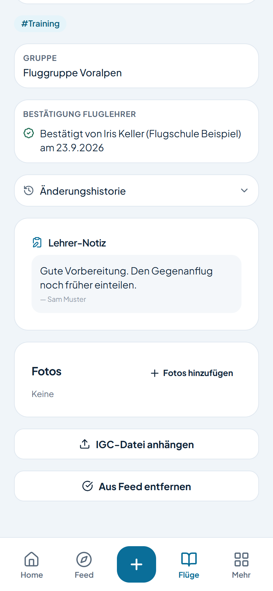

1. Scrolle unter die Kennzahlen zum **Kommentar**. Hier stehen deine eigenen Beobachtungen aus dem Flugformular.

2. Prüfe **Tags**, Gruppenzuordnung und gegebenenfalls **trainierte Manöver**. Ein Tag lässt sich antippen, um passende Feed-Beiträge zu suchen.

3. Wenn eine für dich freigegebene **Lehrer-Notiz** vorliegt, lies sie getrennt von deinem eigenen Kommentar. Sie ist keine Eingabeaufforderung an dich.

4. Im Bereich **Fotos** öffnest du ein Bild durch Antippen. Über **Hinzufügen** ergänzt du bei deinem Flug weitere Bilder.

5. Weiter unten erscheinen vorhandene Videos und die Track-Aktion. Lade Medien vollständig und prüfe nach einer Ergänzung die Rückmeldung.

6. Für eine Veröffentlichung scrolle zur Feed-Aktion. Das Speichern des Flugs allein veröffentlicht ihn nicht; folge Kapitel 09.
:::

## 09 · Einen Flug veröffentlichen und teilen

Ein gespeicherter Flug, eine Gruppenzuordnung und eine Veröffentlichung im Feed sind unterschiedliche Dinge. Entscheide bewusst, welche Informationen du wem zugänglich machen möchtest.

### Vor dem Teilen kontrollieren

1. Öffne den gespeicherten Flug und prüfe Kommentar, Orte und Medien.
2. Wähle die angebotene Veröffentlichung im Feed und prüfe die Vorschau.
3. Kontrolliere die ausgewählten Bilder und den Begleittext.
4. Bestätige die Veröffentlichung.
5. Öffne den Feed und prüfe, wie der Beitrag erscheint.

Eine Gruppenzuordnung kann den Flug für Mitglieder dieser Gruppe zugänglich machen. Eine Feed-Veröffentlichung steuert zusätzlich die Anzeige als Aktivität. Das Entfernen aus dem Feed entfernt deshalb nicht automatisch alle übrigen Freigaben oder den Flugbucheintrag.

::: schritte Die Veröffentlichungsvorschau prüfen
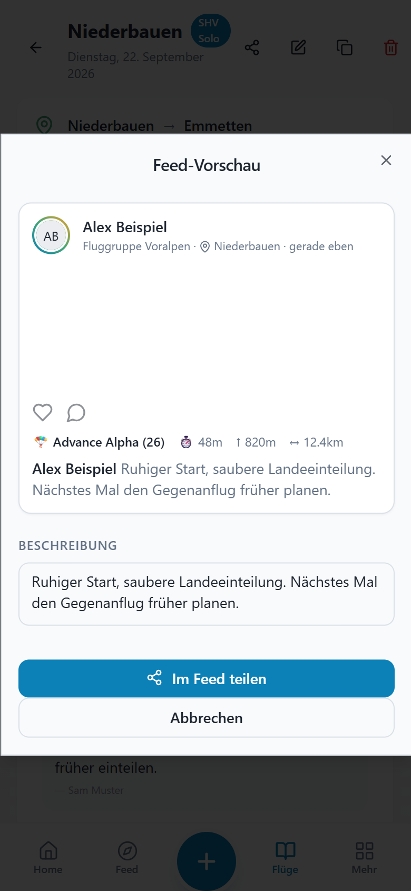

1. Ordne deinen Flug beim Bearbeiten einer **Gruppe** zu, wenn er dort erscheinen soll, und speichere ihn. Ohne Gruppenzuordnung erscheint ein Hinweis mit **Flug bearbeiten**, damit du die Zuordnung nachholen kannst.

2. Öffne den gespeicherten Flug und tippe unten auf **Im Feed teilen**. Die Vorschau wird geöffnet.

3. Prüfe Name, Gruppe, Flugdaten und die ausgewählten Fotos. Wähle nur Bilder aus, die du in diesem Beitrag zeigen möchtest.

4. Prüfe das Feld **Beschreibung**. Eine Änderung dieses Textes in der Vorschau kann auch den gespeicherten Flugkommentar ändern; verfasse hier keinen vermeintlich privaten Zusatz.

5. Tippe erst nach der Kontrolle auf **Im Feed teilen**. Warte auf die Bestätigung und öffne anschliessend den **Feed**.

6. Zum Zurücknehmen verwende die angebotene Aktion zum Entfernen aus dem Feed in der Flugansicht. Der Flug bleibt im Flugbuch; ein bereits weitergegebener Freigabelink ist davon getrennt zu betrachten.
:::

::: schritte Einen Flug ohne Gruppe für den Feed vorbereiten
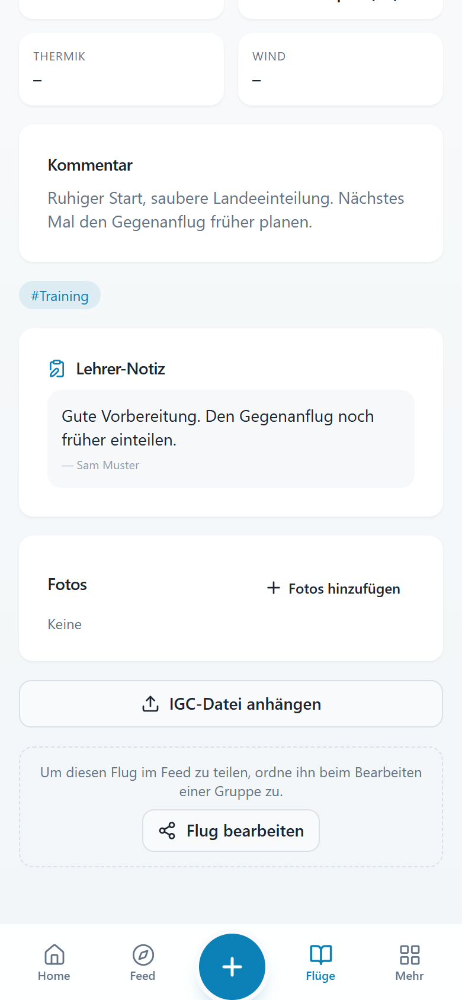

1. Öffne deinen gespeicherten Flug und scrolle zum Hinweis für das Teilen im Feed.

2. Tippe beim Hinweis auf **Flug bearbeiten**. Wähle im Flugformular die passende **Gruppe**.

3. Speichere die Änderung und prüfe die Zuordnung in der Flugansicht.

4. Öffne **Im Feed teilen** und kontrolliere die Veröffentlichungsvorschau. Die Gruppenzuordnung allein veröffentlicht keinen Beitrag.
:::

### Einen Freigabelink versenden

Die Teilen-Funktion in der Flugdetailansicht kann einen Freigabelink erzeugen und den Teilen-Dialog deines Geräts öffnen oder den Link kopieren. Behandle diesen Link wie eine Freigabe: Personen, an die er weitergegeben wird, können die freigegebene Ansicht erreichen. Prüfe die Inhalte vor dem Versand.

## 10 · Feed, Reaktionen und Benachrichtigungen

**Weg: Feed in der unteren Navigation.** Der Feed zeigt veröffentlichte Aktivitäten aus deinen Gruppen und von Pilotinnen und Piloten, denen du folgst. Je nach Datenbestand erscheinen Flüge, Termine und Errungenschaften. Er ist keine vollständige Kopie deines Flugbuchs.

::: schritte Einen Beitrag lesen und reagieren
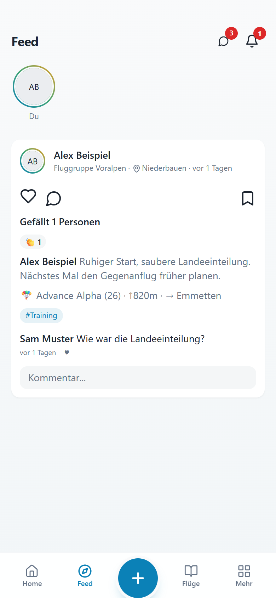
> Beispiel eines Beitrags ohne Foto oder Track. Bei Medienbeiträgen befinden sich die Aktionen unter der Medienansicht.

1. Öffne **Feed**. Im Kopf eines Beitrags erkennst du die Person und gegebenenfalls die Gruppe. Die Zeitangabe bezieht sich auf die Veröffentlichung.

2. Tippe auf **Name oder Profilbild**, um das öffentliche Pilotenprofil zu öffnen. Bei einer Kartenansicht führt das Antippen der Karte zur Flugansicht.

3. Bei mehreren Medien wischst du seitlich – auch über einem Video kannst du zum nächsten Medium wechseln. Ein Foto öffnet die grössere Bildansicht. Für Start, Pause oder Ton verwendest du die Videobedienelemente.

4. Tippe auf das **Herz**, um zu reagieren. Halte die Reaktion gedrückt, um weitere Reaktionen auszuwählen. Die erneute Auswahl derselben Reaktion nimmt sie zurück.

5. Das **Sprechblasensymbol** klappt die Kommentare auf. Das **Lesezeichen** merkt den Beitrag; erneutes Antippen entfernt die Markierung.

6. Tippe auf einen **#Tag**, um den Feed auf dieses Thema einzugrenzen. Entferne den angezeigten Tag-Filter wieder, wenn du alle Beiträge sehen möchtest.
:::
::: schritte Einen Kommentar schreiben
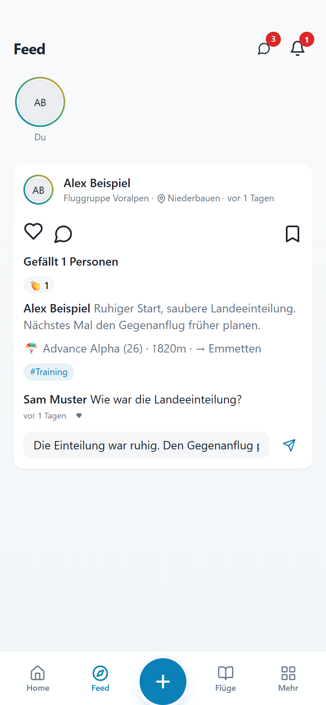

1. Suche den richtigen Beitrag und lies vorhandene Kommentare. Scrolle bei Bedarf bis zum Eingabefeld unter dem Beitrag.

2. Tippe in **Kommentar …** und schreibe deinen Text. Im Beispiel antwortest du auf eine Frage zur Landeeinteilung.

3. Mit **@** kannst du aus den angebotenen Gruppenmitgliedern eine Person erwähnen. Wähle den passenden Vorschlag aus.

4. Tippe auf das **Senden-Symbol** rechts am Eingabefeld. Der Kommentar gehört zum Beitrag und ist keine private Nachricht.

5. Kontrolliere, ob der Text in der Kommentarliste erscheint. Ein geleertes Eingabefeld allein ist noch keine ausreichende Ergebniskontrolle.

6. Ein kleines **Herz** bei einem bestehenden Kommentar reagiert auf genau diesen Kommentar; das grosse Herz gehört zum gesamten Beitrag.
:::

### Die Profilkreise über dem Feed

Oberhalb der Beiträge können Profilkreise von Personen mit kürzlich veröffentlichten Flügen erscheinen. Tippe einen Kreis an, um den zuletzt zugeordneten Flug direkt zu öffnen. Das ist ein Schnellzugriff auf einen Flug; ein Name oder Avatar im Kopf eines Beitrags führt dagegen zum öffentlichen Profil.

### Feed aktualisieren und fehlende Beiträge finden

Ziehe die Liste am oberen Rand nach unten, um zu aktualisieren. Beim Scrollen können weitere Beiträge nachgeladen werden. Wenn ein Beitrag fehlt, prüfe einen aktiven Tag-Filter, die Gruppenzugehörigkeit und ob der Flug tatsächlich veröffentlicht wurde. Ein gespeicherter privater Flug erscheint nicht automatisch im Feed. Bei gefolgten Personen hängt die Anzeige zusätzlich von den verfügbaren und sichtbaren Veröffentlichungen ab.

Lesezeichen lassen sich am jeweiligen Beitrag setzen und wieder entfernen. Eine eigenständige Liste aller gemerkten Beiträge wird in dieser Handbuchversion nicht als verfügbarer Menüpunkt vorausgesetzt.

::: schritte Aktivitäten über die Feed-Glocke lesen
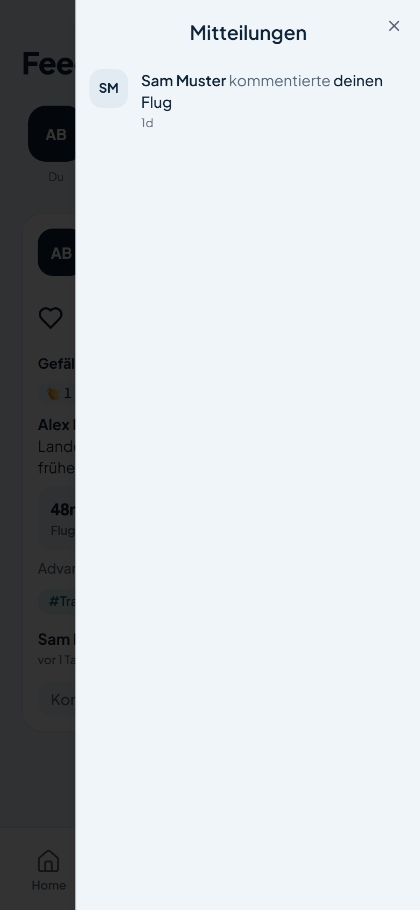

1. Tippe oben im **Feed** auf die **Glocke**. Eine Zahl kennzeichnet ungelesene Einträge.

2. Lies in der geöffneten Seitenleiste, wer beispielsweise reagiert, kommentiert oder dir folgt.

3. Tippe eine Benachrichtigung an, um den zugehörigen Flug, Termin oder das Profil zu öffnen. Hinweise auf Errungenschaften führen in den Feed.

4. Beim Öffnen des Eingangs werden ungelesene Einträge als gelesen markiert. Das löscht die Aktivitäten nicht.

5. Schliesse die Seitenleiste, um weiter im Feed zu lesen. Push-Nachrichten auf dem Sperrbildschirm aktivierst du separat unter **Mehr → Mitteilungen**.
:::

### Termine und Errungenschaften im Feed

Eine Terminkarte kann eine Anmeldung anbieten. Öffne vor deiner Entscheidung die Termindetails und kontrolliere Zeitpunkt, Treffpunkt, Status und Kapazität. Bei einem Beitrag über eine Errungenschaft beziehen sich Reaktionen und Kommentare auf diese Errungenschaft. Eine Reaktion ersetzt weder eine Anmeldung noch eine Rückmeldung an die Schule.

## 11 · Termine, Anmeldung und Flugtag

**Weg:** **Mehr → Termine** oder eine Terminkarte auf Home.

Die Übersicht enthält Termine deiner verfügbaren Gruppen. Datum, Kategorie, Status und Treffpunkt helfen beim Auswählen. Ein Filter nach Gruppe oder Terminart reduziert die Liste, ändert aber keine Anmeldung.

::: schritte Einen Termin auswählen
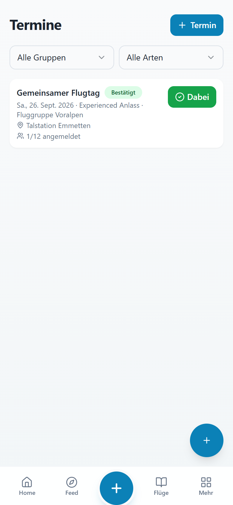

1. Öffne **Mehr → Termine**.

2. Wähle bei Bedarf eine Gruppe oder Terminart, um die Liste einzugrenzen.

3. Lies Titel, Datum und Status auf der Karte. Eine bestätigte Durchführung und deine eigene Anmeldung sind unterschiedliche Angaben.

4. Tippe auf die Terminkarte. Prüfe die Details vor einer Anmeldung.

5. Wenn du bereits **Dabei** siehst, kontrolliere in der Detailansicht, ob deine Teilnahme wie erwartet aufgeführt ist.
:::

### Hinweise zum Ablauf

**Warteliste:** Bei begrenzten Plätzen kann deine Anmeldung auf der Warteliste landen. Das ist keine bestätigte Teilnahme. Massgeblich ist der angezeigte Status beziehungsweise die Rückmeldung der Organisation. Melde dich ab, wenn du nicht teilnehmen kannst.

::: schritte Anmeldung und Treffpunkt prüfen
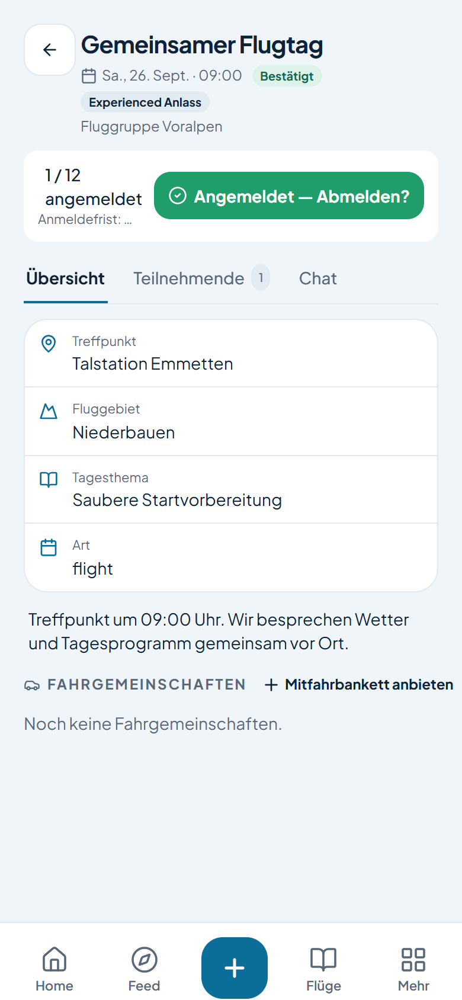

1. Lies oben Titel, Datum und Durchführungsstatus.

2. Kontrolliere **Treffpunkt**, **Fluggebiet**, Tagesthema und Anmeldeschluss. Richte deine Planung nach den Angaben der Organisierenden.

3. Nutze die angebotene **Anmeldung**. Je nach Kapazität und Schulablauf erscheint anschliessend eine Bestätigung oder ein anderer Teilnahmestatus.

4. Öffne den Reiter **Teilnehmende** und prüfe deinen Eintrag. Eine Warteliste ist noch keine bestätigte Teilnahme.

5. Unter **Übersicht** findest du die Tagesinformationen, unter **Chat** die Nachrichten zum Anlass. Zum Abmelden tippe auf deine Anmeldeschaltfläche und kontrolliere den neuen Status.
:::

### Die Details zum Flugtag

Die Detailansicht ist in Reiter gegliedert. **Übersicht** enthält die Angaben zum Flugtag, Briefing, Programm und Anreise. Die Flugvorbereitung lässt sich bei vorhandenen Angaben aufklappen. **Teilnehmende** zeigt die Anmeldungen und gegebenenfalls die Warteliste. **Chat** enthält die Nachrichten dieses Anlasses. Bei schmalen Bildschirmen lässt sich die Reiterleiste seitlich verschieben.

::: schritte Die eigene Teilnahme kontrollieren
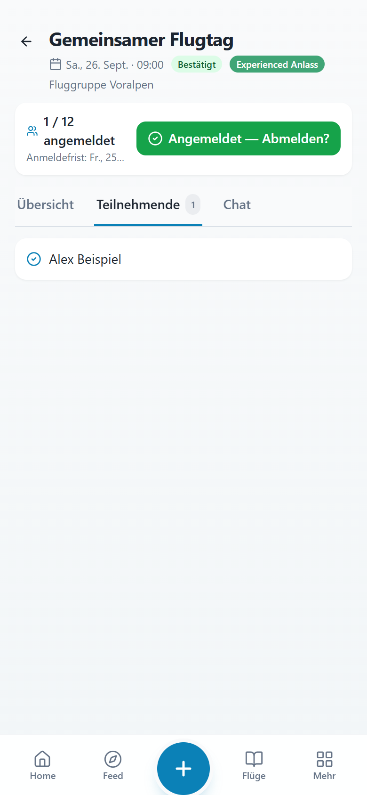

1. Öffne den Termin und tippe auf **Teilnehmende**.

2. Prüfe deinen Namen und den angezeigten Teilnahmestatus. **Auf Warteliste** ist keine bestätigte Teilnahme.

3. Vergleiche oben die Teilnehmerzahl und Kapazität. Eine schulische Bestätigung kann zusätzlich zu deiner Anmeldung erscheinen.

4. Zum Abmelden verwendest du die Anmeldeschaltfläche im Kopf. Kontrolliere danach den neuen Status und informiere bei kurzfristigen Änderungen die Organisation.
:::

::: schritte Im Terminchat nachfragen
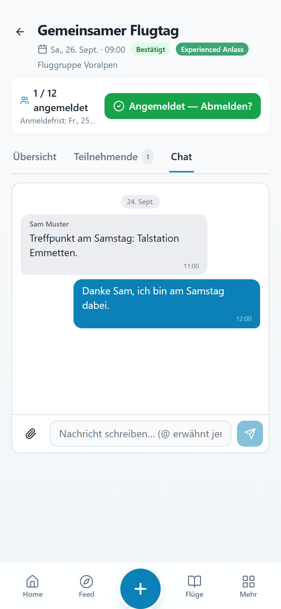

1. Öffne im richtigen Termin den Reiter **Chat**.

2. Lies die aktuellen Nachrichten, bevor du eine Frage stellst. Prüfe insbesondere Treffpunkt und Änderungen.

3. Schreibe deine Frage in das Eingabefeld und tippe auf **Senden**. Die Nachricht gehört zum Terminchat, nicht zu einem persönlichen Gespräch.

4. Bestätige eine Ankündigung erst nach dem Lesen, falls ausdrücklich eine Bestätigung verlangt wird. Die weiteren Chataktionen werden in Kapitel 25 erklärt.
:::

Die Reiter richten sich nach deiner Rolle. Schulinterne **Planung** und der Bereich **Flugtag** stehen nur mit entsprechenden Berechtigungen zur Verfügung. Bei vergangenen Schulterminen können Schüler unter **Feedback** freigegebene Rückmeldungen lesen.

Bei Absage oder Verschiebung prüfst du Terminstatus und Nachricht der Organisation. Ein früher gespeicherter Screenshot ist keine verlässliche Auskunft über einen später geänderten Treffpunkt.

### Rückmeldungen zum Schulflugtag lesen

1. Öffne unter **Mehr → Termine** den vergangenen Schultermin und wähle **Feedback**.
2. Vor der Freigabe zeigt die App einen Hinweis: Die Rückmeldung erscheint nach dem Tagesabschluss, spätestens am Folgetag um **06:00 Uhr**.
3. Nach der Freigabe siehst du die von der Schule erfassten Flüge mit vorhandenen Zeiten, Start- und Landeplätzen sowie Rückmeldungen.
4. Lies die Manöverbewertungen: **Nochmals**, **Geht** und **Sitzt**. Die farbigen Punkte ergänzen diese Bezeichnungen.
5. Lies auch eine vorhandene **Tageszusammenfassung** und besprich den nächsten Lernschritt mit deiner betreuenden Person.

Beim Tagesabschluss erhältst du eine Mitteilung; Push setzt die Freigabe auf deinem Gerät voraus. Interne Teamnotizen bleiben schulintern. Frühere Rückmeldungen aus dem Ausbildungsblatt können weiterhin erscheinen; deren Flugnummern sind nicht automatisch Einträge deines persönlichen Flugbuchs. Fehlen nach der Freigabe erwartete Angaben, frage bei der Schule nach. Die Übernahme ins eigene Flugbuch erfolgt separat nach Kapitel 27.

### Einen eigenen Termin anlegen

Wenn dir **+ Termin** angeboten wird und du einen Anlass organisieren darfst, öffnest du damit das Terminformular. Für eine reine Teilnahme verwendest du die Anmeldung am bestehenden Termin.

1. Wähle die passende Terminart und **Gruppe**. Je nach Art erscheinen andere Zusatzfelder.
2. **Pflicht:** Erfasse einen aussagekräftigen Titel sowie Datum und Uhrzeit und ordne den Termin einer Gruppe zu.
3. Ergänze Treffpunkt, Beschreibung und – soweit angeboten – Gebiet, Thema, Kapazität und Anmeldeschluss. Erkläre, was Teilnehmende mitbringen oder vorbereiten sollen.
4. Prüfe alle Angaben und speichere den Termin. Öffne danach die Detailansicht und kontrolliere besonders Datum, Uhrzeit und Treffpunkt.
5. Berechtigte Personen setzen den Durchführungsstatus direkt im Kopf des Termins. **Weitere Aktionen** mit den drei Punkten enthält je nach Rolle Bearbeiten, Duplizieren, Fotos und Feed-Veröffentlichung. Prüfe nach jeder Änderung das Ergebnis; gewöhnliche Teilnehmende sehen diese Verwaltungsaktionen nicht.

Ein Schultermin kann zusätzliche Vorgaben und Bestätigungen erfordern. Die schulinterne Planung und Personaleinteilung sind nicht Teil dieser Pilotenanleitung.

### Terminbilder und Sichtbarkeit

Als Ersteller kannst du über **Weitere Aktionen → Fotos hinzufügen** Bilder ergänzen. Prüfe nach dem Hochladen, welche Bilder tatsächlich erscheinen. Bei mehreren Dateien können einzelne Uploads fehlschlagen, während andere erfolgreich sind; lade nur fehlende Bilder erneut hoch. Berechtigte andere Personen können die Bilder ebenfalls sehen. Die Sichtbarkeit richtet sich nach dem zugänglichen Termin beziehungsweise Beitrag und bedeutet keine allgemeine öffentliche Freigabe.

## 12 · Start- und Landeplätze verwalten

**Weg:** **Mehr → Orte**.

Orte bilden die Grundlage für eine saubere Flugerfassung. Ein präzise benannter Ort ist leichter wiederzufinden als mehrere ähnliche Einträge. Wähle den passenden Typ: Startplatz, Landeplatz oder beides.

### Einen Ort anlegen

1. Prüfe in der Ortsübersicht, ob der Ort bereits vorhanden ist.
2. Wähle Neu beziehungsweise die Plus-Aktion.
3. Erfasse einen eindeutigen Namen und den passenden Ortstyp.
4. Hinterlege die Position über Karte oder Koordinatenfelder. Verwechsle Breitengrad und Längengrad nicht.
5. Ergänze bekannte Angaben wie Höhe, Land und Beschreibung.
6. Speichere den Ort und kontrolliere ihn in der Detailansicht.

Die Koordinaten bestimmen, wo der Ort auf der Karte erscheint. Ein importierter Ortsname ohne korrekte Position kann eine unbrauchbare Karte erzeugen. Prüfe besonders Orte, die beim Import automatisch neu entstanden sind. Eine Beschreibung ersetzt keine aktuellen örtlichen Regeln oder Absprachen.

### Bestehende Orte pflegen

Öffne einen Ort, um Daten und Position zu prüfen. Korrigiere Eingabefehler dort, statt für jede Schreibvariante einen neuen Ort anzulegen. Beachte, dass bereits erfasste Flüge auf diesen Ort verweisen können.

**Fehlersuche:** Erscheint ein Startplatz nicht im Flugformular, kontrolliere den Ortstyp. Ein ausschliesslich als Landeplatz erfasster Ort ist in der Startplatzauswahl nicht die richtige Grundlage. Zeigt die Karte eine unerwartete Position, kontrolliere die Koordinaten und nicht nur den Namen.

::: schritte Start- und Landeplätze finden
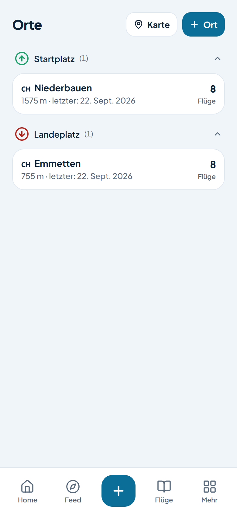

1. Öffne **Mehr → Orte**.

2. Klappe **Startplatz** oder **Landeplatz** auf. Die Zahl nennt die Anzahl der Einträge in diesem Bereich.

3. Tippe einen Namen an, um den Ort mit seinen hinterlegten Angaben zu öffnen.

4. Für einen neuen Ort tippe oben auf **+ Ort**. Das danach geöffnete Formular wird im folgenden Abschnitt erklärt.

5. Mit **Karte** wechselst du zur räumlichen Übersicht. Dafür müssen verwertbare Koordinaten hinterlegt sein.
:::

### Einen offiziellen Platz verwenden

1. Öffne **Mehr → Orte** und die Anlage eines neuen Ortes. Suche im Feld **Offiziellen Start- oder Landeplatz suchen …** nach Name, Gebiet, Gemeinde oder Region.
2. Prüfe Typ, Gebiet und Höhenangabe und wähle den passenden Treffer. Ein bereits übernommener offizieller Platz wird wiederverwendet.
3. Auch in der Start- und Landeplatzauswahl eines Flugs stehen **Meine Orte** und passende **Offizielle Plätze** zur Verfügung.
4. Fehlt der gesuchte Platz im Katalog, erfasse ihn als eigenen Ort. Liegt deine gewählte Position nahe an einem offiziellen Platz, kann Flyary **Offiziellen Platz verwenden** anbieten.

Der Katalog basiert auf der DHV-Geländedatenbank; sein Schwerpunkt ist die Schweiz. Das Kennzeichen **Offizieller Platz** bezeichnet die Katalogverknüpfung, keine Bestätigung aktueller Flugbedingungen. Bei verknüpften Orten sind Typ, Koordinaten, Höhe und Land vorgegeben. Beschreibung, Windangaben und persönlicher Name bleiben pflegbar. Die vorherige Anleitung zur freien Positionseingabe gilt für eigene, nicht verknüpfte Orte.

### Persönliche Namen und bestehende Orte verknüpfen

1. Öffne einen verknüpften Ort zum Bearbeiten und trage deinen gewünschten Namen ein. Speichere die Änderung.
2. Mit **Offiziellen Namen verwenden** setzt du einen eigenen Namen wieder zurück. Der offizielle Name steht zusätzlich als Orientierung beim Ort.
3. In der Ortsübersicht können Vorschläge zur Verknüpfung bestehender Orte erscheinen. Prüfe Platz und Entfernung und wähle **Verknüpfen** oder nach Prüfung aller Vorschläge **Alle … verknüpfen**.
4. Dein bisheriger Name und die Zuordnung deiner Flüge bleiben beim Verknüpfen erhalten; Typ und Position werden mit dem Katalog abgeglichen. Ein abgelehnter Vorschlag wird auf diesem Gerät ausgeblendet.

Andere Personen sehen bei verknüpften Orten ihren eigenen Namen für denselben Platz oder den offiziellen Namen. Dein persönlicher Name wird dafür nicht übernommen. Nicht verknüpfte Orte behalten ihre bisherigen Namen. Im Ausbildungsnachweis der Schule stehen die offiziellen Namen.

### Doppelte Orte zusammenführen

1. Öffne den Ort, den du aufgeben möchtest, und wähle **Mit anderem Ort zusammenführen**.
2. Wähle den eigenen Ort, der erhalten bleiben soll. Orte am selben offiziellen Platz werden bevorzugt angezeigt.
3. Prüfe die Richtung der Zusammenführung und bestätige mit **Zusammenführen**. Der geöffnete Ausgangsort wird gelöscht; seine Verweise in Flügen, Vorlagen, Flugtagen und Challenges gehen zum Zielort.
4. Kontrolliere danach den verbleibenden Ort und betroffene Flüge. Fehlende Beschreibung und Windangaben des Zielorts können aus dem entfernten Ort ergänzt werden; bereits vorhandene Angaben des Zielorts haben Vorrang.

Die Übersicht **Gleicher Platz mehrfach** bietet zusätzlich eine direkte Zusammenführung eigener Orte mit derselben offiziellen Platzverknüpfung an. Dabei bleibt der Ort mit den meisten zugeordneten Flügen erhalten. Prüfe die angezeigte Gruppe vor dem Antippen; diese Aktion hat keinen separaten Bestätigungsdialog. Zusammenführen lässt sich nicht mit einer Rückgängig-Schaltfläche aufheben. Es kann auch Schulflugverweise betreffen, die andere Personen bereits in ihr Flugbuch übernommen haben.

### Den Ort in burnair öffnen

In der Ortsdetailansicht öffnet **In der burnair-Karte öffnen** die externe burnair-Karte an den Koordinaten des Ortes. Das funktioniert auch bei eigenen, nicht mit dem Katalog verknüpften Orten. Kontrolliere die Position und die dort verfügbaren Informationen; die Verknüpfung importiert keine burnair-Daten nach Flyary.

## 13 · Karte und Meteo

### Die Kartenansicht

**Weg:** **Mehr → Karte**.

Die Karte hilft dir, gespeicherte Orte und verfügbare Fluggeometrien räumlich einzuordnen. Verschiebe sie mit einem Finger und ändere den Massstab mit der Zoomgeste oder den angebotenen Schaltflächen. Tippe eine Markierung an, um Informationen zu öffnen.

Ein Start- oder Landeplatzmarker ist kein vollständiger Flugtrack. Für die tatsächlich geflogene Route werden passende Trackdaten benötigt. Enthält ein Flug keine IGC-Aufzeichnung, darfst du aus einer blossen Verbindung zwischen Orten keine tatsächlich geflogene Strecke ableiten.

Bleibt eine Karte leer, prüfe Verbindung und Positionsdaten. Neu angelegte oder importierte Orte können unvollständige Koordinaten haben. Kartenkacheln hängen zudem von der Verfügbarkeit externer Dienste ab.

### Meteo Map

**Weg:** **Mehr → Meteo Map**.

Flyary bindet die burnair Meteo Map als externe Ansicht ein. Bedienelemente, Datenebenen und Aktualisierungen werden vom Anbieter bestimmt. Deshalb beschreibt dieses Handbuch keine unveränderliche Schaltflächenfolge innerhalb der eingebetteten Wetterkarte.

1. Öffne Meteo Map mit bestehender Internetverbindung.
2. Wähle in der eingebetteten Ansicht die Region und die benötigten Informationen.
3. Beachte die dort angezeigten Zeitpunkte und Legenden.
4. Kehre über die Zurück-Funktion zu Flyary zurück.

Lädt die Ansicht nicht, kontrolliere die Verbindung und versuche es erneut. Ein nicht verfügbarer Datensatz bedeutet nicht, dass bestimmte Bedingungen ausgeschlossen sind. Die Ansicht unterstützt deine Vorbereitung; sie trifft keinen Freigabeentscheid für deinen Flug.

**Warum hier kein Wetter-Screenshot steht:** Ein statisches Bild würde einen bestimmten Datenstand und eine möglicherweise geänderte externe Oberfläche festhalten. Für die Bedienung von Flyary sind Einstieg und Rückweg entscheidend; Wetterdaten prüfst du in der aktuellen Ansicht.

## 14 · Training und Lernfortschritt

**Weg:** **Mehr → Training**.

Der Trainingsbereich heisst **Kontrollblatt**. Er enthält den Ausbildungsstand mit Anforderungen, SHV-Unterlagen und Lernkategorien. Das Kontrollblatt ist in **Grundausbildung**, **Höhenflüge**, **Prüfungsreif** und **Pilot** gegliedert, soweit Inhalte vorhanden sind. Dein eigener Bereich ist mit **Deine Stufe** markiert und bereits aufgeklappt; andere Bereiche kannst du über ihre Überschrift öffnen. Allgemeine Inhalte erscheinen zusätzlich unter **Allgemein**. Das Öffnen eines Bereichs ändert deinen Ausbildungsstand nicht.

::: schritte Eine Übung bewerten
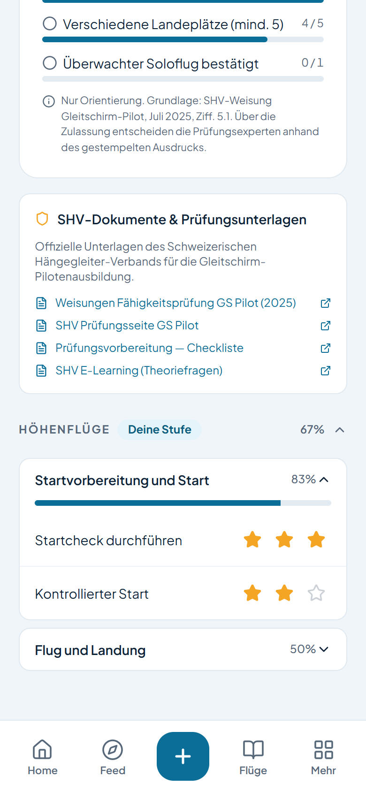

1. Öffne **Mehr → Training**.

2. Prüfe **Deine Stufe**. Tippe bei Bedarf auf eine andere Stufenüberschrift, um deren Kategorien aufzuklappen. So kannst du auch Inhalte ausserhalb deiner aktuellen Stufe ansehen.

3. Tippe auf eine Kategorie, etwa **Startvorbereitung und Start**, um ihre Übungen aufzuklappen.

4. Tippe auf den passenden **Stern** in der Übungszeile. Die Bewertung wird direkt gespeichert; es gibt keinen zusätzlichen Speichern-Schritt.

5. Tippe auf den **Namen der Übung**, um Ziel, Inhalt und eigene Notizen zu öffnen. Die Sterne sind kein formeller Prüfungsentscheid.
:::

### Sterne und Voraussetzungen verstehen

Die antippbaren Sterne sind deine **Selbsteinschätzung**. Zusätzlich kann in der Übungszeile **Fluglehrer: Sitzt (25.9.)** oder eine andere Bewertung mit Datum stehen. Diese Angabe zeigt die neueste freigegebene Fluglehrerbewertung des Manövers aus den Schulflügen. Die Stufen heissen **Nochmals**, **Geht** und **Sitzt**.

Die Fluglehrerbewertung verändert deine eigenen Sterne nicht. Umgekehrt überschreibt das Antippen deiner Sterne keine Schulbewertung. Für die Rückmeldung zu einem bestimmten Flug öffnest du den zugehörigen Termin unter **Feedback**. Noch nicht freigegebene Bewertungen erscheinen hier noch nicht.

Die Sterne zeigen den erfassten Stand auf einer Skala bis drei. Beim erneuten Antippen derselben Stufe kann die Bewertung reduziert werden. Die Bewertung wird beim Antippen übernommen; Notizen in der Detailansicht beim Verlassen des Feldes. Prüfe wichtige Einträge vor dem Schliessen nochmals.

Ein SHV-Hinweis kennzeichnet ein entsprechend markiertes Prüfungsmanöver. Er bestätigt keine bestandene Prüfung. Ein Hinweis auf eine Voraussetzung zeigt, dass eine andere Kategorie noch nicht vollständig abgeschlossen ist. Besprich den nächsten Ausbildungsschritt mit deiner betreuenden Person.

**Hilfreiche Lernnotiz:** «Landeeinteilung heute zweimal geübt. Gegenanflug früher beginnen; nächste Einheit mit Fluglehrer besprechen.» So verknüpfst du die Selbsteinschätzung mit einer konkreten Aufgabe.

Der Anforderungsbereich öffnet das Pilotenbrevet für Schüler oder das gewählte weitere Ausbildungsziel für Piloten. Du kannst Disziplin und Brevet für die angezeigte Auswertung wechseln. Ein erreichtes Brevet wird als solches angezeigt; die Prozentanzeige allein ist keine Prüfung oder Zulassung.

Die Schule kann den für sie zugänglichen Ausbildungsstand in ihrer Schüleransicht verwenden. Schulinterne Coaching-Notizen und deine persönlichen Lernnotizen sind unterschiedliche Einträge.

::: schritte Eine Übung verstehen
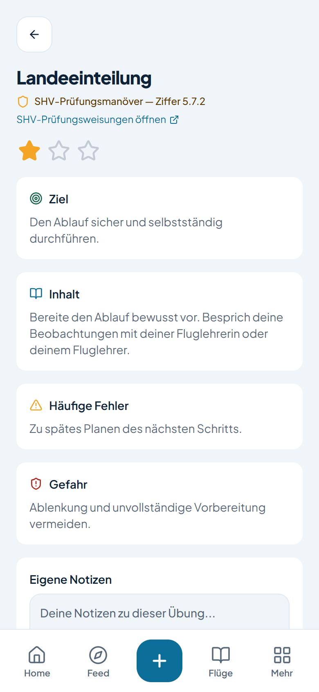

1. Öffne eine Übung über ihren Namen im Kontrollblatt.

2. Lies **Ziel** und **Inhalt**. Vergleiche die Beschreibung mit deiner eigenen Erfahrung.

3. Beachte die Abschnitte **Häufige Fehler** und **Gefahr** als Bestandteil der Übungsbeschreibung.

4. Die Sterne oben zeigen den gespeicherten Stand. Besprich eine neue Bewertung bei Bedarf mit deiner Fluglehrerin oder deinem Fluglehrer.

5. Scrolle zu **Eigene Notizen**. Die folgende Schrittfolge zeigt, wie du eine Lernnotiz erfasst und speicherst.
:::

::: schritte Eine Lernnotiz erfassen und speichern
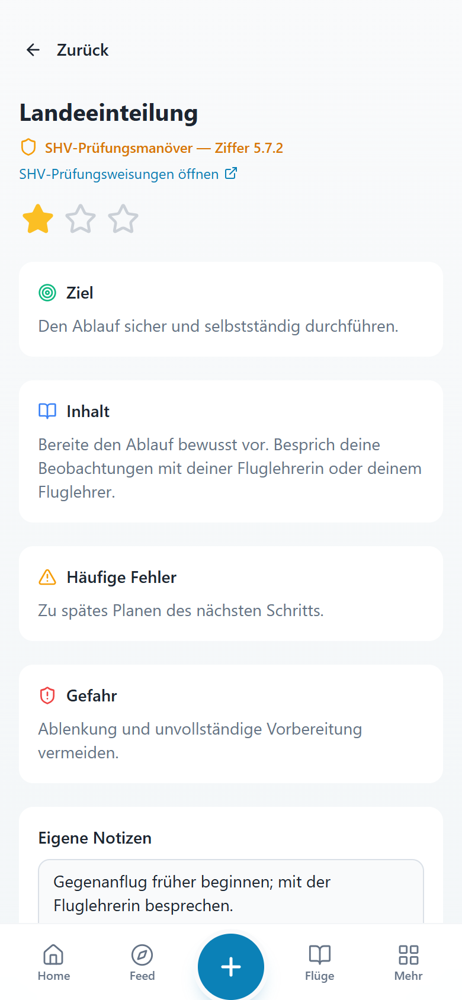

1. Öffne im **Training** die gewünschte Übung und scrolle zu **Eigene Notizen**.

2. Tippe ins Textfeld und erfasse eine konkrete Beobachtung oder den nächsten Übungsschritt.

3. Verlasse das Textfeld bewusst, indem du auf einen anderen Bereich der Seite tippst. Dadurch wird die Speicherung ausgelöst.

4. Öffne die Übung anschliessend erneut und prüfe den Text. Warte bei langsamer Verbindung auf die Rückmeldung.

5. Diese Lernnotiz gehört zur Übung. Sie ist weder der Kommentar eines einzelnen Flugs noch eine Lehrer-Notiz im Flug.
:::

## 15 · Statistiken und Saisonziele

**Weg:** **Mehr → Statistiken**. Persönliche Ziele findest du zusätzlich auf Home.

Statistiken helfen dir, Regelmässigkeit und Entwicklung deiner Flüge zu erkennen. Sie sind nur so vollständig wie die Einträge. Eine fehlende Zeit oder Strecke wird nicht dadurch verlässlich, dass ein Diagramm angezeigt wird.

### Unterschiedliche Zahlen erklären

Jahresauswertung und Gesamtzahl müssen nicht übereinstimmen. Auch der Zeitraum einer Rangliste kann vom persönlichen Statistikfilter abweichen. Vergleiche zuerst Zeitraum und Kennzahl, bevor du einen Datenfehler vermutest.

Ein duplizierter Flug erhöht die Anzahl. Ein falsches Datum verschiebt einen Flug möglicherweise in ein anderes Jahr. Ein fehlender Startplatz beeinflusst Ortsauswertungen. Korrigiere die Ursache im Flugbucheintrag und kontrolliere die Statistik anschliessend erneut.

### Ziele sinnvoll setzen

Wähle einen Zieltyp, den du mit deinen Daten verfolgen kannst. Kontrolliere Saison, Einheit und Zielwert. Ein Ziel ist eine persönliche Orientierung, keine Aufforderung, einen Flug nur wegen einer Statistik durchzuführen. Ein gelöschtes Ziel entfernt nicht deine Flüge.

::: schritte Deinen Zeitraum auswerten
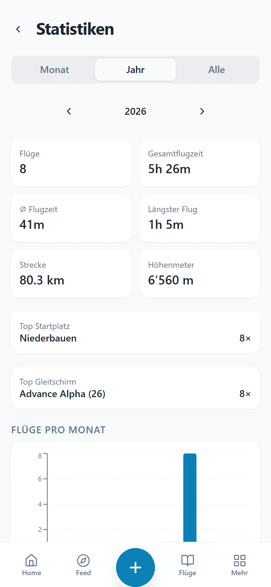

1. Öffne **Mehr → Statistiken**.

2. Wähle **Monat**, **Jahr** oder **Alle**.

3. Verwende die Pfeile beim Zeitraum, um ein anderes Jahr oder einen anderen Monat anzuzeigen.

4. Vergleiche Fluganzahl, Gesamtflugzeit, Strecke und Höhenmeter. Die Auswahl oben gilt für die dargestellte Auswertung.

5. Scrolle zu den Diagrammen. Wenn ein Wert unerwartet ist, prüfe zuerst den Zeitraum und anschliessend die zugrunde liegenden Flüge.
:::

## 16 · Profil, Schirme und persönliche Angaben

**Weg:** **Mehr → Profil**.

Dein Profil enthält persönliche und flugbezogene Angaben. Eigene Profilansicht und öffentliche Pilotenansicht sind nicht identisch. Gesundheitsangaben oder Notfallinformationen sind nicht gewöhnlicher öffentlicher Profiltext.

::: schritte Dein Profil bearbeiten
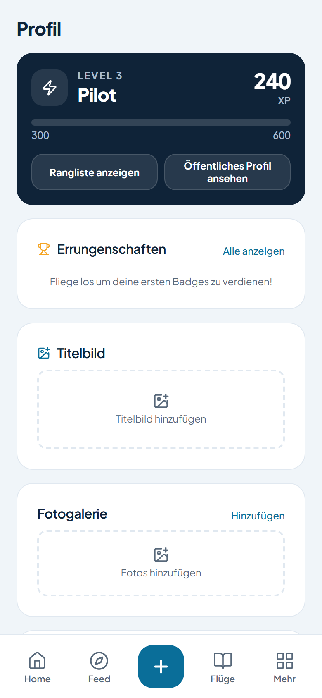

1. Öffne **Mehr → Profil**. Oben erscheinen unter anderem Level und Errungenschaften.

2. **Öffentliches Profil ansehen** zeigt dir die öffentliche Ansicht. Persönliche Bearbeitungsfelder liegen weiter unten auf dieser Seite.

3. Scrolle zu deinen Angaben und ändere die gewünschten Felder, etwa Pilotenname oder Beschreibung.

4. Verwende die zugehörige **Speichern**-Aktion für die Profilangaben. Bild- und Schirmaktionen haben eigene Abläufe.

5. Kontrolliere danach die öffentliche Ansicht, wenn du öffentlich sichtbare Angaben verändert hast. Notfall- und Gesundheitsangaben behandelst du getrennt davon.
:::

::: schritte Persönliche Angaben eintragen
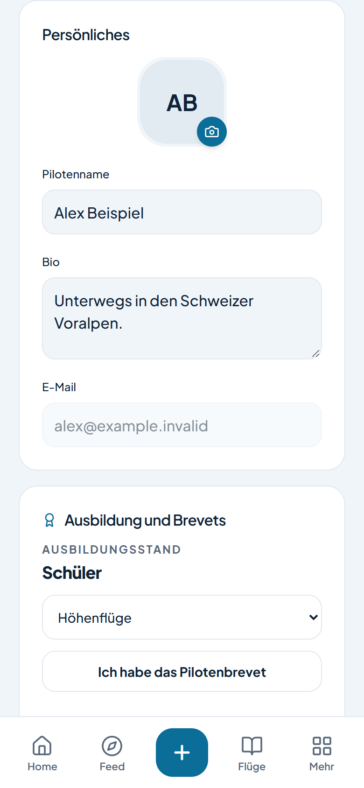

1. Scrolle im **Profil** zum Abschnitt mit Profilbild und **Pilotenname**. Im Bild siehst du den Eingabebereich unterhalb der Profilübersicht.

2. Passe den Pilotenname an und ergänze optional eine kurze Beschreibung. Die angezeigte E-Mail-Adresse ist hier kein bearbeitbares Profilfeld.

3. Ergänze bei Bedarf **SHV-Nummer**, **Flugschule** und die Daten bestandener Prüfungen. Lass unbekannte oder noch nicht zutreffende Angaben leer.

4. Scrolle bis zur Schaltfläche **Profil speichern** und bestätige deine Änderungen. Die Schaltfläche liegt unter weiteren Profilbereichen.

5. Öffne das Profil erneut und kontrolliere die geänderten Angaben. Ein bearbeitetes Textfeld allein bedeutet noch keine gespeicherte Änderung.
:::

### Das Profil pflegen

1. Öffne dein Profil und die angebotene Bearbeitungsfunktion.
2. Prüfe Pilotennamen und Beschreibung. Verwende einen Namen, unter dem dich deine Gruppe wiedererkennt.
3. Ergänze Bilder und Schirmangaben, wenn du sie verwenden möchtest.
4. Hinterlege Ausbildungs- oder Prüfungsangaben nur, wenn sie zutreffen.
5. Bestätige Änderungen mit der zugehörigen Speicheraktion und kontrolliere die Anzeige.

### Ausbildung, Brevets und weitere Ziele

::: schritte Deinen Ausbildungsstand im Profil prüfen
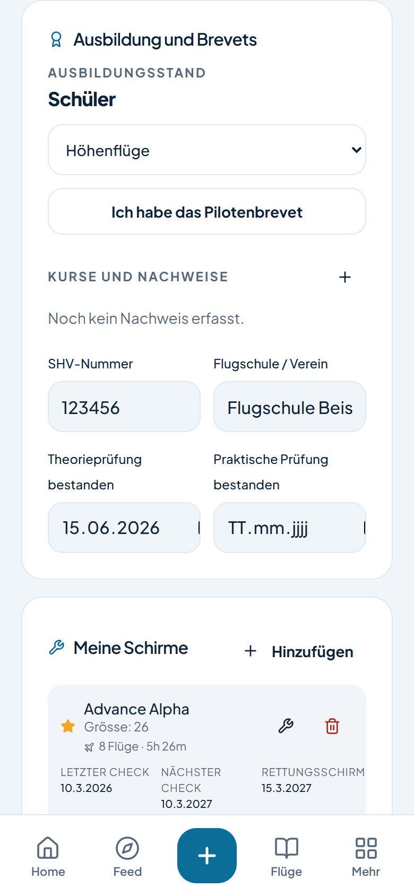

1. Öffne **Mehr → Profil** und scrolle zu **Ausbildung und Brevets**.
2. Prüfe deinen Stand. Schülerstufen sind **Grundausbildung**, **Höhenflüge** und **Prüfungsreif**; nach dem Pilotenbrevet lautet der Stand **Pilot**.
3. Als Schüler einer Schule liest du die schulisch gesetzte Stufe. Ohne schulische Zuständigkeit kannst du deine Stufe selbst auswählen. Die Auswahl wird unmittelbar gespeichert.
4. Nach tatsächlich erworbenem Pilotenbrevet verwende **Ich habe das Pilotenbrevet**. Ergänze Disziplin, Ausstellungsdatum und gegebenenfalls Brevetnummer und bestätige **Als Pilot speichern**. Eine Selbstangabe ersetzt keine Schulbestätigung.
5. Als Pilot kannst du weitere **Brevets** erfassen und unter **Ich arbeite hin auf** ein angebotenes Ziel wählen. Ohne weiteren Ausbildungsweg wähle **Kein Ziel**.
:::

Die angebotenen Ziele berücksichtigen bereits erfasste Brevets. Dazu gehören Biplace 1, Biplace 3 und bei vorhandenem Biplace 3 dessen Erneuerung. Sicherheitstraining und andere datierte Kursnachweise stehen im gleichen Bereich. Halte die tatsächlichen Daten fest, weil davon zeitbezogene Anforderungen abhängen können. Einstellungen zeigen deinen Stand an und führen mit **Im Profil ändern** hierher.

### Eigene Schirme hinterlegen

Erfasse Hersteller, Modell und gegebenenfalls Grösse. Markiere bei Bedarf den hauptsächlich verwendeten Schirm als Standard. Diese Angaben erleichtern die Auswahl im Flugformular. Kontrolliere bei einem Schirmwechsel trotzdem jeden neuen Eintrag.

Prüf- und Packdaten dienen deiner Übersicht. Erfasse sie anhand deiner Unterlagen und beachte, ob das Feld einen erfolgten oder einen fälligen Termin bezeichnet. Ein App-Eintrag ersetzt weder Prüfnachweis noch Wartung. Veraltete Daten können unpassende Hinweise erzeugen; aktualisiere sie nach einer erfolgten Prüfung.

::: schritte Einen eigenen Schirm hinterlegen
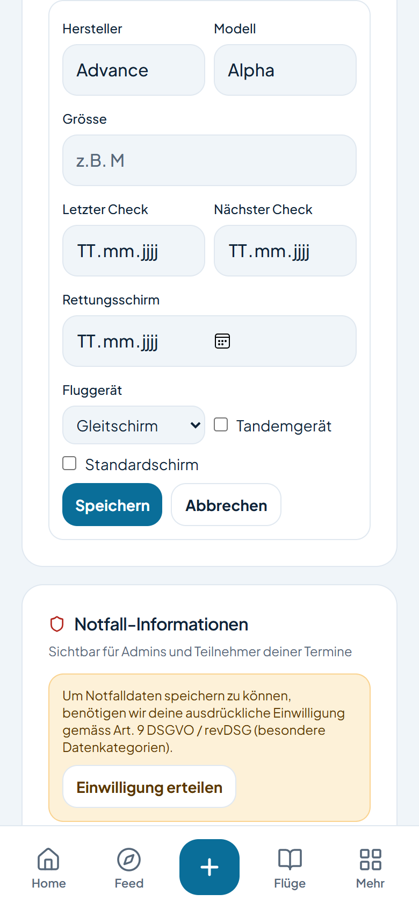

1. Scrolle im **Profil** zu **Meine Schirme** und tippe dort **Hinzufügen**.

2. **Pflicht: Hersteller und Modell.** Fülle beide Felder aus, beispielsweise **Advance** und **Alpha**. Erst dann lässt sich der neue Schirm speichern.

3. **Optional:** Ergänze die Grösse und die Datumsfelder für letzten Check, nächsten Check und Retterpacken. Richte dich nach der genauen Feldbezeichnung.

4. Aktiviere **Standardschirm**, wenn dieser Schirm bei neuen Flügen bevorzugt verwendet werden soll.

5. Tippe auf **Speichern direkt im Schirmformular**. Diese Aktion ist getrennt vom Speichern der übrigen Profilangaben.

6. Prüfe, ob der Schirm in **Meine Schirme** erscheint, und kontrolliere seine Auswahl beim nächsten neuen Flug.
:::

### Tandemflüge und Passagierbestätigung

Bei entsprechender Ausbildung, einem Tandemschirm oder einem bereits als Tandem gespeicherten Flug bietet das Flugformular zusätzliche Tandemfelder. Erfasse die tatsächlich verwendete Disziplin und Tandemart. Nach dem Speichern zeigt die Flugansicht den Passagierbereich.

Trage den Namen des Passagiers ein und speichere ihn. Verwende danach den angebotenen Bestätigungslink oder QR-Code. Der Passagier prüft die angegebenen Flugdaten und bestätigt selbst; ein gespeicherter Name allein ist keine Bestätigung. Den Stand liest du anschliessend in der Flugansicht. Nach Änderungen an bereits bestätigten Daten kann ein Hinweis erscheinen. Lege nur echte Flüge und zutreffende Passagierangaben an.

### Notfall- und Gesundheitsangaben

Lies die dazugehörigen Hinweise und die angebotene Einwilligung sorgfältig. Pflege den Notfallkontakt aktuell und informiere die Kontaktperson. Trage medizinische Angaben nicht zusätzlich in eine öffentliche Biografie, einen Feed-Kommentar oder ein frei geteiltes Bild ein.

Die XContest-Anbindung wird ebenfalls im Profil angeboten. Lies vor der Datenübernahme Kapitel 17. Ein Profilwechsel beziehungsweise eine andere Anmeldung kann einen anderen Datenbestand anzeigen.

## 17 · Vorhandene Flüge importieren

### Excel-Datei vorbereiten

**Weg:** **Mehr → Einstellungen → Daten importieren → Flüge importieren**.

Der Import liest **.xlsx**- und **.xls**-Dateien. Im aktuellen Stand wird das erste Tabellenblatt verarbeitet. Spaltenüberschriften müssen zum vorgesehenen Format passen; beliebig benannte Felder werden nicht automatisch vollständig zugeordnet.

| Spaltenname | Inhalt |
| --- | --- |
| Datum | Flugdatum; Zeilen ohne diesen Wert werden nicht als Flug übernommen |
| Start | Name des Startplatzes |
| Start Land | Land des Startplatzes |
| Landung | Name des Landeplatzes |
| Landung Land | Land des Landeplatzes |
| Flugdauer | Dauer, beispielsweise 00:48 |
| Km | Strecke in Kilometern |
| Gleitschirm | Schirmbezeichnung |
| Beschreibung | Kommentar zum Flug |

### XContest und einzelne IGC-Dateien

Die XContest-Anbindung im Profil ist ein anderer Importweg. Richte sie über die vorgesehenen Felder ein und beachte die Synchronisationsmeldungen. Prüfe nach der Übernahme einige Flüge. Zugangsdaten gehören ausschliesslich in die vorgesehenen Felder, nicht in Kommentare.

Für eine einzelne Aufzeichnung verwendest du den IGC-Import im Flugformular. Dieser Weg ergänzt einen Flug um Trackdaten und ist nicht mit einem Tabellenimport gleichzusetzen.

::: schritte Eine Flugdatei zur Vorschau auswählen
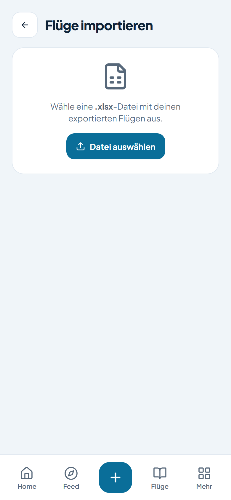

1. Öffne **Mehr → Einstellungen → Flüge importieren**.

2. Bereite die Excel-Datei gemäss der Spaltentabelle in diesem Kapitel vor.

3. Tippe **Datei auswählen** und wähle die Datei vom Gerät.

4. Kontrolliere in der anschliessenden Vorschau Anzahl Flüge, Datum, Start, Landung und Dauer.

5. Starte den Import erst nach dieser Kontrolle. Prüfe das Ergebnis anschliessend im Flugbuch; die reine Dateiauswahl importiert noch nichts.
:::

::: schritte Die Importvorschau kontrollieren
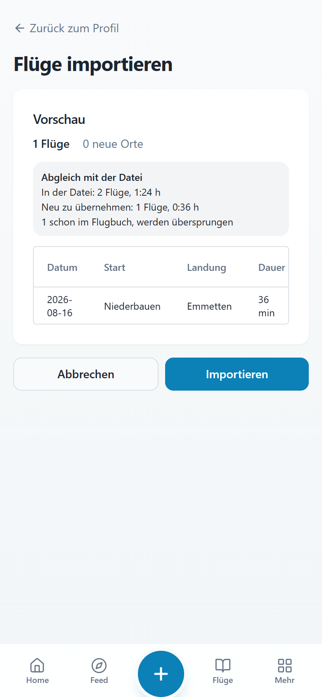

1. Nach der Dateiauswahl zeigt **Vorschau** die erkannten Flüge und neu anzulegenden Orte.

2. Vergleiche eine Beispielzeile mit der Originaldatei: Datum, Startplatz, Landeplatz und Dauer. Im Beispiel muss aus 00:48 die Angabe **48 min** werden.

3. Bei mehreren Spalten oder Einträgen scrolle innerhalb der Tabelle. Prüfe insbesondere ungewohnte Datums- oder Zeitformate.

4. Wenn etwas falsch ist, tippe **Abbrechen**, korrigiere die Quelldatei und wähle sie erneut aus.

5. Stimmt die Vorschau, bestätige **Importieren**. Warte auf die Ergebnisanzeige und prüfe die übernommenen Einträge im Flugbuch.

6. Neu angelegte Orte benötigen gegebenenfalls noch korrekte Koordinaten. Wiederhole den gesamten Flugimport nicht, um nur die Ortsdaten zu ergänzen.
:::

### Nach dem Import

Neu aus Namen angelegte Orte können zunächst unvollständige Positionsdaten besitzen. Korrigiere deren Koordinaten in der Ortsverwaltung. Importiere dieselbe Datei nicht nochmals, nur weil die Karte unvollständig ist. Prüfe vor einer Wiederholung, welche Flüge bereits übernommen wurden.

## 18 · Einstellungen, Mitteilungen und Export

**Weg:** **Mehr → Einstellungen** beziehungsweise **Mehr → Mitteilungen**.

::: schritte Sprache und Darstellung einstellen
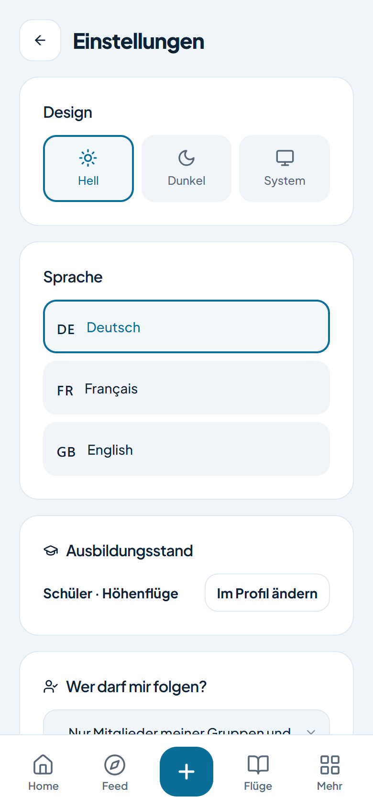

1. Öffne **Mehr → Einstellungen**.

2. Tippe unter **Design** auf **Hell**, **Dunkel** oder **System**. Die Änderung erfolgt direkt.

3. Wähle unter **Sprache** die gewünschte Sprache. Es ist kein zusätzlicher Speichern-Knopf nötig.

4. Prüfe bei **Ausbildungsstand** deine aktuelle Anzeige. **Im Profil ändern** öffnet den Bereich **Ausbildung und Brevets**; die Einstellungen bieten keine eigene Stufenauswahl mehr.

5. Scrolle weiter nach unten, um Export, Import und Kontoaktionen zu erreichen.
:::

### Darstellung und Sprache

Wähle helles, dunkles oder systemabhängiges Erscheinungsbild. Die Auswahl wird unmittelbar angewendet. Dieses Handbuch verwendet das helle Design für eine gute Lesbarkeit auch im Druck. Die Position der Funktionen bleibt im dunklen Design grundsätzlich gleich.

Die angebotenen Sprachen sind Deutsch, Französisch und Englisch. Ein Sprachwechsel ändert die Oberfläche, nicht automatisch deine eigenen Kommentare. Auch diese Auswahl wirkt unmittelbar; eine zusätzliche allgemeine Speichern-Schaltfläche ist nicht nötig.

::: schritte Push-Mitteilungen aktivieren
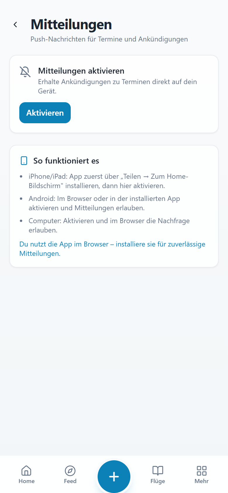

1. Öffne **Mehr → Mitteilungen** auf dem Gerät, das Nachrichten erhalten soll.

2. Lies die Hinweise zum verwendeten Gerät. Auf iPhone/iPad kann zuerst die Installation über **Zum Home-Bildschirm** erforderlich sein.

3. Tippe auf **Aktivieren** und beantworte die Berechtigungsabfrage des Browsers beziehungsweise Betriebssystems.

4. Prüfe den danach angezeigten Status. Falls angeboten, sende eine Testnachricht.

5. Die **Glocke im Feed** zeigt Aktivitätsmeldungen (Kapitel 10). Deine Chats stehen unter **Nachrichten**; dort gelten zusätzlich die Benachrichtigungseinstellungen je Kanal (Kapitel 25).
:::

### Push-Mitteilungen einrichten

Die Seite **Mitteilungen** dient der Einrichtung und Prüfung von Push-Benachrichtigungen. Sie ist nicht einfach eine Liste, auf der du Nachrichten als erledigt markierst.

1. Öffne Mitteilungen auf dem Gerät, auf dem du Hinweise erhalten möchtest.
2. Lies die Hinweise zur Browser- und Geräteunterstützung.
3. Wähle die Aktivierung und bestätige die Berechtigungsanfrage des Geräts.
4. Nutze bei aktivierter Funktion die Testnachricht.
5. Kommt nichts an, kontrolliere Browser- und Systemeinstellungen sowie die angezeigte Rückmeldung.

Eine abgelehnte Browserberechtigung lässt sich nicht immer durch erneutes Antippen in Flyary zurücksetzen. Prüfe dann die Website- beziehungsweise App-Berechtigungen deines Geräts. Anmeldung und Push-Erlaubnis sind getrennte Voraussetzungen.

::: schritte Dein Flugbuch exportieren
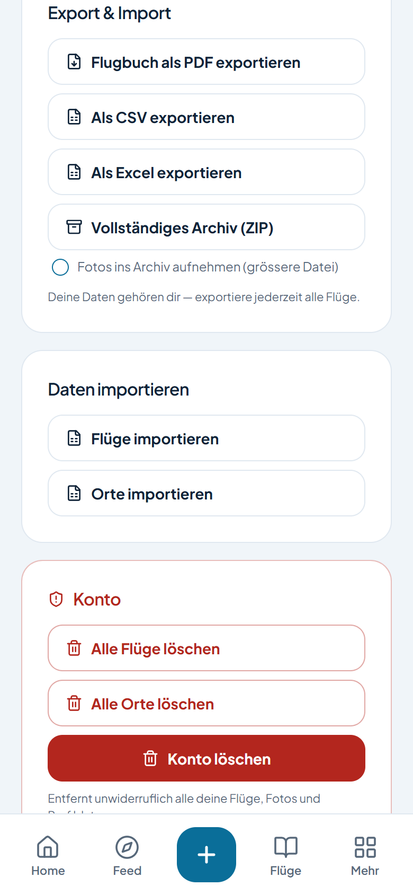

1. Öffne **Mehr → Einstellungen** und scrolle zu **Export & Import**.

2. Wähle **Flugbuch als PDF exportieren**, **Als CSV exportieren**, **Als Excel exportieren** oder **Vollständiges Archiv (ZIP)**. Bei Bedarf aktiviere **Fotos ins Archiv aufnehmen (grössere Datei)**.

3. Warte auf die Erstellung und verwende den Download- oder Teilen-Dialog deines Geräts.

4. Öffne die erzeugte Datei und prüfe Datum, Umfang und ein paar Beispielzeilen.

5. Unter **Daten importieren** führen **Flüge importieren** und **Orte importieren** zu anderen Vorgängen. Die roten Kontoaktionen benötigst du für den Export nicht.
:::

### Flugbuch exportieren

Unter **Einstellungen → Export & Import** stehen PDF-, CSV- und Excel-Exporte sowie **Vollständiges Archiv (ZIP)** bereit. Wähle das Format und warte auf die Fertigstellung. Wird eine Gruppenauswahl angeboten, kontrolliere sie vor dem Start.

Öffne die exportierte Datei und prüfe Auswahl, Einträge und Lesbarkeit. PDF eignet sich als lesbare Ausgabe, CSV für tabellarische Weiterverarbeitung. Die Einzeldateien PDF, CSV und Excel enthalten keine vollständige Mediensicherung. Das ZIP-Archiv bündelt diese Ausgaben, strukturierte Flugdaten, Änderungsverlauf, Bestätigungen, Brevets und IGC-Dateien. Fotos kommen nur mit aktivierter Fotooption hinzu; hochgeladene Videos sind nicht Bestandteil dieses Archivs. Bewahre Videooriginale separat auf. Lade das Archiv herunter, entpacke es und kontrolliere die enthaltene README sowie Stichproben der Dateien.

### Ausbildungsnachweis der Schule

Wenn du einen **Ausbildungsnachweis für den SHV** benötigst, wende dich an deine Flugschule. Die berechtigten Mitarbeitenden erstellen ihn aus deinem Schülerdossier. Diese Funktion gehört nicht zu deinem persönlichen PDF-Export in den Einstellungen.

Der Nachweis beruht auf den von der Schule erfassten Schulflügen und enthält unter anderem Flugtage, Fluggebiete sowie Übungshang- und Höhenflüge im gewählten Zeitraum. Startabbrüche zählen nicht als Flüge; für die Fluggebiete sind die erfassten Startplätze massgeblich. Das PDF enthält ein Feld für Stempel und Unterschrift der Schule.

Die Schulflugerfassung beginnt mit dem Flugtag-Cockpit am **25. September 2026**. Frühere eigene Flüge bleiben im persönlichen Flugbuch. Eine Übernahme nach Kapitel 27 erzeugt keinen zusätzlichen Schulflug; Änderungen an deinem persönlichen Eintrag korrigieren nicht den Schulnachweis. Besprich fehlende oder falsche Schulangaben direkt mit der Schule.

### Anmeldung und Löschfunktionen

Die Anmeldung erfolgt mit Google; die App bietet hier keine Flyary-Passwortänderung. Die Löschfunktionen stehen am Ende der Einstellungen. Lies genau, ob du einzelne Datenbestände oder das ganze Konto löschen würdest. Erstelle vor einer beabsichtigten Bereinigung einen geprüften Export; eine Löschung ist kein Schritt zur Behebung eines gewöhnlichen Ladefehlers.

### App-Version prüfen und aktualisieren

::: schritte Den aktuellen App-Stand laden
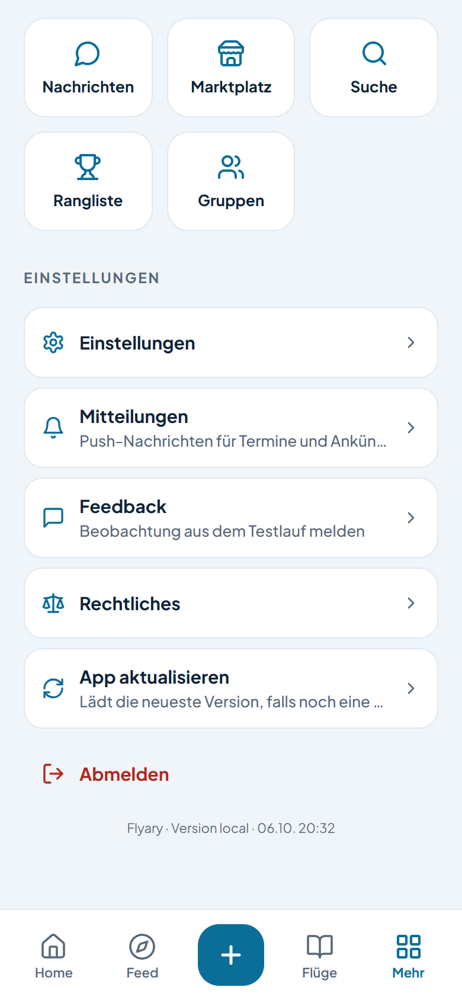

1. Öffne **Mehr** und scrolle bis zum Ende. Unter den Einstellungen steht die **Version** der App.

2. Sichere ungespeicherte Texte und kontrolliere noch offene Uploads, bevor du neu lädst.

3. Stelle eine Internetverbindung her und tippe auf **App aktualisieren**. Die App lädt anschliessend neu.

4. Öffne die betroffene Ansicht erneut und prüfe, ob die neue Funktion oder Korrektur sichtbar ist. Ohne Verbindung wird die manuelle Aktualisierung nicht ausgeführt.

5. Nenne bei einer Fehlermeldung auch die angezeigte Version im Feedback. Die Nummer der App ist unabhängig von der Version dieses Handbuchs.
:::

## 19 · Ohne Verbindung arbeiten

Flyary unterstützt eine lokale Warteschlange für neu erfasste Flüge. Das bedeutet nicht, dass jede Funktion offline vollständig verfügbar ist. Anmeldung, neue Serverdaten, externe Karten und Medien-Uploads können eine Verbindung benötigen.

### Drei Zustände auseinanderhalten

| Zustand | Bedeutung | Deine nächste Kontrolle |
| --- | --- | --- |
| Formularentwurf | Neue Eingabe lokal zwischengespeichert | Formular wieder öffnen und bewusst speichern |
| Offline gespeicherter Flug | Eintrag wartet lokal auf Übertragung | Synchronisationshinweis prüfen |
| Online gespeicherter Flug | Eintrag wurde auf dem Server angelegt | Flug und Medien im Flugbuch kontrollieren |

### Einen Flug offline erfassen

1. Öffne die bereits verfügbare App und lege einen neuen Flug an.
2. Erfasse Grunddaten, Werte und Texte.
3. Speichere und lies die Offline-Rückmeldung.
4. Behalte die App-Daten auf dem Gerät. Lösche weder Browserdaten noch die lokale Installation.
5. Stelle später eine Verbindung her und nutze die angebotene Synchronisation.
6. Kontrolliere den Eintrag danach im Flugbuch.

Die Warteschlange enthält Flugwerte, ausgewählte Lerninhalte und vorgesehene Linkangaben. Lokale Foto-, Video- und IGC-Dateien werden darüber nicht automatisch vollständig übertragen. Ergänze sie bei bestehender Verbindung und prüfe sie separat.

**Wenn die Synchronisation scheitert:** Prüfe Verbindung und Anmeldung und versuche die angebotene Übertragung erneut. Lege nicht vorsorglich denselben Flug mehrfach an. Kontrolliere zuerst, ob schon ein Online-Eintrag vorhanden ist.

Ein lokaler Entwurf kann bei einem Gerätewechsel fehlen. Arbeite wichtige Einträge deshalb fertig ab, bevor du dich auf einem anderen Gerät ausschliesslich auf die Serverdaten verlässt.

## 20 · Probleme gezielt lösen

### Schnellprüfung

| Beobachtung | Was du zuerst prüfst |
| --- | --- |
| Meine Flüge fehlen. | Konto, Suche, Filter, Datum und Offline-Warteschlange |
| Eine Liste lädt nicht. | Verbindung prüfen, Wiederholung nutzen, Seite neu öffnen |
| Bild oder Track fehlt. | Flug öffnen, Upload-Meldung prüfen, Originaldatei bei Verbindung ergänzen |
| Ein Ort liegt falsch. | Koordinaten und Typ kontrollieren, besonders nach Import |
| Die Statistik erscheint zu hoch. | Zeitraum und doppelte Flüge prüfen |
| Die Flugzeit ist falsch. | Minuten statt Stunden? Importformat überprüft? |
| Ein Termin fehlt. | Unter Mehr → Termine suchen; eine auf Home ausgeblendete Karte ist keine Abmeldung. Gruppenmitgliedschaft und Filter prüfen. |
| Keine Push-Hinweise. | Geräteberechtigung, Testnachricht und die Glockeneinstellung des betreffenden Chatkanals prüfen. |
| Eine neue Funktion fehlt. | Unter Mehr die Version prüfen und mit Verbindung App aktualisieren wählen. |
| Ein Kanal fehlt oder ist nicht beschreibbar. | Mitgliedschaft, Empfängerkreis, Archivierung und Hinweis «Hier schreibt nur das Team» prüfen. |
| Ein Lerninhalt fehlt. | Andere Stufen des Kontrollblatts aufklappen und Kategorien öffnen |
| Leere Wetterkarte. | Verbindung und Verfügbarkeit der externen Ansicht prüfen |

### Ein Speicherproblem behandeln

Lies die Fehlermeldung, bevor du weiterarbeitest. Prüfe im Zielbereich, ob der Eintrag teilweise vorhanden ist. Bei einem Flug können Grunddaten gespeichert sein, während der Medien-Upload fehlgeschlagen ist. Eine Neuerfassung kann dann ein Duplikat erzeugen.

Lade die App erst neu, wenn du wichtige ungespeicherte Texte gesichert hast. Lokale Entwürfe helfen bei bestimmten Formularen, sind aber keine allgemeine Wiederherstellung für jede Eingabe.

### Hilfreiches Feedback senden

Über **Mehr → Feedback** erreichst du den vorgesehenen Rückmeldeweg. Beschreibe Seite, Arbeitsschritte und Fehlermeldung. Nenne Gerät, Browser und Zeitpunkt, soweit bekannt. Ein Screenshot sollte die Meldung zeigen, aber keine unnötigen privaten Angaben.

Ein gutes Beispiel: «Unter Flüge habe ich einen Eintrag geöffnet und ein Foto ergänzt. Nach Speichern erschien eine Upload-Fehlermeldung. Der Flug ist vorhanden, das Foto fehlt. Android, Chrome, heute etwa 16:30 Uhr.» Das hilft mehr als «Die App geht nicht».

Gib niemals dein Passwort oder vollständige Zugangsdaten in einer Rückmeldung weiter. Für die Diagnose reichen normalerweise Ablauf und Fehlermeldung.

## 21 · Gruppen, Suche und Community

::: schritte Eine Gruppe öffnen oder beitreten
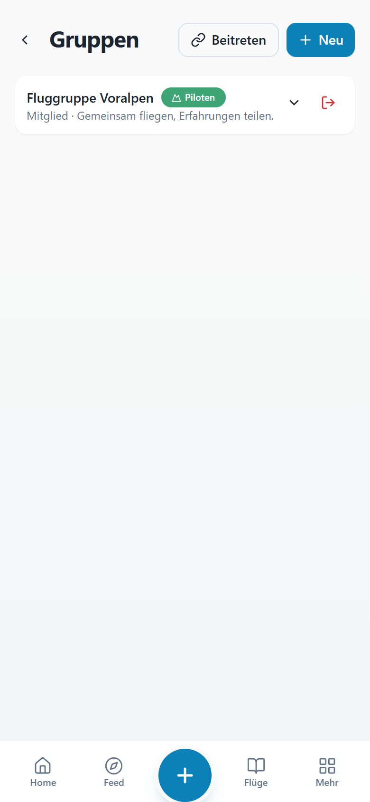

1. Öffne **Mehr → Gruppen**.

2. Tippe eine vorhandene Gruppe an, um ihre Details und verfügbaren Aktionen zu sehen.

3. Für eine Einladung wähle **Beitreten** und gib den erhaltenen Einladungscode ein.

4. Bestätige den Beitritt und prüfe, ob die richtige Gruppe anschliessend in deiner Übersicht erscheint.

5. **+ Neu** erstellt eine eigene Gruppe, sofern verfügbar. Das ist nicht der Beitritt zu einer bestehenden Schule.
:::

### Einer Gruppe beitreten

**Weg:** **Mehr → Gruppen**.

1. Öffne eine Einladung oder die Beitrittsfunktion in der Gruppenübersicht.
2. Gib den Einladungscode vollständig ein, falls er nicht bereits übernommen wurde.
3. Prüfe die Rückmeldung und öffne danach die Gruppe.
4. Kontrolliere, ob du die erwartete Gruppe beziehungsweise Schule erreicht hast.

Bei ungültigem Code prüfst du Schreibweise und versehentliche Leerzeichen. Frage nach einer aktuellen Einladung. Eine bestehende Mitgliedschaft erfordert keinen erneuten Beitritt.

Innerhalb einer Gruppe hängen Inhalte und Aktionen von Typ und Berechtigung ab. Der Chatbereich zeigt die für dich zugänglichen Kanäle. Ein Pilotenzugang enthält nicht automatisch Verwaltungsfunktionen. Wähle einen Kanal anhand seines Empfängerkreises (Kapitel 25), nutze Termine im vorgesehenen Zusammenhang und ordne neue Flüge bewusst zu.

### Eine eigene Pilotengruppe erstellen

1. Öffne **Mehr → Gruppen → + Neu**.
2. Erfasse den **Namen** der Gruppe und wähle den passenden Gruppentyp. Für eine private Fluggruppe verwendest du den Typ Pilotengruppe.
3. Ergänze optional eine Beschreibung, die Zweck und Zielgruppe erklärt.
4. Tippe **Erstellen** und prüfe die neue Gruppe in der Übersicht. Öffne sie für die verfügbaren Mitglieder- und Einladungsfunktionen.

Eine eigene Gruppe zu erstellen ist nicht dasselbe wie einer vorhandenen Flugschule beizutreten. Verwende dafür den Einladungscode der richtigen Schule. Verlasse eine Gruppe nur bewusst; dadurch kann sich ändern, welche Termine und Inhalte dir angezeigt werden.

### Die Suche verwenden

**Mehr → Suche** ist bereichsübergreifend. Je nach verfügbaren Daten kannst du nach Flügen, Orten, Terminen und Personen suchen und zwischen den Kategorien wechseln. Beginne mit einem markanten Namensteil und grenze die Treffer danach ein.

Ein fehlender Treffer bedeutet nicht zwingend, dass ein Konto oder Eintrag nicht existiert. Die Suche zeigt für dich verfügbare Daten. Kontrolliere Schreibweise und Kategorie, bevor du einen Datensatz neu anlegst.

::: schritte Über mehrere Bereiche suchen
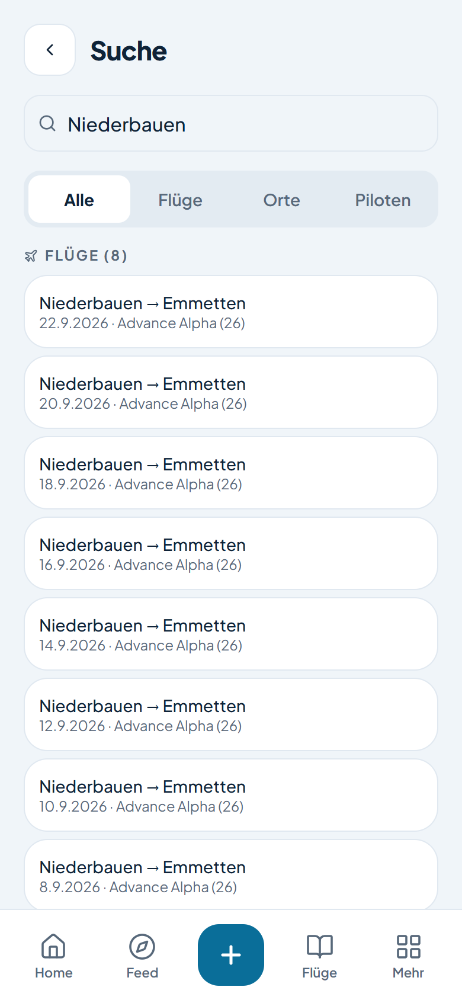

1. Öffne **Mehr → Suche**.

2. Gib einen eindeutigen Begriff ein, etwa **Niederbauen**.

3. Wähle **Alle** oder einen angebotenen Bereich, um die Treffer einzugrenzen. Die Suche berücksichtigt die für dich verfügbaren Daten.

4. Lies Trefferart und Kurzangaben. Derselbe Ortsname kann sowohl bei Flügen als auch bei Orten vorkommen.

5. Tippe das passende Ergebnis an. Wenn kein Treffer erscheint, kürze den Begriff und entferne einen zu engen Bereichsfilter.
:::

### Rangliste und Challenges

Die Rangliste vergleicht die angezeigten Kennzahlen und Zeiträume. Prüfe Filter und Einheit, bevor du Werte mit deiner Statistik vergleichst. Challenges bieten gemeinsame Ziele mit eigenen Zeiträumen und Bedingungen. Öffne ihre Beschreibung, statt allein aus dem Titel auf die Teilnahmebedingungen zu schliessen.

::: schritte Rangliste und öffentliches Profil nutzen
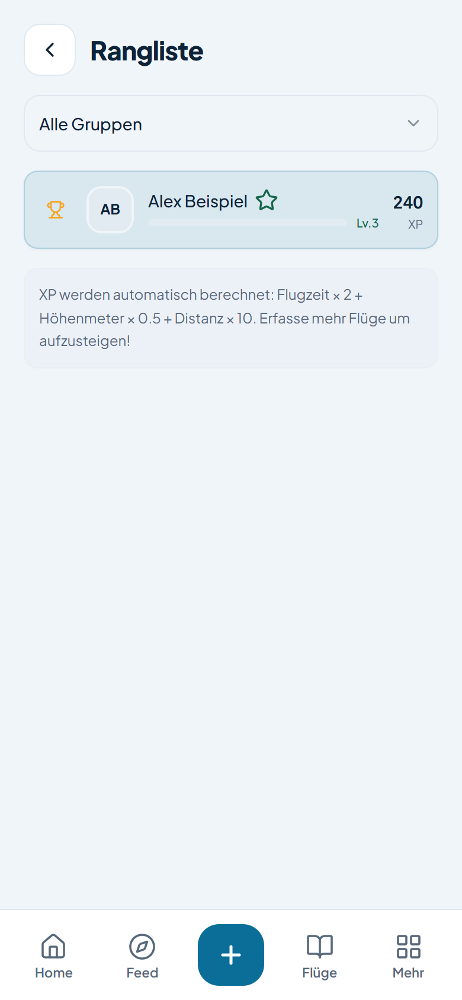

1. Öffne **Mehr → Rangliste**.

2. Wähle die gewünschte Gruppe beziehungsweise den angebotenen Vergleichsbereich.

3. Vergleiche **XP**, Level und Platzierung. Diese Werte beschreiben App-Aktivitäten und ersetzen keine Ausbildungsfreigabe.

4. Tippe einen Piloten an, um dessen öffentliches Profil zu öffnen. Dort kannst du – sofern angeboten – **Folgen** oder das Folgen wieder beenden.

5. Öffne eine angebotene **Challenge**, lies Zeitraum und Ziel und prüfe ihren Fortschritt. Nicht jedes Konto oder jede Gruppe zeigt dieselben Challenges.
:::

### Ziele einer Challenge bearbeiten

Öffne eine verfügbare Challenge und lies ihre Beschreibung sowie ein eventuell angegebenes Enddatum. Unter den Zielen kannst du einen Eintrag antippen, um deinen Erfüllungsstand umzuschalten. Kontrolliere anschliessend Häkchen, Zähler und Fortschritt. Markiere nur tatsächlich erledigte Ziele. Eine versehentliche Markierung kannst du durch erneutes Antippen zurücknehmen. Zusätzliche Bearbeitungs- und Löschaktionen für die Challenge hängen von deinen Rechten ab.

## 22 · Dein Ablauf nach einem Flug

### Die praktische Abschlussroutine

1. **Aufzeichnung sichern:** Originalaufzeichnung und ausgewählte Medien aufbewahren.
2. **Flug anlegen:** Plus öffnen, Datum, Schirm und Orte prüfen.
3. **Werte kontrollieren:** IGC-Datei übernehmen oder Flugzeit und weitere Werte erfassen.
4. **Lernen festhalten:** Beobachtung und nächste Frage an deine betreuende Person notieren.
5. **Zuordnung prüfen:** Richtige Gruppe wählen, wenn der Flug dort verfügbar sein soll.
6. **Speichern abschliessen:** Rückmeldung abwarten; offline später die Synchronisation prüfen.
7. **Ergebnis öffnen:** Eintrag im Flugbuch einschliesslich Bilder und Track kontrollieren.
8. **Teilen entscheiden:** Erst nach der Inhaltskontrolle im Feed veröffentlichen oder einen Link versenden.

### Regelmässige Pflege

Prüfe doppelte Einträge, unvollständige Orte und fehlende Flugzeiten. Aktualisiere Schirmdaten und persönliche Angaben nach Änderungen. Ein monatlicher Blick ins Flugbuch ist oft hilfreicher als eine grosse Bereinigung am Jahresende.

Erstelle vor grösseren Importen oder Bereinigungen einen Export und öffne die Datei zur Kontrolle. Verwechsle das Entfernen eines Ziels, eines Feed-Beitrags oder einer Gruppenzuordnung nicht mit dem Löschen eines Fluges.

### Begriffe kurz erklärt

| Begriff | Bedeutung |
| --- | --- |
| Flugbuch | Deine gespeicherten Flugeinträge |
| IGC | Datei mit einer aufgezeichneten Flugspur und zugehörigen Daten |
| Track | Geografische Spur einer Aufzeichnung |
| Feed | Ansicht geteilter Aktivitäten |
| Entwurf | Noch nicht abgeschlossene lokale Eingabe |
| Synchronisation | Übertragung lokaler Einträge zum Server |
| Kontrollblatt | Übersicht der Trainingsinhalte und Bewertungen |
| Freigabelink | Link zu einer ausdrücklich geteilten Flugansicht |

**Dokumentstand:** 6. Oktober 2026. Beschrieben ist der Funktionsstand des zugehörigen Flyary-Repositories. Plattformabhängige Dialoge und externe Dienste können abweichen. Dieses Handbuch erklärt die App-Bedienung; es ist kein Ausbildungsnachweis und ersetzt keine fliegerische Ausbildung.

## 23 · Flugvorlagen für wiederkehrende Flüge

Eine Vorlage spart wiederholte Eingaben für Startplatz, Landeplatz, Schirm und Gruppe. Sie speichert weder einen geflogenen Flug noch eine vollständige Aufzeichnung mit Messwerten und Medien.

### Vorlage, Entwurf und Kopie unterscheiden

| Funktion | Zweck | Was du danach prüfst |
| --- | --- | --- |
| Vorlage | Wiederkehrende Grundkonfiguration laden | Plätze, Schirm und Gruppe; neue Flugwerte ergänzen |
| Entwurf | Unterbrochene Eingaben auf demselben Gerät fortsetzen | Vollständigkeit der Felder und Medienauswahl |
| Flug duplizieren | Einen neuen Eintrag aus ausgewählten Daten eines gespeicherten Flugs erstellen | Datum, Flugwerte, Übungen sowie separat benötigte Medien und Track |

Eine nicht mehr benötigte Vorlage entfernst du über das kleine Löschsymbol an ihrem Namen im Vorlagenbereich. Bereits gespeicherte Flüge sind davon unabhängig.

::: schritte Eine Vorlage anlegen und wiederverwenden
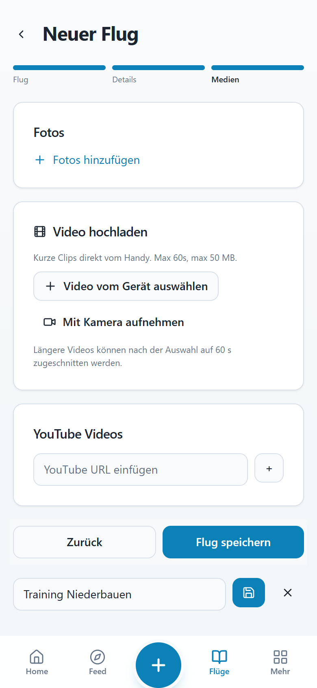

1. Fülle im neuen Flug zuerst Startplatz, Landeplatz, Schirm und gegebenenfalls Gruppe so aus, wie du sie künftig übernehmen möchtest.

2. Wechsle zu **Medien** und scrolle zu **Als Vorlage speichern**. Tippe darauf, um das Namensfeld einzublenden.

3. **Pflicht für die Vorlage: Name.** Gib einen verständlichen Namen ein, etwa **Training Niederbauen**.

4. Bestätige die separate Speicheraktion für die Vorlage. Zum Erfassen des tatsächlichen Flugs musst du zusätzlich **Flug speichern** verwenden.

5. Beim nächsten neuen Flug erscheinen vorhandene Vorlagen oben im Schritt **Flug**. Tippe den gewünschten Namen an und prüfe die übernommenen Werte.

6. Erfasse Datum, Dauer, Strecke, Kommentar und Medien passend zum neuen Flug. Eine Vorlage liefert diese flugspezifischen Angaben nicht.
:::

## 24 · Start- und Landeplätze aus CSV importieren

**Weg: Mehr → Einstellungen → Orte importieren.** Der Ortsimport ist ein anderer Vorgang als der Excel-Import von Flügen. Er verarbeitet Ortsdaten aus einer passend aufgebauten CSV-Datei.

### Die CSV-Datei vorbereiten

Die erste Zeile enthält Spaltenüberschriften, die Datenzeilen verwenden Kommas als Trennzeichen. Ein Koordinatenpaar mit einem inneren Komma muss als zusammengehöriges CSV-Feld in Anführungszeichen stehen.

| Spalte | Erwarteter Inhalt |
| --- | --- |
| name | Ortsname; Präfix SP für Startplatz, LP für Landeplatz, jeweils mit Leerzeichen |
| coordinates | Längengrad zuerst, danach Breitengrad, beispielsweise [8.530,46.929] |
| altitude | Höhe als ganze Zahl in Metern, soweit bekannt |
| country | Land, möglichst zweistelliger Code wie CH |
| notes | Ergänzende Beschreibung, soweit vorhanden |

**Pflicht für einen sinnvollen Eintrag:** ein Name und korrekt vorbereitete Ortsdaten. Ohne SP- oder LP-Präfix wird der Ort als kombinierter Start- und Landeplatz eingelesen. Fehlende oder unlesbare Koordinaten können zu 0/0 führen; kontrolliere deshalb auch das Ergebnis auf der Karte. Die Datei muss zum hier beschriebenen Format passen; ein beliebiger CSV-Export eines anderen Systems ist nicht automatisch kompatibel.

::: schritte Ortsdatei prüfen und übernehmen
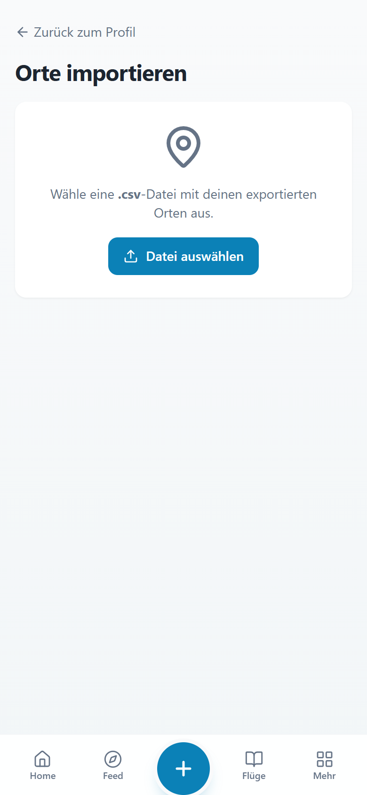

1. Öffne **Orte importieren** und wähle deine vorbereitete CSV-Datei.

2. Kontrolliere in der Vorschau Namen, Typen, Koordinaten und die Kennzeichnung neuer beziehungsweise vorhandener Orte.

3. Ein vorhandener Ort wird anhand seines Namens zugeordnet; Gross- und Kleinschreibung werden dabei nicht unterschieden. Prüfe gleichnamige Orte besonders sorgfältig.

4. Starte den Import erst nach der Kontrolle. Vorhandene Orte können dabei mit den importierten Angaben aktualisiert werden.

5. Warte auf die Ergebnisanzeige mit neu angelegten und aktualisierten Einträgen.

6. Öffne anschliessend **Mehr → Orte**. Prüfe bei einigen Einträgen Typ, Position und Beschreibung, bevor du sie neuen Flügen zuordnest.
:::

### Wenn die Vorschau nicht passt

Breche ab und korrigiere die Quelldatei, wenn Ortsnamen getrennt, Koordinaten vertauscht oder unerwartete Dubletten angezeigt werden. Führe nicht mehrfach denselben Import aus, um eine fehlerhafte Vorschau zu umgehen. Bei bestehenden Einträgen werden unter anderem der Typ und verwertbare zusätzliche Angaben aktualisiert; der Import ist deshalb nicht ausschliesslich ein Hinzufügen neuer Orte.

## 25 · Nachrichten, Kanäle und persönliche Gespräche

**Weg: Nachrichtensymbol auf Home oder im Feed, alternativ Mehr → Nachrichten.** Hier kommen deine Gruppen-, Schul-, Termin-, Marktplatz- und Direktnachrichten zusammen. Die Glocke im Feed bleibt der separate Eingang für Aktivitäten wie Reaktionen und Kommentare.

::: schritte Den Nachrichteneingang nutzen
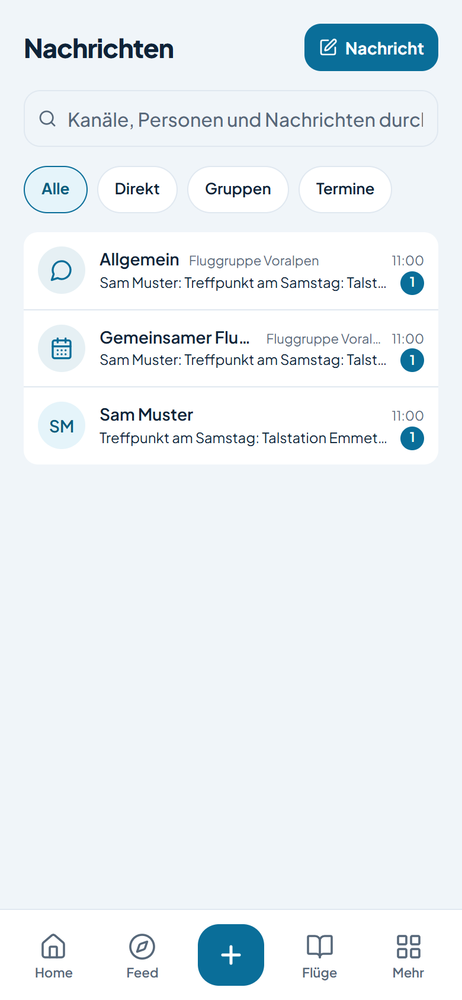

1. Öffne **Nachrichten** und lies die Titel der Gespräche. Bei Gruppen- und Terminkanälen hilft der Gruppenname bei der Zuordnung.

2. Prüfe letzte Nachricht und Ungelesen-Zähler. Die Reihenfolge orientiert sich an der letzten Aktivität; archivierte Kanäle stehen hinten.

3. Nutze die angebotenen Filter, etwa **Direkt**, **Gruppen**, **Schule** oder **Termine**. Es erscheinen nur Filter für vorhandene Gespräche.

4. Tippe auf einen Eintrag, um den Verlauf zu öffnen. Das Lesen aktualisiert den Ungelesen-Zähler und ersetzt keine ausdrücklich angeforderte Bestätigung.
:::

### Wer eine Nachricht lesen kann

**Allgemein** richtet sich an die Mitglieder der betreffenden Gruppe. Schulkanäle können für Schüler, einzelne Ausbildungsstufen oder ausgewählte Personen bestimmt sein. Der interne Team-Kanal einer Schule ist nicht automatisch für Schüler sichtbar. Schulleitung, Instruktoren und Administratoren können alle Gruppenkanäle ihrer Schule sehen; ein Kanal für ausgewählte Personen ist deshalb kein persönlicher Zweierchat.

Für ein persönliches Gespräch verwendest du eine **Direktnachricht**. Im **Terminchat** bleiben Absprachen einem konkreten Flugtag zugeordnet. Prüfe vor dem Senden den Namen und Empfängerkreis im Kopf. Archivierte Kanäle bleiben lesbar, nehmen aber keine neuen Nachrichten an. Bei **Hier schreibt nur das Team** können gewöhnliche Mitglieder mitlesen, aber nicht schreiben.

::: schritte In einem Kanal schreiben und Personen erwähnen
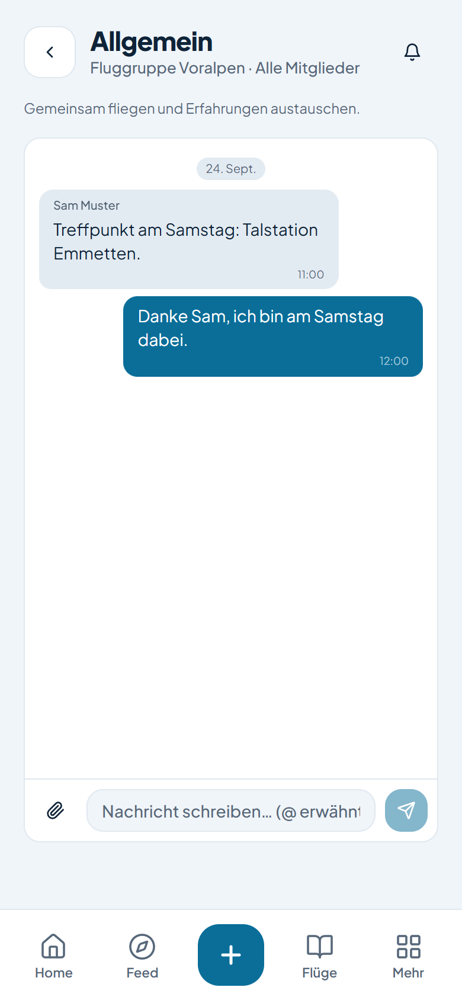

1. Prüfe Kanalname, Gruppe und Empfängerkreis oben in der Ansicht.

2. Schreibe deine Nachricht in das Eingabefeld. Halte Terminfragen im entsprechenden Terminchat.

3. Tippe **@** und wähle eine Person aus den Namensvorschlägen, wenn du sie gezielt ansprechen möchtest.

4. Über das Anhangsymbol kannst du ein Bild oder eine unterstützte Datei auswählen. Prüfe die Vorschau und den Empfängerkreis.

5. Tippe auf **Senden** und kontrolliere den Verlauf. Ein Text im Eingabefeld allein wurde noch nicht versendet.
:::

### Ankündigungen ausdrücklich bestätigen

Berechtigte Personen können Ankündigungen senden und eine Bestätigung verlangen. Lies die Nachricht vollständig und verwende anschliessend die angebotene Bestätigung. Das Öffnen des Kanals und eine Emoji-Reaktion ersetzen diesen Schritt nicht. Eine fehlende Bestätigung bedeutet umgekehrt nicht zwingend, dass die Nachricht ungelesen ist.

::: schritte Nachrichtenaktionen öffnen
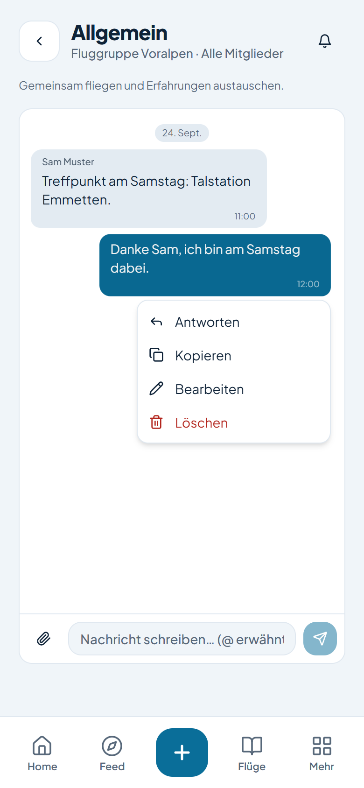

1. Tippe eine Nachrichtenblase kurz an, um die Emoji-Reaktionen zu öffnen. Die erneute Auswahl einer eigenen Reaktion entfernt sie.

2. Halte die Nachricht länger gedrückt; am Computer öffnet ein Rechtsklick die weiteren Aktionen.

3. Wähle **Antworten**, um dich auf diese Nachricht zu beziehen, oder **Kopieren**, um ihren Text zu übernehmen.

4. Bei einer eigenen Nachricht kannst du **Bearbeiten** wählen, den Text korrigieren und speichern. Der Verlauf kennzeichnet den bearbeiteten Eintrag.

5. **Löschen** entfernt eine Nachricht erst nach Bestätigung und ist nur mit entsprechender Berechtigung verfügbar. Kontrolliere vorher den richtigen Eintrag.
:::

::: schritte Mit Bezug auf eine Nachricht antworten
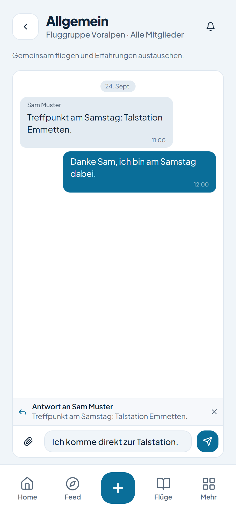

1. Öffne die Aktionen der Nachricht und wähle **Antworten**.

2. Prüfe das Zitat und den Namen über dem Eingabefeld. So erkennst du, auf welche Aussage deine Antwort Bezug nimmt.

3. Schreibe die Antwort und tippe auf **Senden**. Sie erscheint im selben Gespräch mit Bezug zur Originalnachricht.

4. Mit dem Kreuz am Zitat entfernst du den Antwortbezug, bevor du sendest. Eine zitierte Nachricht macht deine Antwort nicht zu einer Direktnachricht.
:::

::: schritte Eine Direktnachricht beginnen
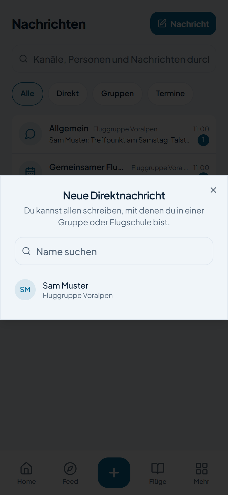

1. Tippe im Nachrichteneingang oben auf **Nachricht**.

2. Suche die gewünschte Person. Du kannst Personen anschreiben, mit denen du eine Gruppe oder Flugschule teilst.

3. Tippe auf den Namen. Prüfe den Empfänger im Kopf des geöffneten Gesprächs.

4. Schreibe und sende deine Nachricht. Das Gespräch ist anschliessend im gemeinsamen Nachrichteneingang verfügbar.
:::

::: schritte Benachrichtigungen je Gespräch einstellen
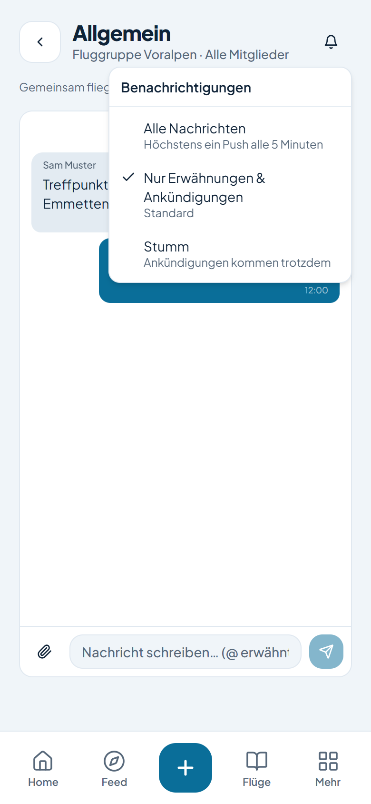

1. Öffne den Kanal und tippe oben auf die **Glocke** für **Benachrichtigungen**.

2. **Alle Nachrichten** benachrichtigt dich über gewöhnliche Nachrichten; Push-Mitteilungen werden auf höchstens eine alle fünf Minuten gebündelt.

3. **Nur Erwähnungen & Ankündigungen** ist die Standardeinstellung für Gruppen- und Terminkanäle.

4. **Stumm** schaltet gewöhnliche Nachrichten stumm. Ankündigungen kommen weiterhin. In Direktnachrichten stehen **Alle Nachrichten** und **Stumm** zur Auswahl.

5. Prüfe die Rückmeldung nach der Auswahl. Zusätzlich muss Push auf deinem Gerät erlaubt sein; die Einrichtung findest du unter **Mehr → Mitteilungen**.
:::

Stummgeschaltete und archivierte Kanäle zählen nicht zum gemeinsamen Ungelesen-Zähler am Nachrichtensymbol. In der Kanalliste kann dennoch eine Zahl ungelesener Nachrichten stehen. Eine fehlende Push-Mitteilung beweist deshalb nicht, dass keine Nachricht eingegangen ist.

::: schritte Nachrichten wiederfinden
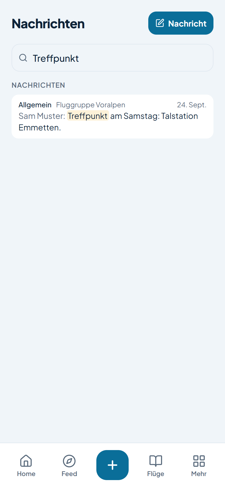

1. Öffne den Nachrichteneingang und gib einen Begriff in **Kanäle, Personen und Nachrichten durchsuchen** ein.

2. Ab zwei Zeichen sucht die App auch im Nachrichtentext aller für dich lesbaren Kanäle.

3. Vergleiche bei einem Treffer Kanal, Verfasser, Datum und Textausschnitt.

4. Tippe den Treffer an, um das Gespräch zu öffnen. Die aktuelle Ansicht lädt bis zu 200 Nachrichten; sehr alte Treffer sind darin möglicherweise nicht direkt sichtbar.

5. Leere das Suchfeld, um zur normalen Liste und ihren Filtern zurückzukehren.
:::

## 26 · Marktplatz: Material suchen, inserieren und verkaufen

**Weg: Mehr → Marktplatz.** Flyary vermittelt Kleinanzeigen. Kauf, Zahlung und Übergabe vereinbarst du direkt mit der anderen Partei. Die App bietet keinen Bezahlvorgang, Käuferschutz oder Versanddienst. Die hier gezeigten Inserate sind fiktive Beispiele; in einigen Aufnahmen fehlen Produktfotos. Für ein tatsächliches Verkaufsangebot verlangt Flyary mindestens ein Foto.

### Suchen und Angebote prüfen

::: schritte Den Marktplatz durchsuchen
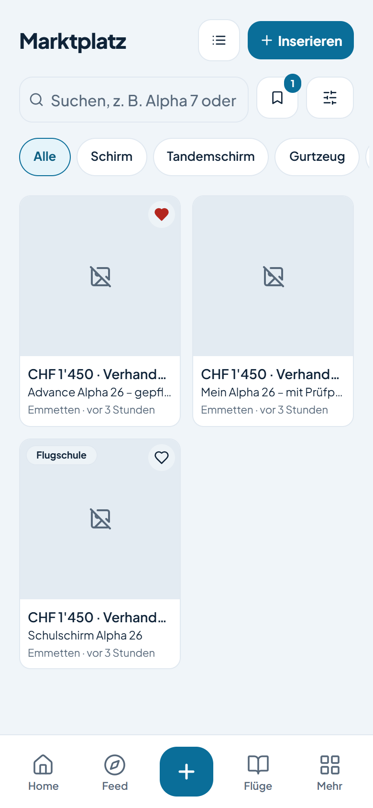

1. Öffne **Marktplatz** und gib bei Bedarf Hersteller, Modell oder einen Suchbegriff ein.
2. Wähle eine Kategorie, etwa **Schirm**, **Gurtzeug**, **Retter** oder **Instrumente**.
3. Vergleiche Preis, Ort und Kennzeichnung. **Gesucht** bezeichnet ein Gesuch; **Flugschule** kennzeichnet ein Schulangebot.
4. Tippe ein Inserat an. Der Listenpreis allein sagt nichts über Zustand oder Eignung aus.
:::

::: schritte Filter und Umkreis einstellen
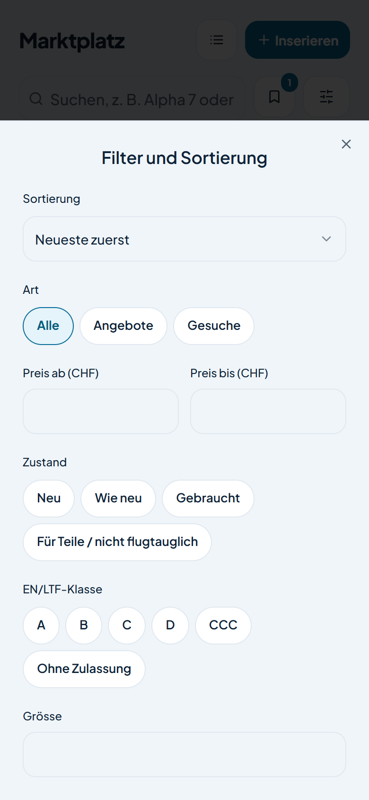

1. Öffne **Filter** und wähle Angebote oder Gesuche, Zustand und weitere passende Kriterien.
2. Grenze den Preis in CHF sowie Grösse, Kanton oder EN/LTF-Klasse ein. Die verfügbaren Filter hängen teilweise von der Kategorie ab.
3. Für eine örtliche Suche trägst du **Umkreis um PLZ** ein und wählst den Umkreis. Wird die PLZ nicht erkannt, meldet die App dies und sucht ohne Umkreis.
4. Mit **Startgewicht (kg)** kannst du Schirme nach passendem Gewichtsbereich filtern. Diese Angabe ersetzt keine Beurteilung des Materials.
5. Wähle Sortierung und gegebenenfalls **Nur Flugschulen**, dann **Anwenden**. **Zurücksetzen** entfernt die Einschränkungen.
:::

::: schritte Ein Inserat vollständig lesen
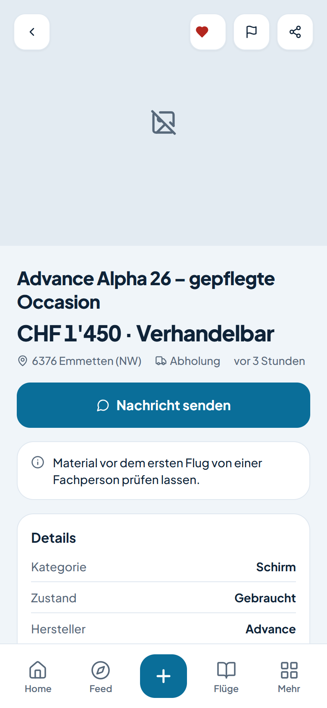

1. Prüfe Titel, Preisart und Status. **Reserviert** bedeutet nicht, dass das Material noch frei angeboten wird.
2. Blättere durch vorhandene Fotos und lies Beschreibung, Grösse, Baujahr und Zustand.
3. Vergleiche die Merkmale der Kategorie, etwa Gewichtsbereich, EN/LTF-Klasse, Nachprüfung oder Packdatum.
4. Beachte die eingeblendeten Materialhinweise. **Für Teile / nicht flugtauglich** ist keine Freigabe für den Flugbetrieb.
5. Scrolle bis zu den Anbieterangaben. Angaben aus dem Flugbuch beziehen sich nur auf die dort erfassten Flüge.
:::

::: schritte Kontakt aufnehmen oder einen Link teilen
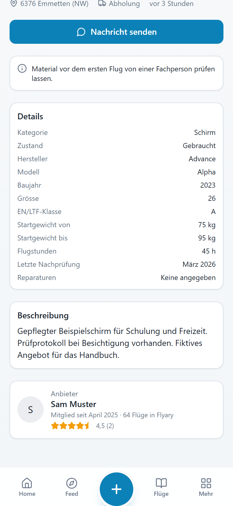

1. Prüfe den Anbieter und vorhandene Bewertungen. Bei einer Schule erscheinen zusätzlich ihre gewerblichen Anbieterangaben.
2. Tippe **Nachricht senden**. Es öffnet sich ein Gespräch zu genau diesem Inserat; eine gemeinsame Fluggruppe ist dafür nicht erforderlich.
3. Prüfe den vorbereiteten Nachrichtentext und sende deine Frage bewusst ab. Vereinbare Zustand, Besichtigung, Preis und Übergabe direkt im Chat.
4. Das Gespräch findest du anschliessend unter **Nachrichten**. Eine Inseratkarte führt zurück zum Angebot; nach dessen Entfernung kann sie **Anzeige nicht mehr online** zeigen.
5. Über **Teilen** erhältst du für aktive oder reservierte, allgemein sichtbare Inserate einen öffentlichen Link. Andere Personen können damit ohne Anmeldung lesen; zum Kontaktieren benötigen sie Flyary.
:::

Der öffentliche Link zeigt keinen Namen einer privaten verkaufenden Person und keine Kontaktfunktion. Schulangebote zeigen die Anbieterangaben der Schule. Auf die Schule beschränkte, verkaufte oder abgelaufene Inserate erhalten keine allgemein zugängliche Angebotsansicht. Das Teilen-Feld oder der Gerätedialog versendet noch keine Nachricht von selbst.

### Merken und über neue Angebote informiert bleiben

::: schritte Ein Angebot merken
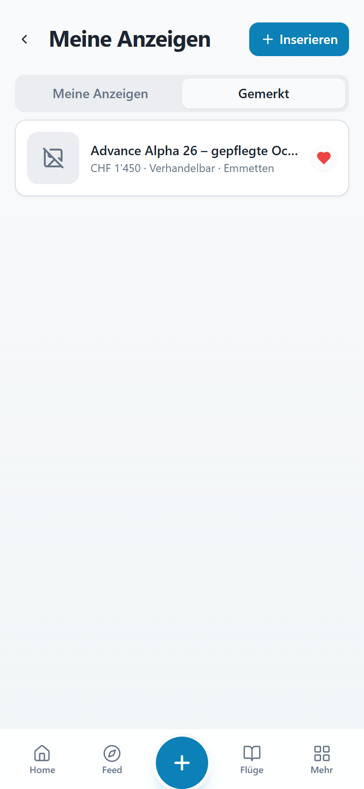

1. Tippe bei einem fremden Inserat auf das **Herz**, um es zu merken.
2. Öffne **Meine Anzeigen → Gemerkt** für deine Merkliste.
3. Prüfe Preis und Status erneut. Nicht mehr zugängliche Einträge können als **Nicht mehr verfügbar** erscheinen.
4. Tippe erneut auf das Herz, um die Markierung zu entfernen. Für Preissenkungen, Reservierungen und Verkäufe gemerkter Angebote gibt es Mitteilungen; Push benötigt zusätzlich die Gerätefreigabe.
:::

::: schritte Eine Suche speichern und verwalten
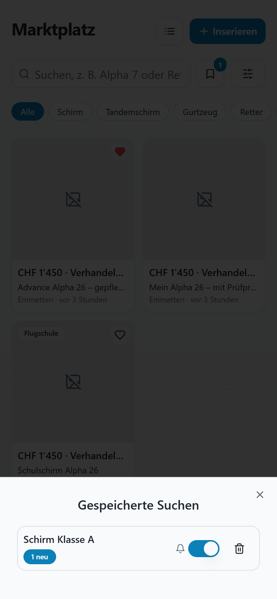

1. Gib einen Suchbegriff ein oder setze Filter. Eine reine Änderung der Sortierung reicht zum Speichern einer Suche nicht aus.
2. Wähle **Suche speichern**, gib einen Namen ein und bestätige. Du kannst bis zu fünf Suchen speichern.
3. Öffne **Gespeicherte Suchen**, um gespeicherte Kriterien und neue Treffer wiederzufinden.
4. Schalte **Mitteilung bei neuen Treffern** nach Bedarf ein oder aus. Zum Freigeben eines Platzes kannst du eine Suche mit Bestätigung löschen.
:::

### Ein eigenes Angebot oder Gesuch erstellen

::: schritte Die Marktplatzregeln bestätigen
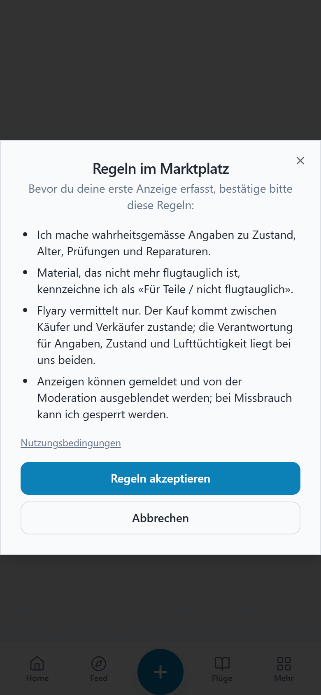

1. Tippe im Marktplatz auf **Inserieren**.
2. Lies bei der ersten Anzeige die Regeln zu Angaben, Materialzustand und Moderation.
3. Wähle **Regeln akzeptieren**, um fortzufahren, oder **Abbrechen**, um das Formular zu verlassen.
4. Plane wahrheitsgemässe Angaben zu Zustand, Alter, Prüfungen und Reparaturen. Flyary prüft die Flugtauglichkeit nicht für dich.
:::

::: schritte Fotos vorbereiten
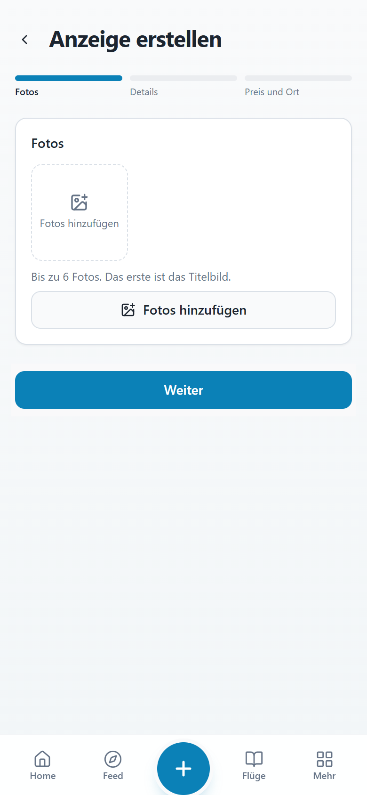

1. Wähle unter **Fotos** die Bilder des tatsächlich angebotenen Materials.
2. Du kannst bis zu sechs Fotos ergänzen. Das erste Bild ist das Titelbild; über **Als Titelbild** änderst du die Auswahl.
3. Kontrolliere die Vorschauen und entferne falsche oder doppelte Aufnahmen.
4. Tippe auf **Weiter**. Die weiteren Schritte heissen **Details** und **Preis und Ort**.
:::

::: schritte Kategorie und Zustand beschreiben
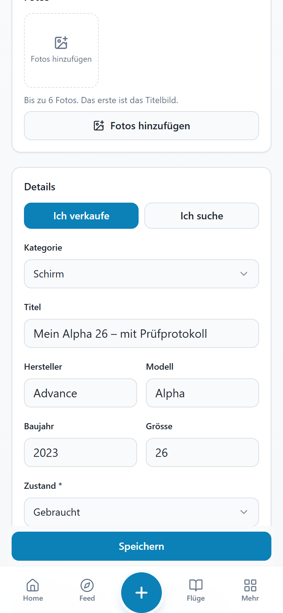

1. Wähle **Ich verkaufe** oder **Ich suche** und die passende **Kategorie**.
2. Gib einen aussagekräftigen Titel ein, mindestens drei Zeichen lang. Ergänze Hersteller, Modell, Grösse und Baujahr soweit zutreffend.
3. Bei Angeboten wählst du Zustand und Pflichtmerkmale der Kategorie. Beschreibe Reparaturen und bekannte Mängel im Text.
4. Bei einer neuen privaten Anzeige kannst du über **Aus meinem Material** einen eigenen Schirm übernehmen. Prüfe die vorgeschlagenen Angaben; die übernommenen Stunden stammen nur aus dem Flyary-Flugbuch.
5. Fahre mit **Weiter** fort. Beim Bearbeiten einer bestehenden Anzeige sind die Abschnitte untereinander sichtbar, wie im Bild.
:::

Der angebotene Hinweis **Privatverkauf** fügt einen Textbaustein ein. Kontrolliere den vollständigen Beschreibungstext vor dem Veröffentlichen. Ein Gesuch benötigt keine Materialfotos und nicht dieselben Zustandsmerkmale wie ein Angebot; Titel sowie PLZ und Ort sind trotzdem erforderlich.

::: schritte Preis und Ort speichern und veröffentlichen
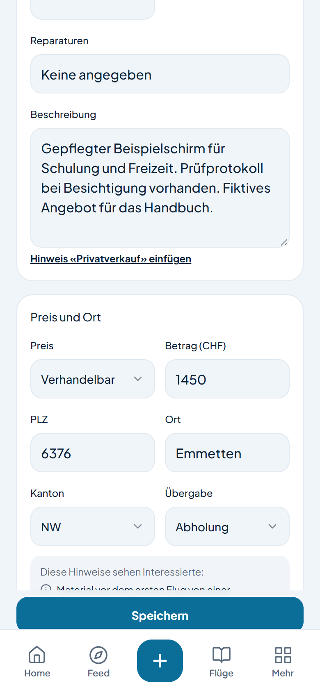

1. Wähle **Festpreis**, **Verhandelbar**, **Gratis** oder **Preis auf Anfrage**. Bei Festpreis oder Verhandelbar ist für ein Angebot ein positiver Betrag in CHF erforderlich.
2. Ergänze **PLZ**, **Ort**, Kanton und **Übergabe**. Versand ist eine Vereinbarung zwischen euch; Flyary organisiert ihn nicht.
3. Prüfe die Hinweise und die Liste fehlender Pflichtangaben. Verkaufsangebote benötigen mindestens ein Foto.
4. Mit **Als Entwurf speichern** bleibt eine neue Anzeige unveröffentlicht. **Veröffentlichen** stellt sie online, wenn alle erforderlichen Angaben vorhanden sind.
5. Bei einer bestehenden Anzeige verwendest du **Speichern**. Öffne anschliessend das Inserat und kontrolliere Preis, Sichtbarkeit und Status.
:::

Privatanzeigen sind für alle angemeldeten Flyary-Nutzer sichtbar. Als Privatperson kannst du höchstens zehn aktive Anzeigen führen und höchstens fünf neue Anzeigen innerhalb von 24 Stunden veröffentlichen. Die Laufzeit beträgt 60 Tage. Entwürfe sind keine dauerhafte Ablage für Originalfotos; die Plattform räumt alte Entwürfe und Bilder beendeter Anzeigen automatisch auf.

### Inserate pflegen, abschliessen und bewerten

::: schritte Eigene Anzeigen verwalten
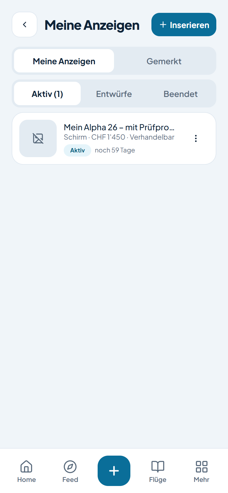

1. Öffne **Meine Anzeigen** und wähle **Aktiv**, **Entwürfe** oder **Beendet**.
2. Öffne die betreffende Anzeige zum Bearbeiten. Verwaltungsaktionen stehen auch direkt auf der eigenen Detailseite zur Verfügung.
3. Verwende **Reservieren** für eine verbindlich vorgemerkte Übergabe. **Reservierung aufheben** gibt das Angebot wieder frei.
4. Im Aktionsmenü kannst du **Verlängern (60 Tage)** beziehungsweise **Hochschieben** verwenden, wenn angeboten. Hochschieben ist frühestens nach sieben Tagen wieder möglich.
5. **Anzeige zurückziehen (löschen)** entfernt die Anzeige und ihre Fotos endgültig nach Bestätigung. Verwende für einen tatsächlichen Abschluss die Verkaufsaktion.
:::

::: schritte Einen Verkauf abschliessen
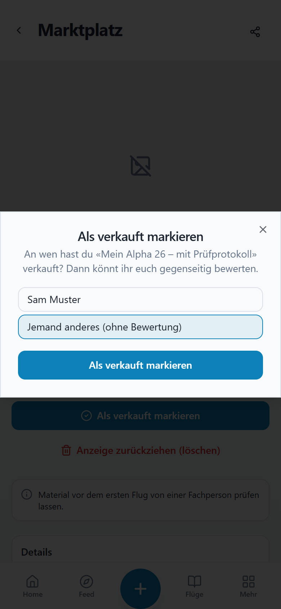

1. Öffne die eigene Anzeige und wähle **Als verkauft markieren**.
2. Wähle die kaufende Person aus den Chats zu diesem Inserat, wenn sie über Flyary Kontakt aufgenommen hat.
3. Bei **Jemand anderes (ohne Bewertung)** wird der Verkauf ohne gegenseitige Bewertungsmöglichkeit erfasst.
4. Bestätige erst nach Prüfung. Kontrolliere danach **Verkauft** unter den beendeten Anzeigen. Die Aktion löst keine Zahlung aus.
:::

::: schritte Nach einem Kauf bewerten
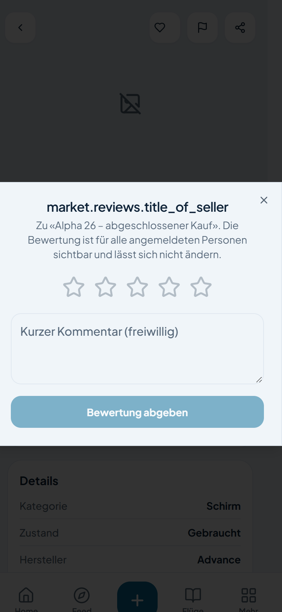

1. Öffne das abgeschlossene Inserat, beispielsweise aus dem Inseratchat oder der Mitteilung.
2. Wenn du als kaufende Person aus dem Chat zugeordnet wurdest, bietet die App **Bewerten** an. Auch die verkaufende Seite kann die Gegenseite bewerten.
3. Vergib ein bis fünf Sterne und ergänze bei Bedarf einen kurzen Kommentar zum tatsächlichen Ablauf.
4. Prüfe vor **Bewertung abgeben** alles genau: Bewertungen sind für angemeldete Personen sichtbar und lassen sich anschliessend nicht ändern.
:::

::: schritte Ein problematisches Inserat melden
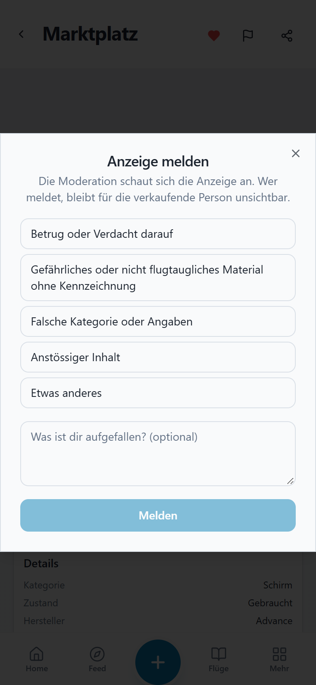

1. Öffne das fremde Inserat und tippe auf **Anzeige melden**.
2. Wähle einen passenden Grund, etwa falsche Angaben oder Betrugsverdacht.
3. Beschreibe im optionalen Text konkret, was dir aufgefallen ist.
4. Tippe **Melden** und warte auf die Bestätigung. Die verkaufende Person sieht nicht, wer gemeldet hat. Die Meldung ist noch keine Entscheidung der Moderation.
:::

Auch eine Bewertung kann über ihre Meldefunktion zur Prüfung weitergegeben werden. Hinweise auf ungewöhnliche Zahlungsforderungen gehören in die Prüfung des Angebots; ein Inseratchat oder eine gute Bewertung garantiert keinen sicheren Kauf. Beachte die in Flyary angezeigten Hinweise zur Besichtigung und Übergabe.

## 27 · Schulflüge ins eigene Flugbuch übernehmen

**Weg:** Hinweis auf **Home**, unter **Flüge** oder im Formular **Neuer Flug**.

Wenn deine Schule Flüge im Flugtag-Cockpit erfasst, werden diese nicht automatisch zu persönlichen Flugbucheinträgen. Nach der Freigabe bietet Flyary für Flugtage ab dem **25. September 2026** eine Übernahme an. Berücksichtigt werden gelandete, noch nicht mit deinem Flugbuch verknüpfte Schulflüge. Startabbrüche werden nicht übernommen.

### Übernehmen oder mit einem eigenen Eintrag verknüpfen

1. Suche den Hinweis **Die Schule hat … Flüge vom … erfasst**. Prüfe Datum und Termintitel.
2. Tippe **Ins Flugbuch übernehmen**. Gibt es keine passenden eigenen Einträge zur Auswahl, werden die Schulflüge unmittelbar als neue Einträge übernommen; es folgt kein zusätzlicher Bestätigungsdialog.
3. Sind eigene Einträge verfügbar, öffnet sich ein Zuordnungsdialog. Prüfe für jeden Schulflug die vorgeschlagene Auswahl anhand der angezeigten Zeiten, Orte und Flugdauer.
4. Wähle **Mit meinem Eintrag … verknüpfen**, wenn du denselben Flug bereits dokumentiert hast. Wähle **Neu im Flugbuch anlegen** nur, wenn noch kein entsprechender Eintrag besteht.
5. Bestätige im Dialog mit **Übernehmen**. Die Rückmeldung nennt die Anzahl neu angelegter und verknüpfter Einträge.
6. Öffne danach **Flüge** und kontrolliere das Ergebnis. Ergänze bei neuen Einträgen deinen Schirm und bei Bedarf weitere Werte, Kommentare, Fotos oder eine Aufzeichnung.

**Welche eigenen Flüge werden angeboten?** Die Auswahl enthält noch nicht verknüpfte eigene Flüge, die dem Termin zugeordnet sind oder dieselbe Gruppe und dasselbe Datum haben. Ein bereits erfasster Flug ohne passende Gruppenzuordnung erscheint möglicherweise nicht. Prüfe in diesem Fall zuerst deinen bestehenden Eintrag und öffne danach die Übernahme erneut, bevor du einen neuen Eintrag anlegen lässt.

**Was wird übernommen?** Neue Einträge erhalten Datum, vorhandene Start- und Landeplätze sowie die Zuordnung zu Schule und Termin. Eine Dauer wird aus vorhandener Start- und Landezeit berechnet; ohne beide Zeiten bleibt sie leer. Fluglehrerbewertungen und Rückmeldungen liest du weiterhin im Training beziehungsweise beim Termin. Beim Verknüpfen bleiben deine vorhandenen Flugwerte, Kommentare und Medien erhalten.

**Beispiel:** Die Schule hat drei Flüge erfasst. Zwei davon stehen bereits in deinem Flugbuch mit der richtigen Gruppe und dem richtigen Datum. Verknüpfe diese beiden und wähle nur beim dritten **Neu im Flugbuch anlegen**. So entsteht ein neuer Eintrag statt drei zusätzlicher Flüge.

### Was bedeutet Nicht jetzt?

**Nicht jetzt** blendet den Übernahmehinweis für diesen Flugtag dauerhaft aus, auch bei späterem Öffnen der App. Es ist keine Erinnerung für später; derzeit gibt es in der Oberfläche keine Aktion zum Wiedereinblenden. Wenn du noch prüfen möchtest, lasse die Karte stehen oder schliesse den Zuordnungsdialog ohne Übernahme. Das Ausblenden löscht weder die Schulflüge noch bereits vorhandene persönliche Einträge.

### Angaben korrigieren und Probleme lösen

Dein Flugbuch bleibt unabhängig von der Schulaufzeichnung. Bearbeiten oder Löschen eines persönlichen Eintrags ändert den Schulflug und dessen Nachweis nicht. Fehler in der Schulaufzeichnung lässt du durch die Schule korrigieren.

| Beobachtung | Nächster Schritt |
| --- | --- |
| Noch kein Übernahmehinweis | Freigabe des Flugtags abwarten und prüfen, ob die Schule gelandete Flüge erfasst hat. |
| Ein eigener Flug fehlt in der Zuordnung | Datum und Gruppenzuordnung des bestehenden Eintrags prüfen. |
| Hinweis nach Nicht jetzt verschwunden | Der Hinweis wurde für diesen Tag ausgeblendet. Fehlende persönliche Einträge kannst du manuell erfassen; prüfe vorher dein Flugbuch. |
| Übernahme meldet einen Fehler | Verbindung und Flugbuch prüfen, Seite erneut öffnen und nur noch angebotene Flüge übernehmen. |
| Flugzeit ist leer | Die Schule hat möglicherweise nicht beide Zeiten erfasst. Ergänze nur eine nachvollziehbare Dauer. |
| Schulnachweis und eigene Statistik unterscheiden sich | Zeitraum und Datenbasis vergleichen: Schulflüge und persönliche Einträge werden getrennt geführt. |
