# Flyary – Betriebshandbuch für Flugschulen

Version 1.4 · 28. September 2026

Für Schulleitung, Fluglehrerinnen und Fluglehrer, Starthelfer sowie die Administration. Dieses Handbuch führt durch die Schulansicht von Flyary: von der Einrichtung über den Flugtag bis zur nachvollziehbaren Ausbildungsdokumentation und Abrechnung.

Die Beispiele begleiten die fiktive Flugschule Voralpen. Robin Beispiel betreut die Ausbildung, Sam Muster unterstützt am Startplatz und Alex Beispiel besucht den Höhenflugkurs. Namen, Beträge, Termine und Nachweise dienen ausschliesslich der Erklärung. Die Screenshots zeigen die echte App im Smartphoneformat. Geldbeträge sind Beispiele in CHF und keine Tarifempfehlung.

Lies beim ersten Einrichten die Kapitel 1 bis 5. Für den täglichen Betrieb sind die Kapitel 6 bis 15 besonders wichtig. Material, Nachweise und Administration folgen in den Kapiteln 16 bis 25. Kapitel 27 und 28 enthalten Arbeitsroutinen und Hilfe bei Problemen. Kapitel 29 und 30 erklären den neuen Schul-Shop und Materialverkauf. Persönliche Flugbuchfunktionen werden ergänzend im Benutzerhandbuch für Pilotinnen und Piloten beschrieben.

**Neu in Version 1.3:** Check-in, Start- und Landeplatzerfassung, Manöverbewertungen und Tagesabschluss ersetzen die bisherigen Abläufe in Kapitel 14 und 15. Kapitel 31 erklärt den Ausbildungsnachweis und die Übernahme ins persönliche Flugbuch. Die übrigen bestehenden Screenshots bleiben erhalten; die neuen Abläufe sind als Textanleitungen beschrieben. Die Bilder der abgelösten Anwesenheits- und Coaching-Ansicht wurden aus der Anleitung entfernt.

**Neu in Version 1.4:** Ergänzt sind Fotoupload und Sichtbarkeit (Kapitel 12), der Filter für inaktive Schüler auch bei Starthelfern (Kapitel 14) sowie offizielle Plätze, persönliche Namen und deren Bedeutung für den Ausbildungsnachweis (Kapitel 14 und 31). Die bestehenden Bildschirmansichten vom 24./25. September bleiben zur Orientierung erhalten; die Ergänzungen sind Textanleitungen.

## 1. Schulansicht öffnen und den Überblick nutzen

Die Schulansicht bündelt die Arbeit für eine bestimmte Flugschule. Melde dich mit deinem persönlichen Flyary-Konto an. Das Konto muss der Schulgruppe angehören und die erforderliche Rolle oder Teamfunktion besitzen. Verwende im Rollenumschalter **Flugschule**, um in den Schulbetrieb zu wechseln. **Pilot** führt zurück zum persönlichen Flugbuch. Der Wechsel der Ansicht verändert deine Berechtigungen nicht.

Wenn du mehreren Schulen angehörst, wähle vor jeder Bearbeitung die richtige Schule. Der Schulname steht im Kopf der jeweiligen Seite. Das ist besonders bei Materialausgaben, Abrechnungen und Ausbildungsänderungen wichtig: Diese Angaben sollen der richtigen Schule zugeordnet sein.

::: schritte Den Arbeitstag auf der Startseite beginnen
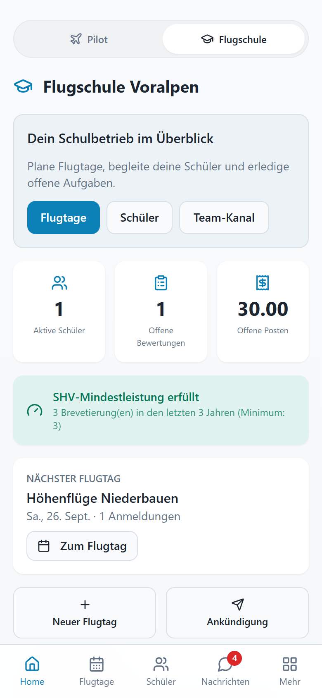

1. **Flugschule wählen.** Prüfe den Rollenumschalter und den Namen «Flugschule Voralpen» im Kopf der Seite.
2. **Offene Arbeit erkennen.** Lies die Kennzahlen für aktive Schüler, offene Bewertungen und offene Posten. Sie beziehen sich auf die ausgewählte Schule.
3. **Zum nächsten Flugtag wechseln.** Tippe auf **Zum Flugtag**, um Teilnehmer, Planung und Betreuung dieses Termins zu öffnen.
4. **Einen Bereich öffnen.** Nutze **Flugtage**, **Schüler** oder **Team-Kanal**. Weitere Verwaltungsbereiche erreichst du über die Navigation beziehungsweise die Bereichsliste weiter unten.
5. **Neuen Tag vorbereiten.** Mit **Neuer Flugtag** öffnest du das Terminformular für diese Schule. Das Anlegen wird in Kapitel 10 erklärt.
:::

Die Kennzahlen sind Einstiege in die Arbeit. Eine offene Bewertung bedeutet, dass Ausbildungsdokumentation zu prüfen ist. Offene Posten sind noch nicht als bezahlt markierte Buchungen. Beides ersetzt die Kontrolle der zugrunde liegenden Einträge nicht. Die auf der Startseite angezeigte Leistungsampel verwendet die in Flyary erfassten Brevetierungen. Unvollständige Ausbildungsdaten können daher zu einer unvollständigen Kennzahl führen.

## 2. Rollen, Funktionen und Zuständigkeiten verstehen

Flyary unterscheidet zwischen der Mitgliedsrolle innerhalb der Gruppe und fachlichen Funktionen. Eine Person kann mehrere Funktionen besitzen, beispielsweise Schulleitung und Fluglehrer. Eine Funktion beschreibt ihre Aufgabe; ein Ausbildungsstand beschreibt ihre eigene Ausbildung. Diese Angaben sollten nicht miteinander verwechselt werden.

| Zugang oder Funktion | Typischer Arbeitsbereich in Flyary |
| --- | --- |
| Gruppenadministrator | Schulverwaltung sowie Zuweisen und Entfernen von Teamfunktionen |
| Schulleitung oder Fluglehrer | Schulübersicht, Schülerdossiers und Verwaltungsbereiche; Funktionen anderer Personen sind nicht allein aufgrund dieser Funktion frei änderbar |
| Starthelfer ohne weitere Verwaltungsrolle | Teamstartseite, Flugtage, Team-Kanal und Verfügbarkeit; kein allgemeiner Zugang zu Schülerdossiers oder Abrechnung |
| Schüler oder brevetiertes Gruppenmitglied | Persönliche Pilotensicht, Gruppen- und Terminangebote sowie freigegebene Rückmeldungen |

Die sichtbare Oberfläche passt sich diesen Zugängen an. Es ist deshalb normal, dass ein Starthelfer eine andere Startseite und weniger Bereiche sieht als ein Administrator. Eine fehlende Schaltfläche ist nicht automatisch ein Ladefehler. Prüfe zuerst die Mitgliedschaft und die zugewiesenen Funktionen.

### Zuständigkeiten im Team festlegen

Bestimme schulintern, wer Mitglieder aufnimmt, Ausbildungsstände pflegt, Termine bestätigt, Material ausgibt und Zahlungseingänge kontrolliert. Flyary führt diese Informationen zusammen, entscheidet aber nicht, welche Person in deiner Schule organisatorisch verantwortlich ist. Verwende persönliche Konten, damit Rückmeldungen und Bearbeitungen einer Person zugeordnet bleiben.

Die Funktion **Shop** berechtigt zur Arbeit mit den Schul-Anzeigen und zugehörigen Inseratchats. **Shop-Profil** ändern Administratoren und Schulleitung. Die Shop-Funktion allein ist kein allgemeiner Zugang zu Schülerdossiers oder Abrechnung. Eine Fluglehrerfunktion allein berechtigt nicht automatisch zur Shop-Verwaltung.

Ein Zertifikat und eine Teamfunktion sind ebenfalls getrennte Angaben. Ein hinterlegter Fluglehrernachweis ersetzt die Zuweisung einer Teamfunktion nicht. Umgekehrt bestätigt die Funktion «Fluglehrer:in» nicht die Gültigkeit eines Nachweises. Die Pflege von Zertifikaten wird in Kapitel 20 beschrieben.

### Begriffe für die tägliche Arbeit

**Dossier:** schulbezogene Gesamtsicht auf eine Person. **Ausbildungsstand:** Übergeordnete Ausbildungsstufe. **Schülerstatus:** aktiv, pausiert oder abgebrochen. **Tagespause:** Kennzeichnung innerhalb eines einzelnen Termins. **Einteilung:** strukturierte Zuordnung von Teammitgliedern zu einem Termin. **Ausgabe:** dokumentierte Materialausleihe. **Posten:** einzelne Abrechnungsposition. **Guthaben:** Saldo aus Einsätzen, Auszahlungen und Korrekturen. **Ankündigung:** hervorgehobene Nachricht, gegebenenfalls mit angeforderter Bestätigung.

::: schritte Als Starthelfer den eigenen Einsatz vorbereiten
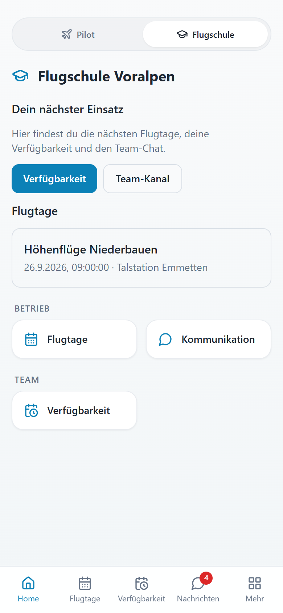

1. **Schulansicht wählen.** Als Starthelfer ohne zusätzliche Verwaltungsrolle erhältst du die Teamstartseite.
2. **Verfügbarkeit pflegen.** Öffne den Bereich und trage deine eigenen verfügbaren Zeiten ein.
3. **Kommunikation öffnen.** Der Einstieg **Team-Kanal** führt zur Kanalübersicht. Öffne dort **Team** für interne Absprachen; Umfragen stehen unterhalb der Kanalliste.
4. **Anstehenden Flugtag öffnen.** Lies Datum, Treffpunkt und die für dich verfügbaren Termininformationen.
5. **Einsatz abstimmen.** Kläre Änderungen mit der verantwortlichen Leitung. Fehlende Verwaltungsbereiche werden durch den Rollenwechsel allein nicht freigeschaltet.
:::

## 3. Die Schule einrichten und Personen einladen

Die Schulverwaltung setzt eine Gruppe vom Typ Flugschule voraus. Besteht diese bereits, arbeite in der vorhandenen Gruppe weiter. Vermeide eine zweite Schulgruppe nur deshalb, weil dein Konto noch keinen Zugang besitzt. Der zuständige Administrator kann deine Mitgliedschaft und Funktion prüfen.

Die Einrichtungskarte auf der Schulstartseite führt zu den grundlegenden Aufgaben: Funktionen verteilen, Ansätze setzen, Material erfassen, Mitteilungen aktivieren und einen ersten Termin erstellen. Bearbeite die Punkte in dieser Reihenfolge, wenn noch keine Daten vorhanden sind. Vor dem ersten Einsatz sollten mindestens Teamzuständigkeiten, verfügbare Ausrüstung und die verwendeten Ansätze geklärt sein.

::: schritte Den Einladungslink der Schule verwenden
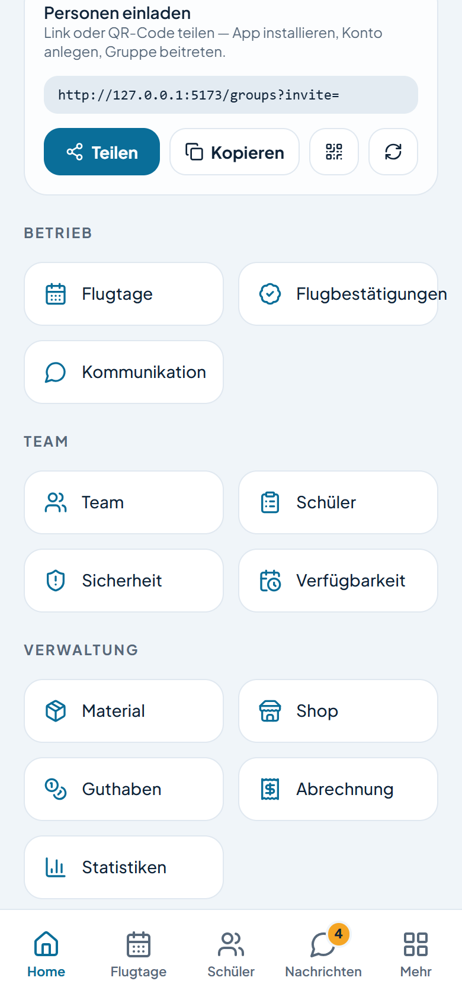
> Der sichtbare Link gehört zur lokalen Beispielumgebung. Verwende in deiner Schule den Link aus deiner eigenen App.

1. **Einladung finden.** Scrolle auf der Schulstartseite zu **Personen einladen**.
2. **Link kopieren oder teilen.** **Kopieren** Übernimmt die Einladung in die Zwischenablage. **Teilen** öffnet, soweit vom Gerät unterstützt, dessen Teilen-Funktion.
3. **QR-Code bei Bedarf anzeigen.** Tippe auf das QR-Symbol, wenn die Person die Einladung direkt mit ihrem Smartphone öffnen soll.
4. **Beitritt durchführen lassen.** Die eingeladene Person richtet ihr Konto ein und tritt der Schulgruppe bei. Das Teilen eines Links allein weist noch keine Teamfunktion zu.
5. **Mitgliedschaft prüfen.** Kontrolliere anschliessend die Person in der Gruppe und verteile für Mitarbeitende die passende Funktion im Bereich **Team**.
:::

### Einführungsablauf für neue Mitglieder

Bitte neue Schüler, ihren Pilotennamen und die für ihre Ausbildung benötigten Profilangaben zu prüfen. Vereinbare anschliessend Ausbildungsstand, Materialbedarf und den ersten Termin. Neue Mitarbeitende benötigen zusätzlich eine Teamfunktion, gegebenenfalls Zertifikate und eine Einteilung am konkreten Flugtag. Eine allgemeine Funktion ist noch kein Einsatzplan für jeden Termin.

## 4. Team verwalten und Funktionen verteilen

Der Bereich **Team** konzentriert sich auf Personen mit Schulleitungs-, Fluglehrer- oder Starthelferfunktion. Die Schülerbetreuung erfolgt im separaten Bereich **Schüler**. Wenn ein neues Mitglied noch nicht in der Teamübersicht erscheint, kann die Teamfunktion fehlen.

::: schritte Eine Person im Team finden
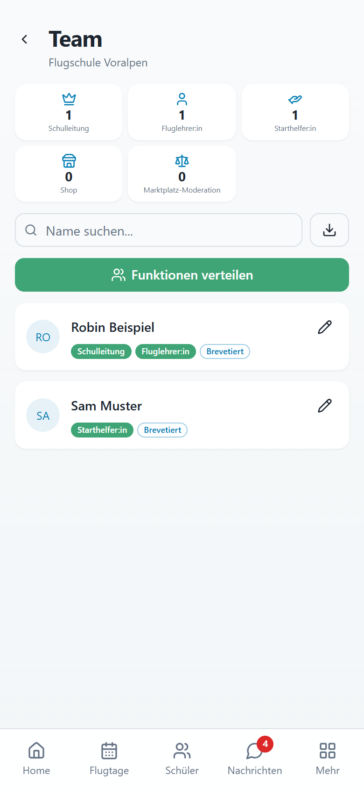

1. **Team öffnen.** Wechsle in den gleichnamigen Bereich der ausgewählten Schule.
2. **Namen suchen.** Gib im Suchfeld einen Teil des Pilotennamens ein. Prüfe bei ähnlichen Namen die angezeigten Funktionen.
3. **Auswahl eingrenzen.** Verwende bei Bedarf den Funktionsfilter. Setze ihn auf **Alle** zurück, wenn eine Person unerwartet fehlt.
4. **Person bearbeiten.** Öffne das Stiftsymbol der betreffenden Karte. Prüfe Ausbildungsstand und die für dich bearbeitbaren Angaben.
5. **Ergebnis kontrollieren.** Nach dem Speichern muss die Personenkarte die gewünschte Angabe zeigen. Eine Fehlermeldung bedeutet, dass die Änderung noch zu prüfen ist.
:::

::: schritte Als Administrator Funktionen zuweisen
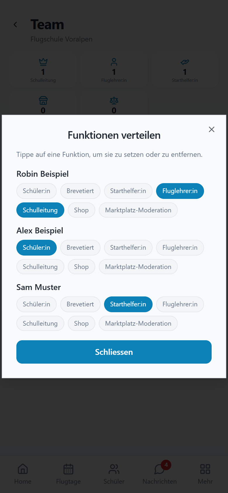

1. **Funktionen verteilen öffnen.** Die Schaltfläche steht der Gruppenadministration zur Verfügung.
2. **Richtige Person wählen.** Suche die Zeile des neuen Teammitglieds. In dieser Übersicht können auch Mitglieder ohne Teamfunktion erscheinen.
3. **Benötigte Funktion antippen.** Markiere beispielsweise **Starthelfer:in**. Bereits aktive Funktionen sind farblich hervorgehoben.
4. **Mehrfachfunktionen bewusst vergeben.** Schulleitung und Fluglehrer können gleichzeitig gesetzt sein. Entferne eine Funktion nur, wenn sie tatsächlich nicht mehr zutrifft.
5. **Schliessen und prüfen.** Kontrolliere die Teamliste und lasse die Person ihre Schulansicht erneut öffnen. Die Zuweisung kann ihren verfügbaren Arbeitsbereich verändern.
:::

Die CSV-Ausgabe unterstützt eine externe Teamübersicht. Sie ersetzt keine Rechteverwaltung: Änderungen in einer heruntergeladenen Datei wirken nicht auf die App zurück. Bewahre solche Listen entsprechend euren internen Abläufen auf und prüfe vor der Weitergabe, welche Angaben enthalten sind.

## 5. Verfügbarkeit erfassen und Einsätze vorbereiten

Die Wochenübersicht zeigt Personen mit Teamfunktion. Sie hilft bei der Planung, ob genügend Betreuung und Unterstützung verfügbar sind. Eine Verfügbarkeitsangabe ist noch keine verbindliche Einteilung zu einem Flugtag. Diese Einteilung erfolgt im jeweiligen Termin.

::: schritte Eine Woche gemeinsam planen
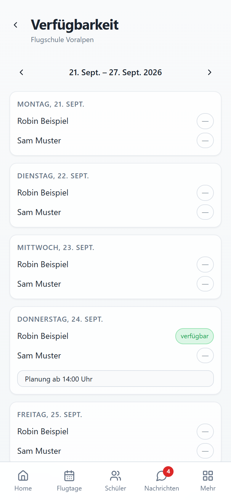

1. **Verfügbarkeit öffnen.** Prüfe den angezeigten Wochenzeitraum. Mit den Pfeilen wechselst du zur vorherigen oder nächsten Woche.
2. **Zum gewünschten Tag scrollen.** Auf dem Smartphone werden die Tage untereinander dargestellt. Samstag und Sonntag liegen unterhalb des ersten Bildausschnitts.
3. **Status setzen.** Tippe auf den Status der betreffenden Person. Wiederholtes Tippen wechselt zwischen verfügbar, unsicher, nicht verfügbar und ohne Angabe.
4. **Einschränkung ergänzen.** Nutze das Notizfeld, wenn beispielsweise nur der Vormittag möglich ist. Verlasse das Feld und prüfe, dass die Angabe erhalten bleibt.
5. **Terminbesetzung festlegen.** Übernimm die abgesprochene Person anschliessend in die Einteilung des Flugtags. Plane nicht allein anhand eines unbestätigten Status.
:::

Starthelfer ohne Verwaltungszugang können ihre eigenen Angaben pflegen. Personen mit Verwaltungszugang können auch die Planung anderer Teammitglieder bearbeiten. Klärt im Team, ob die Schulleitung Verfügbarkeiten direkt nachträgt oder die Mitarbeitenden ihre Angaben selbst aktualisieren.

Eine leere Angabe bedeutet «noch keine Angabe» und sollte nicht als Zusage behandelt werden. Bei einem Ladefehler bleibt der tatsächliche Status unbekannt. Verwende **Erneut laden**, bevor du eine Einsatzentscheidung aus der Übersicht ableitest.

## 6. Schülerliste, Status und Export

Die Schülersektion ist der Einstieg in die schulbezogene Betreuung. Eine Karte verbindet Ausbildungsstand, Flugzahl, Prüfungsfortschritt und die letzte Zusammenfassung. Das Öffnen der Karte führt in das interne Schülerdossier der ausgewählten Schule.

::: schritte Einen Schüler finden und sein Dossier öffnen
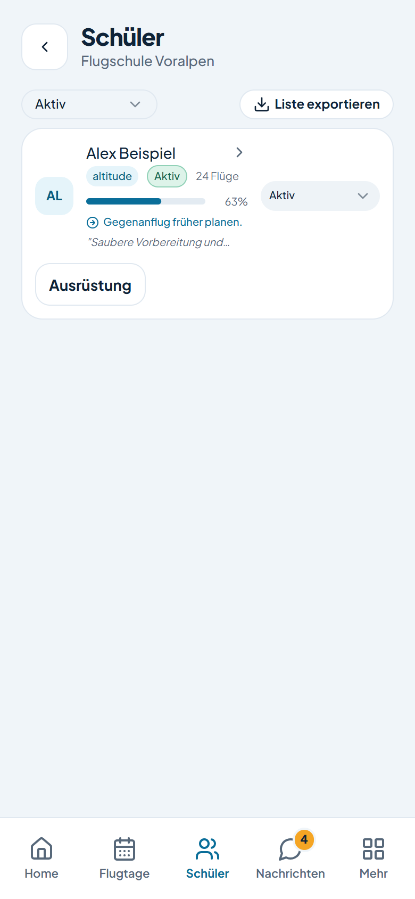

1. **Schüler öffnen.** Kontrolliere den Schulnamen unter dem Seitentitel.
2. **Filter prüfen.** Die Auswahl **Aktiv** blendet pausierte und abgebrochene Ausbildungen aus. Wähle **Alle**, um auch diese Einträge zu sehen.
3. **Karte lesen.** Prüfe Namen, Ausbildungsstand und den letzten Lernhinweis. Diese Angaben helfen bei der Vorbereitung auf den nächsten Termin.
4. **Dossier öffnen.** Tippe auf die Schülerkarte beziehungsweise den Pfeil. Das Dossier zeigt die für diese Schule verfügbaren Informationen.
5. **Ausrüstung direkt prüfen.** Die separate Schaltfläche **Ausrüstung** führt zum persönlichen Ausrüstungscheck; sie öffnet nicht die komplette Materialverwaltung.
:::

### Ausbildung pausieren, abbrechen oder wieder aktivieren

Verwende die Statusauswahl der betreffenden Karte. Wähle **Pausiert**, **Abgebrochen** oder **Aktiv** und ergänze im Bestätigungsdialog bei Bedarf einen Grund, beispielsweise «Unterbruch bis zum nächsten Frühjahr». Prüfe vor dem Bestätigen nochmals die Person. Bei einem Speicherfehler bleibt der Entwurf für einen erneuten Versuch erhalten.

Der Schülerstatus und die Pause innerhalb eines einzelnen Flugtags erfüllen unterschiedliche Zwecke. Der Status beschreibt die Ausbildung insgesamt; **Heute pausieren** im Flugtag-Cockpit betrifft den betreffenden Tag. Eine Statusänderung löscht bestehende Anmeldungen nicht automatisch. Aktuelle Teilnehmerlisten können inaktive Schüler ausblenden, obwohl deren Anmeldung und belegter Platz weiterhin bestehen.

**Liste exportieren** lädt eine CSV mit den bereitgestellten Schülerdaten herunter. Der Export ist nicht auf den sichtbaren Aktiv-Filter beschränkt. Er kann damit auch pausierte oder abgebrochene Ausbildungen enthalten. Prüfe die Datei, bevor du sie weiterverarbeitest.

## 7. Schülerdossier und Ausbildungsstand

Das Dossier bündelt Übersicht, Ausbildung, Flüge, Tagesnotizen, Material und Abrechnung. Auf kleinen Bildschirmen kannst du die Reiterleiste horizontal verschieben. Prüfe vor einer Änderung stets den Namen oben auf der Seite.

::: schritte Einen Ausbildungsstand prüfen und ändern
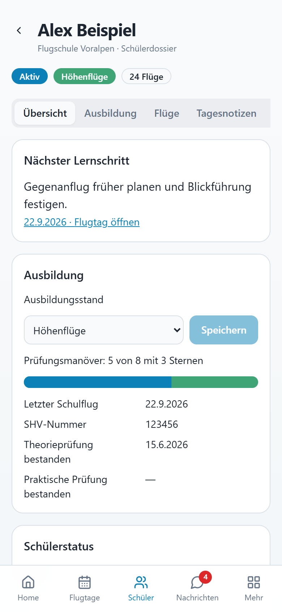

1. **Überblick verschaffen.** Lies den nächsten Lernschritt und den Zeitpunkt der letzten Rückmeldung. Über **Flugtag öffnen** gelangst du zum zugehörigen Termin.
2. **Ausbildungsstand kontrollieren.** Die Auswahl in der Karte **Ausbildung** zeigt den gespeicherten Stand der Person.
3. **Neue Stufe wählen.** Wähle die passende Stufe erst nach der schulischen Beurteilung, beispielsweise **Prüfungsreif**. Ein hoher Fortschrittsbalken allein trifft diese Entscheidung nicht.
4. **Speichern antippen.** Eine geänderte Auswahl wird durch die Schaltfläche übernommen. Prüfe die Erfolgsmeldung und die aktualisierte Anzeige.
5. **Stammdaten einordnen.** SHV-Nummer sowie Theorie- und Praxisdatum dienen hier der Übersicht. Sie werden nicht durch das Ändern des Ausbildungsstands automatisch ausgefüllt.
:::

::: schritte Ausbildungsdetails lesen
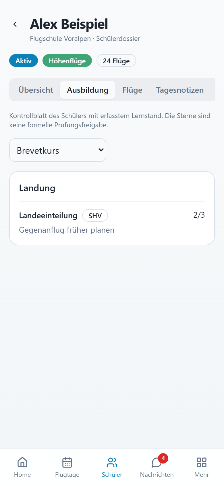

1. **Ausbildung öffnen.** Wähle den Reiter im Schülerdossier.
2. **Kursbereich prüfen.** Die Vorauswahl orientiert sich am Ausbildungsstand. Wähle bei Bedarf Grundkurs, Brevetkurs, Sicherheitstraining oder die gesamte Auswahl.
3. **Manöver lesen.** Die Liste zeigt die erfassten Bewertungen, Notizen und Kategorien. Im Beispiel ist die Landeeinteilung mit zwei von drei Punkten erfasst.
4. **Prüfungsbezug beachten.** Markierte Prüfungsmanöver fliessen in die entsprechende Fortschrittsanzeige ein. Die Anzeige dokumentiert Daten und ist kein formelles Prüfungsergebnis.
5. **Folgemassnahme festlegen.** Besprich offene Punkte am nächsten Flugtag und halte den konkreten nächsten Lernschritt in der Tageszusammenfassung fest (Kapitel 15). Dieser Reiter ist eine Leseansicht.
:::

Die Gesamtzahl der Flüge im Dossier bezieht sich auf die mit dieser Schule verknüpften Flüge. Sie ist daher nicht zwingend identisch mit dem gesamten persönlichen Flugbuch des Schülers. Eine vollständige Betreuungsübersicht setzt voraus, dass relevante Flüge der richtigen Schule zugeordnet sind.

## 8. Flüge und Tagesnotizen im Dossier nachvollziehen

Flugbezogene Coaching-Notizen und Tagesnotizen ergänzen einander. Ein Flug enthält die Aufzeichnung und Kommentare zu einem bestimmten Flugbucheintrag. Die Tagesnotiz kann Beobachtungen zu mehreren Flügen, eine Zusammenfassung oder den nächsten Lernschritt enthalten.

Der Reiter **Flüge** zeigt schulbezogene persönliche Flugbucheinträge. Die eigenständigen Schulflüge aus dem Cockpit findest du beim Termin unter **Flugtag** und im Dossier unter **Nachweis**. Neue Flugrückmeldungen liest du am Schulflug; die Tagesnotizen enthalten Zusammenfassungen und gegebenenfalls frühere F1–F6-Notizen. Kapitel 31 erklärt die Verknüpfung beider Flugbestände.

::: schritte Einen Schulflug mit Rückmeldung ansehen
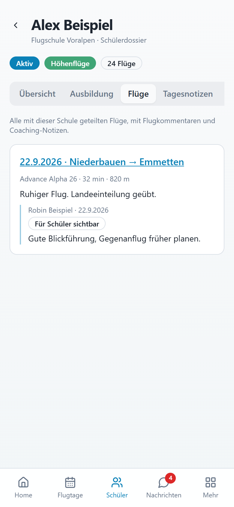

1. **Flüge wählen.** Öffne den entsprechenden Reiter im Dossier.
2. **Datum und Strecke prüfen.** Suche den gewünschten Tag und die Kombination aus Start- und Landeplatz.
3. **Flugdaten lesen.** Vergleiche Schirm, Dauer und Höhenangabe mit der Situation, die du besprechen möchtest.
4. **Notizen zuordnen.** Lies den Kommentar sowie vorhandene Coaching-Notizen mit Autor und Datum. Die Kennzeichnung zeigt, ob die Rückmeldung für den Schüler sichtbar ist.
5. **Flugansicht öffnen.** Tippe auf die verlinkte Flugüberschrift. Bei längeren Listen lade weitere Einträge nach, um frühere Flüge zu finden.
:::

::: schritte Die Entwicklung über Tagesnotizen verfolgen
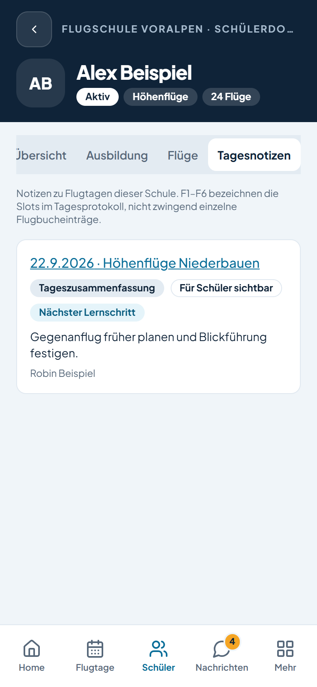

1. **Tagesnotizen öffnen.** Dieser Reiter zeigt die am Flugtag erfassten Rückmeldungen.
2. **Termin erkennen.** Prüfe Titel und Datum. Die Verknüpfung führt zum betreffenden Flugtag.
3. **Art der Notiz lesen.** Unterscheide Tageszusammenfassung und die Slots F1 bis F6. Die Slotnummer ist eine Tageszuordnung und nicht zwingend die Nummer eines Flugbucheintrags.
4. **Sichtbarkeit prüfen.** **Für Schüler sichtbar** und interne Notizen haben unterschiedliche Empfänger. Verwende den Text entsprechend seiner Kennzeichnung.
5. **Lernziel aufnehmen.** Eine Markierung als nächster Lernschritt erleichtert die Vorbereitung des nächsten Termins. Formuliere bei der nächsten Betreuung eine überprüfbare Folgeaufgabe.
:::

### Eine hilfreiche Rückmeldung formulieren

Beschreibe zuerst die beobachtete Handlung und anschliessend die nächste Übung. «Gegenanflug spät eingeleitet; beim nächsten Flug die Position früher festlegen» ist für eine Übergabe konkreter als «Landung verbessern». Trenne Beobachtung, Interpretation und vereinbartes Ziel. Verweise bei Bedarf auf den jeweiligen Flug, damit ein anderer Fluglehrer den Zusammenhang findet.

## 9. Material und Abrechnung im Schülerdossier

Der Materialreiter verbindet den persönlichen Ausrüstungscheck, Ausleihen der Schule und vom Schüler hinterlegte eigene Schirme. Diese Informationen haben unterschiedliche Quellen. Eine abgehakte Ausrüstung bedeutet beispielsweise nicht, dass ein bestimmtes Inventarstück ausgegeben wurde.

::: schritte Den Materialbedarf einer Person prüfen
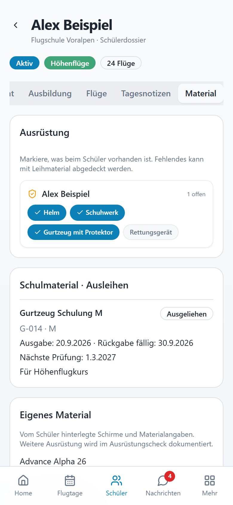

1. **Material öffnen.** Wähle den Reiter im Dossier der richtigen Person.
2. **Ausrüstungscheck prüfen.** Kontrolliere Helm, Schuhwerk, Gurtzeug mit Protektor und Rettungsgerät. Markiere nur, was tatsächlich geklärt ist.
3. **Ausleihen lesen.** Prüfe Inventarnummer, Grösse, Ausgabe- und Rückgabedatum. Eine offene Ausleihe bleibt bis zur erfassten Rücknahme bestehen.
4. **Eigenes Material ansehen.** Scrolle weiter nach unten. Dort erscheinen hinterlegte Schirme und verfügbare Check- beziehungsweise Packtermine.
5. **Bedarf organisieren.** Führe eine neue Ausgabe oder Rücknahme in der Schulmaterialverwaltung durch. Die Leseübersicht ersetzt diesen Buchungsschritt nicht.
:::

::: schritte Offene und bezahlte Positionen einer Person ansehen
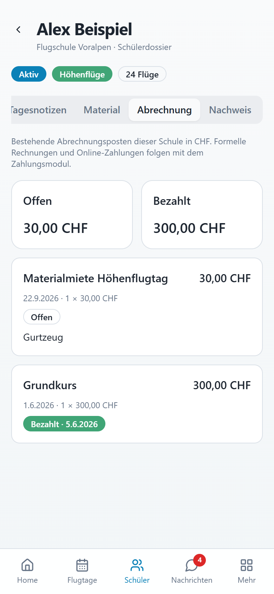

1. **Abrechnung wählen.** Verschiebe bei Bedarf die Reiterleiste nach links, bis der Reiter sichtbar wird.
2. **Summen vergleichen.** Oben stehen offene und als bezahlt markierte Beträge in CHF.
3. **Position prüfen.** Lies Beschreibung, Datum, Menge, Ansatz und Betrag. Im Beispiel ist die Materialmiete noch offen.
4. **Zahlungsmarkierung lesen.** Eine bezahlte Position zeigt den entsprechenden Status und das hinterlegte Datum.
5. **Bearbeitung am richtigen Ort durchführen.** Neue Positionen und Zahlungsmarkierungen werden im Schulbereich **Abrechnung** verwaltet. Das Dossier dient hier der Übersicht.
:::

Die hier gezeigten Positionen sind keine vollständige Rechnungsverwaltung mit Rechnungsnummern und Zahlungsabwicklung. Sie dokumentieren schulbezogene Forderungen und deren manuell gepflegten Zahlungsstatus. Formelle Rechnungen oder Onlinezahlungen werden aus diesem Reiter nicht erzeugt.

## 10. Flugtage finden und einen neuen Termin anlegen

Ein Flugtag ist der gemeinsame Bezugspunkt für Anmeldung, Personal, Terminstatus, Anwesenheit und Rückmeldungen. Lege für einen neuen Anlass einen passenden Termin an und verwende bei wiederkehrenden Angeboten eindeutige Titel mit Fluggebiet oder Kursinhalt.

::: schritte Einen bestehenden Flugtag öffnen
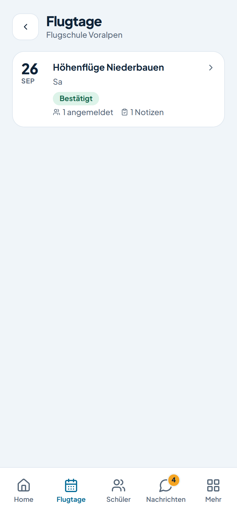

1. **Flugtage öffnen.** Verwende die untere Navigation oder die Schulstartseite.
2. **Datum kontrollieren.** Prüfe Titel und Datum des Eintrags, bevor du ihn öffnest.
3. **Status lesen.** Achte darauf, ob der Anlass angekündigt, bestätigt oder abgesagt ist.
4. **Eintrag antippen.** Die Detailseite bündelt die Arbeit am Termin. Teilnehmerzahl und Notizanzahl in der Liste geben eine erste Orientierung.
5. **Neuen Termin beginnen.** Über das Plus beziehungsweise **Neuer Flugtag** auf der Startseite öffnest du ein neues Formular.
:::

::: schritte Grundangaben eines neuen Termins erfassen
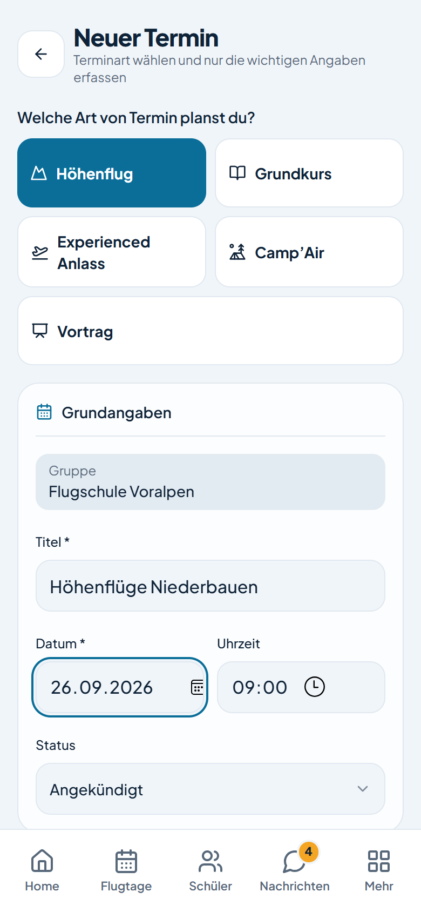

1. **Terminart auswählen.** Wähle Höhenflug, Grundkurs, Experienced Anlass, Camp’Air oder Vortrag. Die folgenden Felder passen sich der Art an.
2. **Gruppe prüfen.** Aus der Schulstartseite ist die Schule bereits vorgewählt. Ein Termin muss der richtigen Gruppe zugeordnet sein.
3. **Titel eingeben.** Der Titel ist eine Pflichtangabe. Verwende beispielsweise «Höhenflüge Niederbauen».
4. **Datum setzen.** Das Datum ist ebenfalls erforderlich. Prüfe die Uhrzeit; bei einem Camp werden Start- und Enddatum benötigt.
5. **Status festlegen.** Verwende **Angekündigt**, solange die Durchführung noch nicht feststeht. **Bestätigt** und **Abgesagt** sollten den tatsächlichen Planungsstand wiedergeben.
:::

### Angaben passend zur Terminart

Für Höhenflüge sind Treffpunkt, Fluggebiet, Tagesthema und Rückreisehinweise sinnvoll. Beim Grundkurs stehen Tagesinhalte und Materialhinweise im Vordergrund. Ein Vortrag benötigt Thema und Leitung beziehungsweise Referent. Bei mehrtägigen Angeboten solltest du den Zeitraum und Reiseinformationen prüfen. Fülle die sichtbaren Felder so aus, dass Teilnehmende auch ohne zusätzliche Einzelmitteilung wissen, wo sie wann erwartet werden.

Das Terminformular ist länger als ein Smartphonebildschirm. Scrolle bis zum Ende und speichere erst nach der Planung der weiteren Angaben. Mit dem Verlassen eines noch nicht gespeicherten Formulars ist kein neuer Termin angelegt.

## 11. Leitung, Anmeldung, Briefing und Programm planen

Die Grundangaben bestimmen, welcher Anlass stattfindet. Für die Durchführung brauchst du zusätzlich Betreuung, Kapazität und klare Aufgaben. Prüfe diese Angaben vor der Bekanntgabe an die Teilnehmenden.

::: schritte Die Organisation im Terminformular vervollständigen
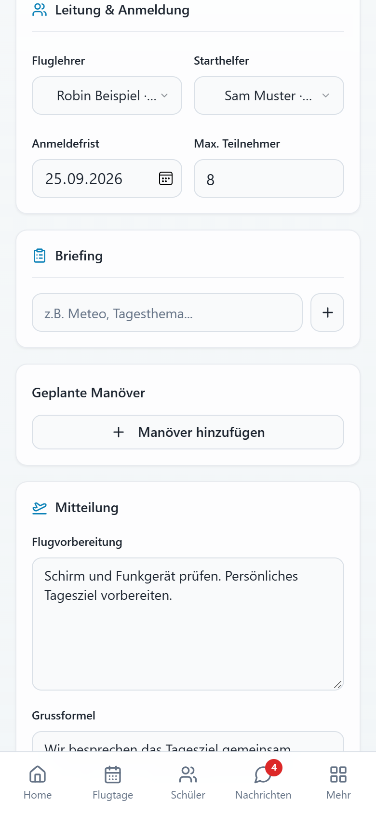

1. **Leitung und Anmeldung finden.** Scrolle im Terminformular zum entsprechenden Abschnitt.
2. **Personen auswählen.** Weise die vorgesehene Leitung beziehungsweise Fluglehrer und Starthelfer zu. Wähle Namen aus der Schule, soweit das Formular dies anbietet.
3. **Anmeldefrist setzen.** Ergänze bei Bedarf das letzte Anmeldedatum. Prüfe, ob es zeitlich zum Anlass passt.
4. **Kapazität festlegen.** Gib bei begrenzten Plätzen die maximale Teilnehmerzahl ein. Ein leeres Feld ist keine dokumentierte Kapazitätsplanung.
5. **Briefing und Manöver ergänzen.** Ordne Aufgaben zu, füge nötige Punkte hinzu und wähle geplante Manöver. Scrolle anschliessend zur Mitteilung und speichere das vollständige Formular.
:::

### Die gespeicherte Detailseite prüfen

Öffne den Termin nach dem Speichern erneut. Kontrolliere Datum, Uhrzeit und Status im Kopf sowie Treffpunkt und Gebiet unter **Übersicht**. Für Schulleitung, Fluglehrer und Administratoren bündelt **Planung** die Benachrichtigung der Teilnehmenden, die Teameinteilung und das bearbeitbare Tagesprogramm. Halte die Einteilung aktuell: Aus ihr werden beispielsweise Starthelfereinsätze und Guthaben abgeleitet.

::: schritte Die Planung auf der Detailseite prüfen
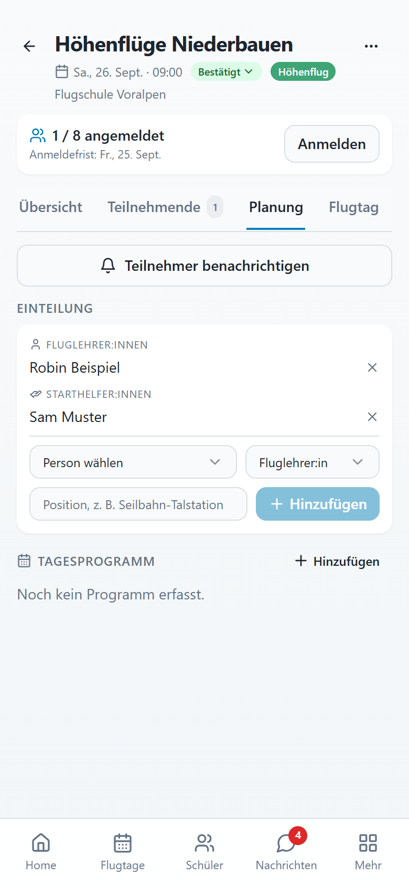

1. **Planung wählen.** Öffne den Flugtag und tippe auf den Reiter **Planung**.
2. **Team kontrollieren.** Prüfe die eingeteilten Personen und ihre Rollen. Ergänze oder korrigiere die strukturierte Einteilung.
3. **Tagesprogramm pflegen.** Ergänze die nötigen Programmpunkte im gleichen Reiter.
4. **Information weitergeben.** Bei Höhenflugtagen findest du hier **Teilnehmer benachrichtigen**. Kontrolliere Nachricht und Empfänger vor dem Versand.
:::

Eine Person, die nur im Freitext erwähnt wird, ist nicht automatisch für alle Auswertungen als eingeteilt erfasst. Prüfe deshalb die strukturierte Einteilung auf der Detailseite. Gleiches gilt bei einer Vertretung: Ein Name in einer Chatnachricht ersetzt das Aktualisieren des Termins nicht.

Geplante Manöver dienen der Vorbereitung. Ihre Auswahl ist noch keine absolvierte Übung und vergibt keine Sterne im Ausbildungsstand. Die tatsächliche Beobachtung und Rückmeldung erfolgt nach der Durchführung.

## 12. Termin kommunizieren, veröffentlichen und ändern

Die Detailansicht ist in Reiter gegliedert. **Übersicht** enthält Tagesinformationen, Briefing, Programm und Anreise; die Flugvorbereitung lässt sich aufklappen. **Teilnehmende** enthält Anmeldungen und Warteliste. **Planung** dient der zuständigen Schulbetreuung zur Vorbereitung. **Flugtag** bündelt Check-in, Starts, Landungen und für berechtigte Fluglehrer den Tagesabschluss. **Chat** öffnet den Terminchat. Schüler können bei vergangenen Terminen zusätzlich **Feedback** sehen. Auf schmalen Bildschirmen lässt sich die Reiterleiste seitlich verschieben.

Die Termindetailseite ist der gemeinsame Informationsstand. Änderungen an Datum, Treffpunkt oder Durchführung sollten dort nachvollziehbar sein. Eine Nachricht ergänzt diese Angaben, sollte ihnen aber nicht widersprechen.

::: schritte Den gespeicherten Termin bekanntgeben
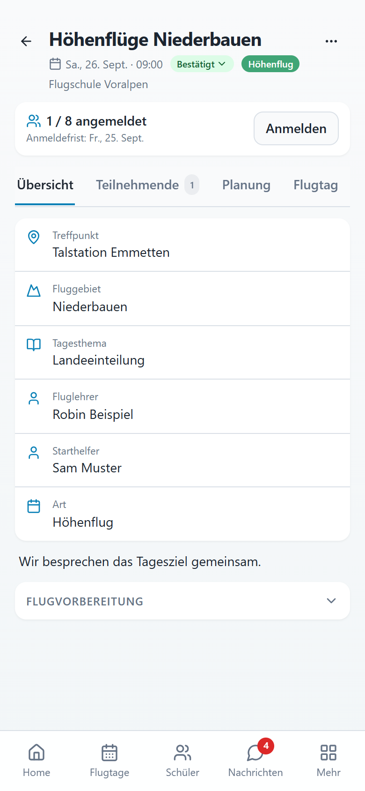

1. **Termin prüfen.** Lies Status, Datum, Uhrzeit und Treffpunkt in der Detailansicht.
2. **Als Administrator bearbeiten.** Öffne das Menü **Weitere Aktionen** mit den drei Punkten und wähle **Bearbeiten**. Speichere die Korrekturen im Terminformular.
3. **Teilnehmer benachrichtigen.** Öffne bei Höhenflugtagen unter **Planung** die gleichnamige Aktion. Prüfe Empfänger, Nachricht und Versandstatus.
4. **Fotos ergänzen.** Öffne als Ersteller **Weitere Aktionen → Fotos hinzufügen**. Vorhandene Fotos erscheinen in der Übersicht.
5. **Im Feed teilen.** Öffne als Ersteller über **Weitere Aktionen** die Veröffentlichungsvorschau. Prüfe Text und Bilder und bestätige erst dann die Veröffentlichung.
:::

### Fotoupload kontrollieren

Nach **Weitere Aktionen → Fotos hinzufügen** prüfst du als Ersteller die tatsächlich angezeigten Bilder. Flyary meldet erfolgreiche und fehlgeschlagene Uploads getrennt; bei einer gemischten Auswahl können beide Meldungen auftreten. Wiederhole nur fehlende Bilder. Berechtigte andere Personen können Termin- und freigegebene Flugbilder ebenfalls sehen. Ein erfolgreicher Upload bedeutet keine öffentliche Sichtbarkeit für beliebige Personen.

### Änderungen und Absagen

Wenn ein Anlass nicht stattfindet, dokumentiere den Status **Abgesagt** und informiere die betroffenen Personen. Setze den Status direkt im Kopf der Detailansicht, auch bei einer wetterbedingten Absage (Kapitel 13). Ein abgesagter Termin bleibt als Bezug für die Planung und Dokumentation verständlich. Das Löschen eines Termins ist wesentlich weitergehend und kann verknüpfte Inhalte entfernen.

Die Kopierfunktion eignet sich als Ausgangspunkt für einen ähnlichen Termin. Kontrolliere bei einer Kopie insbesondere Datum, Anmeldefrist, Titel, Team und wiederverwendete Texte. Eine Kopie ist ein neuer Anlass und muss entsprechend geprüft werden.

Eine erfolgreich gespeicherte Änderung beweist nicht, dass jede Person eine Push-Mitteilung gesehen hat. Wenn eine Nachricht im Betrieb verbindlich bestätigt werden soll, eignet sich die Bestätigungsfunktion einer Ankündigung im Chat besser als die blosse Annahme, dass ein Push gelesen wurde.

### Notfallinformationen einer teilnehmenden Person

In der Teilnehmerliste können berechtigte Personen über das rote Notfallsymbol die hinterlegten Notfallinformationen abrufen. Prüfe zuerst den Namen der Person. Die Anzeige unterscheidet Notfallkontakt und Gesundheitsangaben; Letztere hängen von der hinterlegten Einwilligung und den tatsächlich erfassten Daten ab. «Keine Angaben» bedeutet, dass Flyary keine entsprechenden Informationen anzeigen kann. Der Zugriff wird protokolliert. Verwende ihn im dafür vorgesehenen Anlassbezug und übertrage die Angaben nicht in einen allgemeinen Chat.

## 13. Terminstatus setzen und Durchführung kommunizieren

Die Durchführung wird direkt über den Status im Kopf des Flugtags festgehalten. Zur Auswahl stehen **Angekündigt**, **Bestätigt** und **Abgesagt**. Die frühere separate Wetterentscheid-Bearbeitung mit Frist und Notiz ist in dieser Ansicht durch die Statuswahl ersetzt. Wetterbeurteilung und Zeitpunkt der Rückmeldung stimmt ihr im Team ab; die Information an die Teilnehmenden erfolgt über die Kommunikationsfunktionen.

::: schritte Den Status eines Flugtags ändern
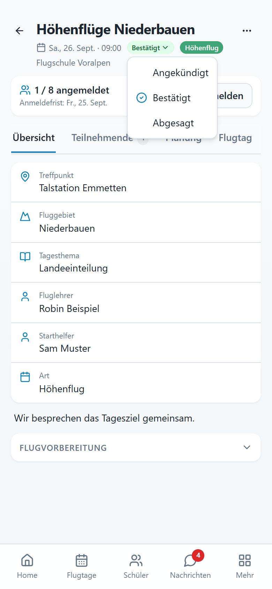

1. **Flugtag öffnen.** Prüfe Titel und Datum, damit du den richtigen Anlass änderst.
2. **Status antippen.** Schulleitung, Fluglehrer und Administratoren können die Statusanzeige im Kopf öffnen.
3. **Status wählen.** Setze **Angekündigt**, solange die Durchführung offen ist, **Bestätigt** für die geplante Durchführung oder **Abgesagt**, wenn der Anlass entfällt.
4. **Absage bestätigen.** Bei **Abgesagt** fragt die App ausdrücklich nach. Prüfe den Anlass nochmals, bevor du bestätigst.
5. **Ergebnis kontrollieren.** Warte auf **Status geändert** und prüfe die neue Anzeige. Ergänze die Begründung und allfällige nächste Schritte im Terminchat.
:::

Die Statuswahl speichert den Terminstatus. Sie öffnet keinen Nachrichtendialog und ist kein Nachweis, dass alle Teilnehmenden informiert wurden. Nutze **Chat** oder bei Höhenflugtagen **Planung → Teilnehmer benachrichtigen**. Vereinbare bei einer noch offenen Durchführung im Chat, wann die nächste Information folgt.

Bei abgesagten Schulterminen kann unter **Übersicht** ein Vorschlag für ein Ersatzdatum erscheinen. Prüfe Verfügbarkeiten und Terminangaben, bevor du eine neue Durchführung planst.

## 14. Check-in und Flüge am Flugtag erfassen

**Weg:** Schulansicht → **Flugtage** → Termin → **Flugtag**. Am Veranstaltungstag öffnet sich dieser Reiter für das berechtigte Team automatisch. Anmeldung, bestätigter Platz und tatsächliche Anwesenheit sind getrennte Angaben. Die Warteliste ist kein bestätigter Platz.

### Check-in und Tagespause

1. Prüfe Termin, Datum und die bestätigten Teilnehmenden. Unter **Teilnehmende** kontrollierst du Anmeldungen und Warteliste.
2. Tippe im Reiter **Flugtag** auf die Kachel einer angekommenen Person. Der Status wechselt zu **Da**. Erneutes Antippen setzt ihn auf **Noch offen** zurück.
3. Verwende im Menü der Person **Fehlt**, wenn sie nicht teilnimmt. **Alle anwesend** markiert nach Bestätigung die noch offenen Personen als da; bereits als fehlend markierte Personen werden dadurch nicht umgestellt.
4. Verwende für eine Tagespause **Heute pausieren** beziehungsweise **Pause bearbeiten**. Wähle Material, Müdigkeit, Verletzung, Wetter oder Anderes und ergänze bei Bedarf eine interne Notiz.
5. Kontrolliere die Zähler für anwesende, offene, fehlende und pausierte Personen. Über **Check-in anzeigen** beziehungsweise **Check-in ausblenden** kannst du die Kacheln ein- oder ausklappen, wenn angeboten.

Eine Tagespause verändert den allgemeinen Ausbildungsstatus nicht. Der Grund ist nur für das Team sichtbar. Sie ist auch keine automatische technische Startsperre: Bei einer pausierten Person fordert die Startaktion eine zusätzliche Bestätigung. Kläre die Teilnahme vor einer solchen Bestätigung.

### Inaktive Schüler in der Tagesansicht

Bei heutigen und zukünftigen, nicht abgesagten Schulterminen blendet Flyary pausierte oder abgebrochene Ausbildungen für das Schul- und eingeteilte Tagesteam standardmässig aus. Dies gilt auch für Starthelfer in Check-in und Startansicht. Über die angebotene Option zum Einschliessen inaktiver Schüler kannst du sie zur Kontrolle wieder anzeigen. Bei einem Ladefehler der Statusliste verwende die Wiederholung, bevor du aus fehlenden Personen Schlüsse ziehst.

Diese Filterung ist keine Abmeldung vom Termin und keine Löschung. Sie gibt Starthelfern keinen Zugang zum Schülerdossier oder zu den Gründen des Ausbildungsstatus. Die Tagespause eines einzelnen Flugtags bleibt ein eigener Vorgang.

### Zuständigkeit und Plätze des Tages

Starthelfer erhalten die **Startplatz**-Ansicht. Berechtigte Fluglehrer können zwischen **Landeplatz** und **Startplatz** wechseln; die Auswahl wird auf dem Gerät gemerkt. Der Zugang kann sich aus der Schulfunktion oder der Einteilung im Termin ergeben. Ein Starthelfer erhält dadurch keinen Zugang zu Fluglehrerbewertungen oder Schülerdossiers.

1. Prüfe als Fluglehrer unter **Plätze des Tages** Start- und Landeplatz und ändere sie bei Bedarf über **Ändern**.
2. Bestätige mit **Plätze speichern**. Neue Flüge übernehmen diese Vorgaben; ohne Vorgabe wird der zuletzt am Tag verwendete Platz herangezogen.
3. Kontrolliere bestehende Flüge separat. Ein Wechsel der Tagesvorgabe korrigiert bereits erfasste Flüge nicht automatisch.
4. Stelle bei Bedarf einen **Landehinweis** nach 15, 30, 45, 60 oder 90 Minuten ein. Standardmässig ist er aus. Die orange Kennzeichnung ist ein Hinweis in der Ansicht und keine Alarmierung.

### Offizielle Plätze und Ortsnamen im Schulbetrieb

Wähle bei den Tagesplätzen möglichst den passenden Eintrag aus **Offizielle Plätze**. Die Auswahl übernimmt beziehungsweise verwendet einen eigenen verknüpften Ort. Typ und Position kommen aus dem Katalog; persönliche Namen kannst du in **Pilot → Mehr → Orte** pflegen. Im Cockpit und bei geteilten Flügen sehen andere Personen ihren eigenen Namen für den offiziellen Platz oder dessen offiziellen Namen. Gleiche deshalb bei Unklarheiten den tatsächlichen Platz ab, nicht nur die Schreibweise.

Bestehende eigene Orte lassen sich in der Ortsverwaltung mit einem offiziellen Platz verknüpfen, ohne die zugehörigen Flüge zu verlieren. Doppelte eigene Orte können zusammengeführt werden. Dabei werden auch Schulflug- und Flugtagverweise auf den behaltenen Ort umgehängt, einschliesslich Verweisen bereits übernommener Schülerflüge. Prüfe deshalb den Zielort und vorhandene Schulnachweise vor einer Bereinigung. Eine Anleitung steht im Pilotenhandbuch, Kapitel 12.

**Platznamen** unter **Mehr** ist eine separate Funktion für globale Flyary-Administratoren. Schuladministration oder Schulleitung allein berechtigen nicht zur Änderung des offiziellen Katalognamens.

### Am Startplatz

1. Prüfe Person und Tagesstatus und tippe beim tatsächlichen Start auf **Start**.
2. Kontrolliere, dass der Flug als **in der Luft** erscheint. Pro Person kann nur ein Flug gleichzeitig in der Luft sein.
3. Bei einem abgebrochenen Start verwende **Abbruch**, ergänze gegebenenfalls eine interne Startnotiz und bestätige **Abbruch speichern**.
4. Halte sonstige Startbeobachtungen über **Startnotiz** fest. Diese Notizen sind für das Team bestimmt.

Ein Startabbruch zählt nicht als Schulflug. Verwende ihn nicht anstelle einer tatsächlich erfolgten Landung. Die Leiste **In der Luft** zeigt laufende Flüge mit der seit dem erfassten Start vergangenen Zeit, längste zuerst.

### Am Landeplatz und Übungshang

1. Öffne die Ansicht **Landeplatz**. Bei einem laufenden Flug tippe **Gelandet**, um die Landung mit Rückmeldung zu erfassen.
2. Wenn kein Start erfasst wurde, verwende **+ Flug**. Damit dokumentierst du einen gelandeten Schulflug; ohne Startzeit kann keine vollständige Flugdauer berechnet werden.
3. Im Grundkurs zählt **+1** direkt einen Flug. Ein versehentliches Antippen kannst du über **Rückgängig** in der Meldung korrigieren. Für zusätzliche Angaben gibt es **Flug mit Rückmeldung erfassen**.
4. Im Erfassungsdialog prüfst du die Person, bewertest bei Bedarf Manöver und schreibst eine Rückmeldung. Bestätige mit **Speichern**; Kapitel 15 erklärt die Inhalte.
5. Klappe die Person auf und öffne einen erfassten Flug zum Bearbeiten. Lösche einen falschen Eintrag nur über **Flug löschen** mit Bestätigung.

Die Schulflugzahl und die zusätzlich angezeigten **Von Schülern selbst im Flugbuch erfasst** stammen aus verschiedenen Datenbeständen. Addiere sie nicht als Gesamtzahl: Ein Schulflug kann bereits mit einem persönlichen Eintrag verknüpft sein. Die Schulaufzeichnung ist die Grundlage für den Ausbildungsnachweis (Kapitel 31).

## 15. Rückmeldungen, Lernschritte und Tagesabschluss

### Einen Flug bewerten

1. Öffne bei **Gelandet**, **+ Flug** oder beim Bearbeiten den Erfassungsdialog.
2. Bewerte die **Manöver des Tages** mit **Nochmals**, **Geht** oder **Sitzt**. Erneutes Antippen der gewählten Stufe entfernt diese Bewertung. Fehlen Manöver, prüfe die Vorbereitung des Termins unter **Planung**.
3. Schreibe unter **Rückmeldung an Schüler** eine konkrete Beobachtung. Textbausteine wie **Anflug sauber** lassen sich ergänzen; kontrolliere den vollständigen Text.
4. Erfasse vertrauliche Teamangaben separat unter **Intern (nur Team)**.
5. Tippe **Speichern** und prüfe das Ergebnis in der Flugliste. Beim Schliessen mit ungespeicherten Änderungen beachte die Rückfrage zum Verwerfen.

Die Rückmeldung und Bewertungen werden nach dem Tagesabschluss für den Schüler freigegeben, spätestens am Folgetag um **06:00 Uhr**. Interne Notizen bleiben im Team. Die Tageszusammenfassung ist ebenfalls für den Schüler bestimmt; sie ist kein Feld für interne Notizen.

### Tageszusammenfassung und nächster Lernschritt

Klappe die Person auf und erfasse unter **Tageszusammenfassung**, was gelungen ist und was als Nächstes geübt wird. Berechtigte Schulmitarbeitende können **Als nächsten Lernschritt markieren** wählen. Ein früherer Lernschritt wird als Vorlage angeboten, nicht automatisch als neue Beobachtung eingesetzt. Nutze **Letzten Lernschritt als Vorlage übernehmen** nur nach Prüfung und passe den Text an.

Die Zusammenfassung speichert automatisch und beim Verlassen des Feldes. Warte auf **Gespeichert**. Bei einem Fehler verwende die Wiederholung und öffne die Person zur Kontrolle erneut. Im Abschlussassistenten werden vorgeschlagene Zusammenfassungen dagegen ausdrücklich mit **Als Zusammenfassung übernehmen** gespeichert.

**Bisheriges Ausbildungsblatt:** Alte F1–F6-Notizen bleiben für berechtigte Schulmitarbeitende unter **Ausbildungsblatt (bisher)** lesbar. Sie lassen sich dort nicht mehr bearbeiten und zählen nicht als Schulflüge. Neue Flüge und Rückmeldungen erfasst du im Cockpit.

### Den Flugtag abschliessen

**Tag abschliessen** ist für berechtigte Fluglehrer ab dem Datum des Flugtags verfügbar. Der Assistent führt durch vier Schritte:

1. **Alle gelandet?** Prüfe die Liste der noch in der Luft erfassten Personen. Erfasse zuerst die tatsächliche Landung oder einen tatsächlichen Startabbruch; laufende Flüge blockieren den Abschluss. Kläre noch offene Anwesenheiten. Bei fehlenden Startplätzen kannst du **Startplatz des Tages einsetzen** verwenden, sofern die Tagesvorgabe stimmt.
2. **Zusammenfassungen:** Prüfe die Vorschläge aus den heutigen Flugrückmeldungen, passe sie an und bestätige einzeln **Als Zusammenfassung übernehmen**. Du kannst Vorschläge auch überspringen. Allein das Weiterblättern speichert einen Vorschlag nicht.
3. **Material:** Markiere nur tatsächlich zurückgegebene Ausleihen. Anfangs ist keine Rückgabe ausgewählt. **Alle zurück** wählt alle gezeigten Ausleihen aus; kontrolliere die Auswahl vor dem Fortfahren.
4. **Abrechnung:** Prüfe Startleiter-Guthaben, Materialmieten und die angezeigten Summen. Noch nicht gebuchte Starthelfer-Guthaben sind vorausgewählt. Bei der Materialmiete sind noch nicht gebuchte Personen mit Ausleihe an diesem Tag vorausgewählt. Korrigiere die Auswahl anhand der vereinbarten Leistungen.
5. Bestätige **Tag abschliessen**. Kontrolliere die Rückmeldung zu Guthaben, Posten, Rücknahmen und benachrichtigten Schülern sowie den Abschlusszeitpunkt.

Nur positive Tagesansätze erzeugen entsprechende Buchungen; die Ansätze pflegst du unter **Material → Ansätze**. Bereits termingebunden gebuchte Positionen werden berücksichtigt. Ein Check-in allein erzeugt keine Miete. Fehlende Zusammenfassungen oder Startplätze sind Hinweise, laufende Flüge hingegen eine Abschlusssperre.

Der Abschluss gibt die Rückmeldungen frei und benachrichtigt die Schüler. Er dokumentiert keine Zahlung und ersetzt keine Auszahlung. Prüfe Guthaben und Abrechnung anschliessend in den jeweiligen Bereichen.

### Nachträgliche Korrekturen

Ein abgeschlossener Tag ist für die Flugerfassung gesperrt. Verwende bei berechtigtem Korrekturbedarf **Wieder öffnen** und bestätige den Hinweis. Bereits verbuchte Guthaben und Posten bleiben bestehen und werden nicht storniert. Prüfe deshalb die Buchungen gesondert, korrigiere die Flugangaben und schliesse den Tag nach der Kontrolle erneut ab.

## 16. Schulinventar erfassen und pflegen

Im Bereich **Material** werden Schulgegenstände geführt. Verwende eine eindeutige Inventarnummer, damit Ausgabe, Rücknahme und Wartung demselben Gegenstand zugeordnet werden können. Gleich benannte Schirme in unterschiedlichen Grössen sollten auch in ihrer Bezeichnung unterscheidbar sein.

::: schritte Material im Lager finden

1. **Material → Lager öffnen.** Die Zähler geben einen Überblick über vorhandene, ausgegebene und ausgesonderte Gegenstände.
2. **Suchen und filtern.** Suche nach Bezeichnung oder Inventarnummer. Verwende Status- und Typenprüfungsfilter bei Bedarf.
3. **Gegenstand identifizieren.** Prüfe Art, Grösse und Inventarnummer. Bei ausgegebenem Material werden Person und Rückgabetermin angezeigt.
4. **Bearbeiten wählen.** Korrigiere Angaben am vorhandenen Gegenstand, statt einen zweiten Inventareintrag anzulegen.
5. **Lebenszyklus dokumentieren.** **Aussondern** entfernt den Gegenstand aus dem aktiven Bestand. Über eine passende Filterauswahl findest du ihn später wieder und kannst ihn gegebenenfalls wieder aufnehmen.
:::

::: schritte Einen neuen Gegenstand aufnehmen
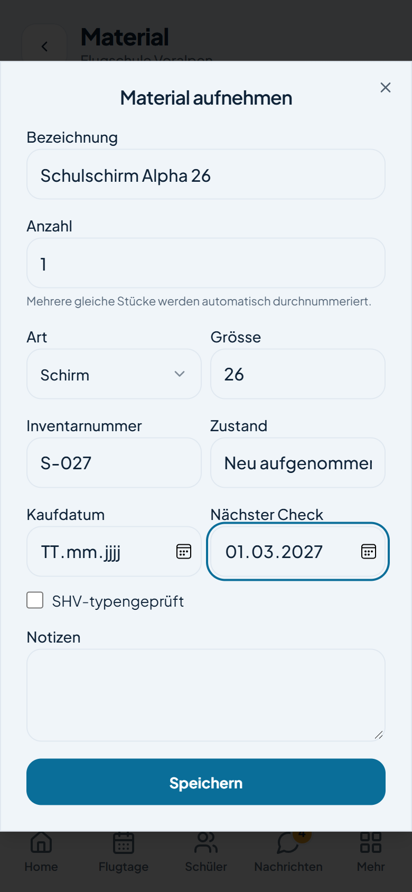

1. **Material aufnehmen öffnen.** Gib eine aussagekräftige **Bezeichnung** ein. Ohne Bezeichnung kann der Eintrag nicht gespeichert werden.
2. **Anzahl und Art wählen.** Die Anzahl ist beim Erfassen mehrerer gleicher Stücke hilfreich. Die App legt einzelne, durchnummerierte Gegenstände an.
3. **Identifikation ergänzen.** Trage Grösse, Inventarnummer und Zustand ein. Beispiel: «26», «S-026», «Gut, Check dokumentiert».
4. **Termine und Nachweise erfassen.** Ergänze Kaufdatum und nächsten Check, soweit bekannt. Setze **SHV-typengeprüft** nur anhand der vorhandenen Materialangaben.
5. **Notiz und Speichern.** Ergänze einen praktischen Hinweis, speichere und prüfe den Eintrag im Lager. Weitere Wartungsaufgaben werden separat erfasst.
:::

Die App kann überfällige Prüfungen und Wartungen anzeigen. Die Warnung ist kein automatischer Nachweis der Einsatzfähigkeit und blockiert eine Ausgabe nicht zwingend. Kläre den Zustand vor der Übergabe. Ein unbekannter Wartungsstatus bei einem Ladefehler darf nicht mit «keine Wartung nötig» verwechselt werden.

## 17. Material ausgeben und zurücknehmen

Eine Ausgabe verbindet einen konkreten Inventargegenstand mit einer Person und einem Zeitraum. Erfasse sie möglichst bei der Übergabe. So bleibt sichtbar, welches Material noch verfügbar ist und wer für eine Rückgabe anzusprechen ist.

::: schritte Einen Gegenstand ausgeben
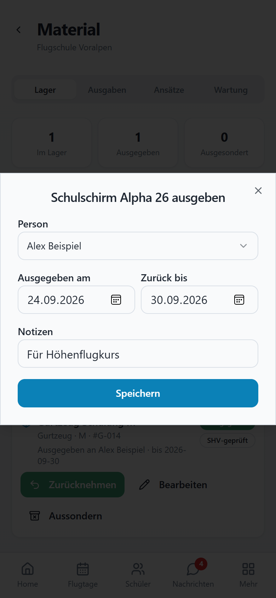

1. **Gegenstand auswählen.** Tippe im Lager beim richtigen Inventarstück auf **Ausgeben**. Prüfe die Bezeichnung im Dialogtitel.
2. **Person wählen.** Die Zuordnung zu einer Person ist erforderlich. Achte bei ähnlichen Namen besonders auf die richtige Auswahl.
3. **Ausgabedatum prüfen.** Kontrolliere das vorgegebene Datum. Trage bei Bedarf unter **Zurück bis** einen Rückgabetermin ein.
4. **Notiz ergänzen.** Dokumentiere beispielsweise Kursbezug oder vereinbarte Rückgabe. Prüfe allfällige Wartungshinweise vor dem Speichern.
5. **Speichern und Lager prüfen.** Der Gegenstand soll anschliessend als ausgegeben mit dem Namen der Person erscheinen.
:::

::: schritte Eine Ausleihe abschliessen
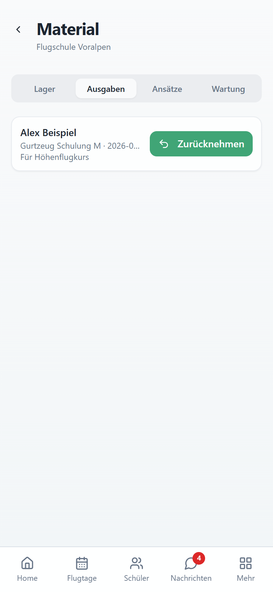

1. **Ausgaben öffnen.** Wechsle im Materialbereich auf den entsprechenden Reiter.
2. **Richtige Ausleihe finden.** Prüfe Person, Gegenstand und Ausgabedatum.
3. **Tatsächliche Rückgabe prüfen.** Kontrolliere, ob der richtige Gegenstand zurückgekommen ist, und kläre seinen Zustand.
4. **Zurücknehmen antippen.** Die App trägt das Rückgabedatum ein und führt den Gegenstand wieder im Lager.
5. **Nacharbeit erledigen.** Erfasse bei Bedarf eine Wartung oder aktualisiere den Materialeintrag. Kontrolliere eine allfällige Mietposition separat in der Abrechnung.
:::

Die Rücknahme und die Bezahlung einer Miete sind getrennte Vorgänge. Ebenso ist das Erfassen einer Ausleihe nicht automatisch eine fertige Rechnung. Prüfe nach dem Flugtag, welche Leistungen tatsächlich abzurechnen sind und ob bereits eine Tagesbuchung existiert.

## 18. Ansätze für Miete, Fahrtkosten und Guthaben

Unter **Material → Ansätze** pflegt die Schule ihre verwendeten Beträge. Sie dienen als Vorschläge für manuelle Positionen und als Grundlage für bestimmte Tagesbuchungen. Die Beispielwerte im Handbuch sind bewusst keine Empfehlung für eure Preise.

::: schritte Einen Ansatz kontrolliert ändern
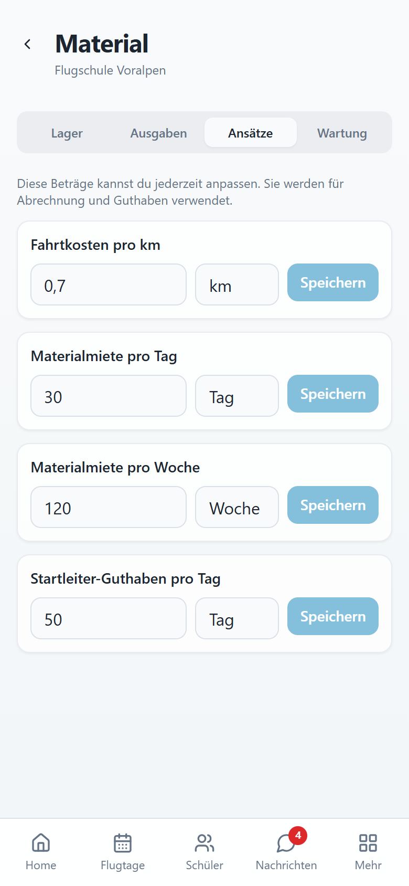

1. **Ansätze öffnen.** Wähle den Reiter im Materialbereich.
2. **Passende Zeile finden.** Unterscheide Fahrtkosten pro Kilometer, Materialmiete pro Tag, Materialmiete pro Woche und Startleiter-Guthaben pro Tag.
3. **Betrag und Einheit prüfen.** Trage den vereinbarten Betrag ein. Die Einheit soll zum Ansatz passen, beispielsweise Kilometer oder Tag.
4. **Zeile speichern.** Verwende **Speichern** bei der geänderten Zeile. Die Bearbeitung mehrerer Zeilen erfordert die Kontrolle jeder einzelnen Änderung.
5. **Neue Buchung prüfen.** Öffne danach eine neue Position und kontrolliere den vorgeschlagenen Ansatz. Bereits gespeicherte Positionen werden nicht durch eine neue Tarifangabe nachträglich umgerechnet.
:::

Wenn noch keine Ansätze vorhanden sind, kann die App Vorschlagswerte anbieten. Übernimm sie nur als Ausgangspunkt und passe sie an die tatsächlichen Vereinbarungen an. Für Fahrtkosten wird der Kilometeransatz vorgeschlagen, für Materialmiete grundsätzlich der Tagesansatz. Eine Wochenmiete muss in der konkreten Position bewusst mit dem passenden Ansatz erfasst werden.

Für die ausgewählten Buchungen beim Tagesabschluss sind positive Tagesansätze relevant (Kapitel 15). Fehlt ein Ansatz oder ist er null, entstehen daraus keine entsprechenden Tagespositionen. Bei «Nichts zu verbuchen» prüfst du daher sowohl die Ansätze als auch Anwesenheit und Teameinteilung.

## 19. Wartungsfristen führen

Wartungsfristen gehören zu konkreten Inventargegenständen. Die Übersicht unterstützt das Verfolgen von Rettungspackungen, Gurtzeug- und Schirmchecks sowie sonstigen Aufgaben. Der Checktermin im Materialstamm und die Liste einzelner Wartungsaufgaben sollten zusammenpassen.

::: schritte Offene Fristen kontrollieren
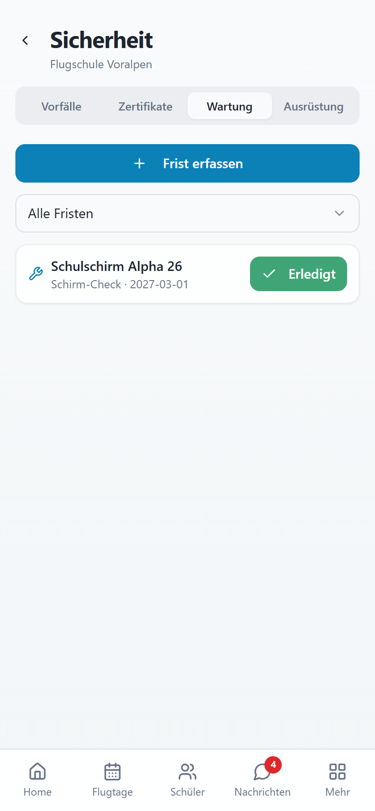

1. **Wartung öffnen.** Du erreichst die Ansicht über **Material → Wartung** oder **Sicherheit → Wartung**.
2. **Filter prüfen.** Zeige alle Fristen, bald fällige oder überfällige Aufgaben an. Eine leere gefilterte Liste bedeutet nicht, dass überhaupt keine Fristen existieren.
3. **Gegenstand und Fälligkeit lesen.** Ordne die Aufgabe dem richtigen Inventarstück zu.
4. **Durchführung organisieren.** Vereinbare den erforderlichen Service und halte relevante Informationen in der Aufgabe fest.
5. **Erst nach Abschluss markieren.** Mit **Erledigt** dokumentierst du die abgeschlossene Aufgabe. Prüfe danach die Anzeige und erfasse den nächsten Termin bei Bedarf separat.
:::

::: schritte Eine neue Wartungsfrist erfassen
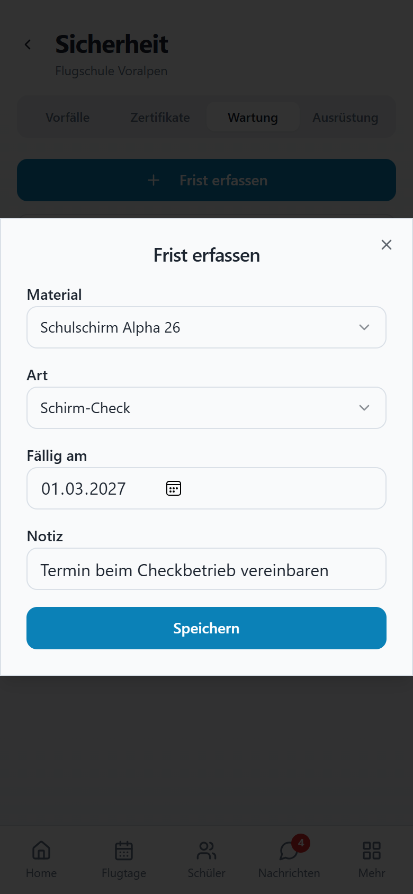

1. **Frist erfassen wählen.** Öffne das Formular in der Wartungsansicht.
2. **Material auswählen.** Die Zuordnung zu einem Gegenstand ist erforderlich. Fehlt er, nimm ihn zuerst ins Inventar auf.
3. **Art festlegen.** Wähle Rettung neu packen, Gurtzeug-Check, Schirm-Check oder eine andere Aufgabe.
4. **Fälligkeitsdatum eingeben.** Das Datum ist erforderlich. Ergänze optional eine Notiz zum Auftrag oder zur zuständigen Stelle.
5. **Speichern und wiederfinden.** Prüfe die neue Frist in der Liste. Wähle bei Bedarf wieder **Alle Fristen**, wenn der aktuelle Filter sie nicht zeigt.
:::

Eine erledigte Frist wird als abgeschlossene Aufgabe geführt. Daraus solltest du nicht ableiten, dass alle Materialangaben automatisch aktualisiert oder wiederkehrende Folgefristen bereits angelegt sind. Kontrolliere den nächsten Check im Inventar und die nächste Wartungsaufgabe ausdrücklich.

## 20. Teamzertifikate und Unterrichtstage

Unter **Sicherheit → Zertifikate** erscheinen Teammitglieder mit den erfassten Nachweisen. Die App zeigt Gültigkeitsangaben und, soweit berechenbar, Unterrichtstage. Verwende die Ansicht für die Datenpflege und Einsatzplanung.

::: schritte Die Nachweise des Teams prüfen
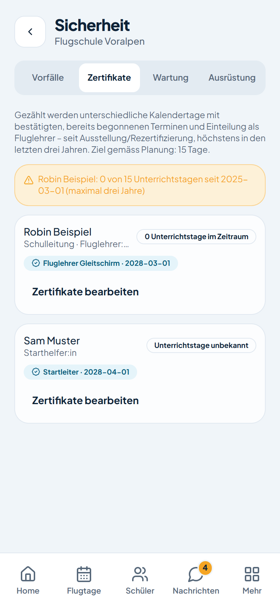

1. **Zertifikate öffnen.** Wähle den Reiter im Sicherheitsbereich.
2. **Person und Funktion prüfen.** Suche das passende Teammitglied. Fehlende Personen benötigen gegebenenfalls zuerst eine Teamfunktion.
3. **Nachweise lesen.** Kontrolliere die erfassten Typen und Gültigkeitsdaten.
4. **Hinweise bearbeiten.** Ein fehlendes Ausstellungsdatum kann die Berechnung der Unterrichtstage verhindern. Prüfe zuerst die Ausgangsdaten.
5. **Bearbeitung öffnen.** Tippe auf **Zertifikate bearbeiten**, um bekannte Angaben zu ergänzen oder zu korrigieren.
:::

::: schritte Datumsangaben eines Zertifikats erfassen
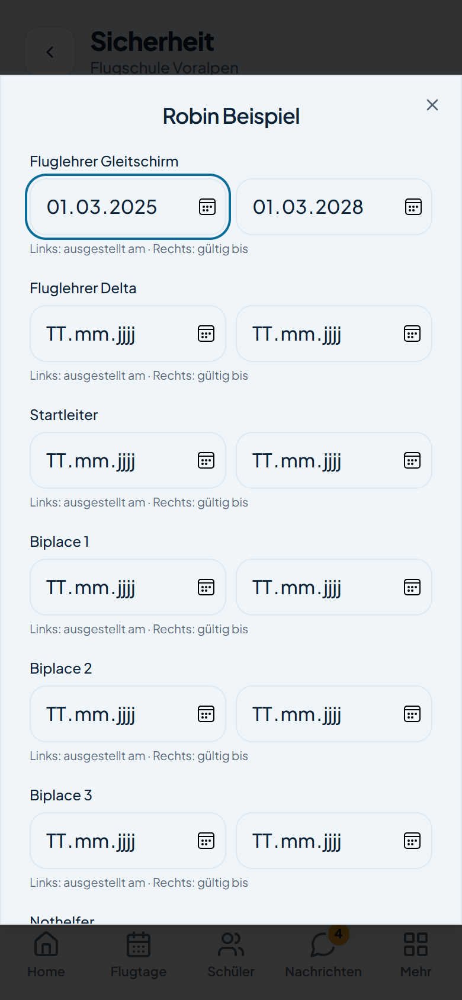

1. **Nachweistyp finden.** Der Dialog enthält unter anderem Fluglehrer, Startleiter, Biplace-Stufen und Nothelfer.
2. **Ausstellung erfassen.** Trage links das Ausstellungs- beziehungsweise Rezertifizierungsdatum des tatsächlichen Nachweises ein.
3. **Gültigkeit ergänzen.** Trage rechts das bekannte Gültigkeitsende ein. Es darf nicht vor dem Ausstellungsdatum liegen.
4. **Keine Daten erfinden.** Lass unbekannte Angaben zur Klärung offen. Beachte, dass das vollständige Leeren eines bestehenden Nachweises dessen Entfernung bewirken kann.
5. **Speichern und prüfen.** Kontrolliere alle bearbeiteten Nachweise. Bei einer Meldung über unvollständiges Speichern können einzelne Änderungen bereits übernommen sein; prüfe die offenen Eingaben vor dem Wiederholen.
:::

Für Unterrichtstage verwendet Flyary unterschiedliche Kalendertage mit bestätigten, bereits begonnenen Terminen und einer Einteilung als Fluglehrer. Der Zeitraum beginnt bei Ausstellung beziehungsweise Rezertifizierung und reicht höchstens drei Jahre zurück. Ein zukünftiger Einsatz oder nur ein Name im Freitext erhöht diese Zahl nicht. Die in der App angezeigten Zielwerte sind die implementierte Planungshilfe; dieses Handbuch legt damit keine eigenständigen Zulassungsanforderungen fest.

## 21. Persönliche Ausrüstung kontrollieren

Der Ausrüstungscheck dokumentiert, ob die für die Person abgefragten Gegenstände vorhanden sind. Er führt Helm, Schuhwerk, Gurtzeug mit Protektor und Rettungsgerät. Fehlende eigene Ausrüstung kann nach Absprache durch Leihmaterial abgedeckt werden.

::: schritte Den Ausrüstungscheck aktualisieren
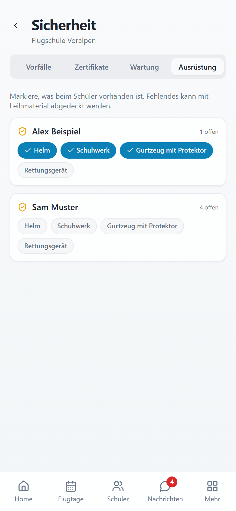

1. **Ausrüstung öffnen.** Verwende **Sicherheit → Ausrüstung**, die Schülerkarte oder den Materialreiter im Dossier.
2. **Person prüfen.** Vergewissere dich vor dem Antippen, dass du die richtige Karte bearbeitest.
3. **Vorhandene Punkte markieren.** Tippe den jeweiligen Gegenstand an. Die farbige Markierung und das Häkchen zeigen die gespeicherte Auswahl.
4. **Offene Punkte klären.** Organisiere fehlendes Material und dokumentiere konkrete Ausleihen separat im Materialbereich.
5. **Ergebnis kontrollieren.** Prüfe die Zahl offener Punkte. Bei einer Fehlermeldung lade die Daten erneut und kontrolliere den tatsächlichen Speicherstand.
:::

Die Checkliste dokumentiert Vorhandensein. Sie enthält keine vollständige Zustandsprüfung, keine Passformbeurteilung und keine automatische Zuordnung einer Serien- oder Inventarnummer. Sie ersetzt daher die schulische Kontrolle vor der Verwendung nicht.

Bei Höhenflug-Anmeldungen kann ein Hinweis auf noch nicht bestätigte Ausrüstung erscheinen. Dieser Hinweis blockiert die Anmeldung nicht. Ebenso kann die App bei Grundkursterminen eine Materialquote anzeigen. Nutze solche Hinweise zur Vorbereitung und kläre den realen Bedarf, statt von einer automatischen Materialreservierung auszugehen.

## 22. Vorfälle dokumentieren und nachverfolgen

Die Vorfallansicht verbindet Zeitpunkt, Termin, beteiligte Personen, Hergang und Massnahmen. Erfasse den Sachverhalt nachvollziehbar und unterscheide Beobachtungen von noch ungeklärten Informationen. Die Eingabe in Flyary dokumentiert den Vorgang innerhalb der Schule.

::: schritte Eine Vorfallmeldung erfassen
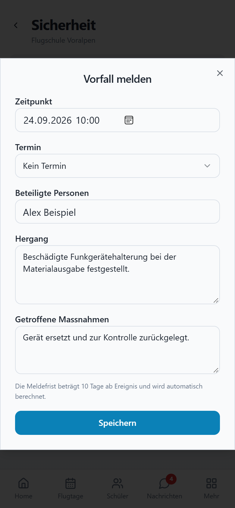

1. **Vorfall melden öffnen.** Verwende den Sicherheitsbereich oder die entsprechende Aktion direkt im betroffenen Termin.
2. **Zeitpunkt prüfen.** Trage den tatsächlichen Zeitpunkt ein. Kontrolliere Datum und lokal angezeigte Uhrzeit.
3. **Termin und Beteiligte ergänzen.** Wähle den zugehörigen Termin, soweit vorhanden. Aus der Terminansicht kann er bereits vorgewählt sein.
4. **Hergang beschreiben.** Dieses Textfeld ist erforderlich. Ergänze die getroffenen Massnahmen im separaten Feld, damit beide Angaben unterscheidbar bleiben.
5. **Speichern und prüfen.** Öffne die erfasste Meldung in der Übersicht und kontrolliere insbesondere Zeitpunkt und Terminbezug.
:::

::: schritte Den Bearbeitungsstand einer Meldung verfolgen
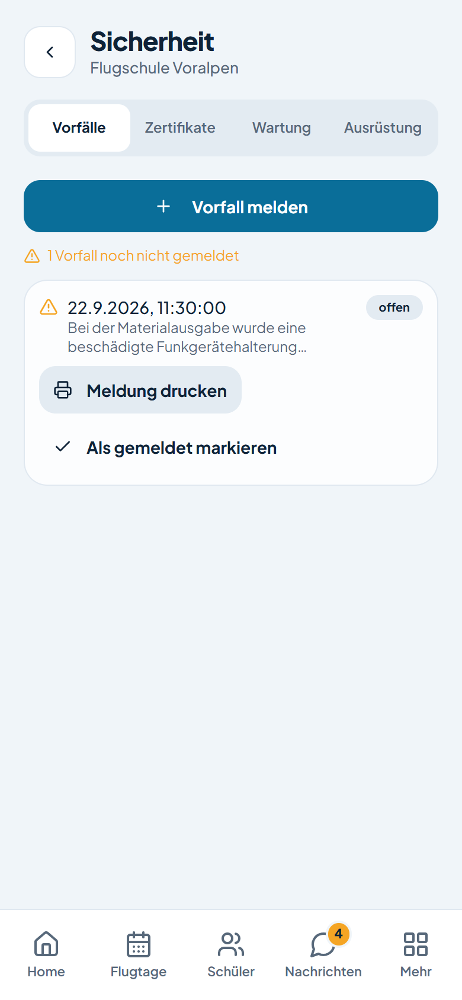

1. **Vorfälle öffnen.** Die Liste zeigt die gespeicherten Meldungen und deren Status.
2. **Datensatz prüfen.** Lies Datum, Kurzbeschreibung und allfällige Fristanzeige.
3. **Meldung drucken.** Nutze die Druckfunktion für die weitere Bearbeitung beziehungsweise Ausgabe über den Gerätedialog.
4. **Übermittlung getrennt durchführen.** Die Druckfunktion versendet die Meldung nicht automatisch an eine externe Stelle.
5. **Als gemeldet markieren.** Setze den Status erst nach der tatsächlich erfolgten Meldung. **Wieder öffnen** korrigiert den internen Bearbeitungsstatus, wenn nötig.
:::

Die Oberfläche berechnet eine Fristanzeige von zehn Tagen ab Ereignis. Dies beschreibt die in Flyary implementierte Erinnerung. Welche Meldung im konkreten Fall an welche Stelle erforderlich ist, richtet sich nach euren dafür geltenden Verfahren; ein Häkchen in der App ist kein Versandnachweis. Ergänze den internen Ablauf so, dass die verantwortliche Person den tatsächlichen Abschluss nachvollziehen kann.

## 23. Abrechnungsposten erfassen und Zahlungseingänge pflegen

Im Bereich **Abrechnung** werden Forderungen pro Person als einzelne Positionen geführt. Die Übersicht unterscheidet offene und als bezahlt markierte Posten. Stimmen Summen nicht, prüfe zuerst die einzelnen Buchungen und ihren Zahlungsstatus.

::: schritte Die offenen Posten überblicken
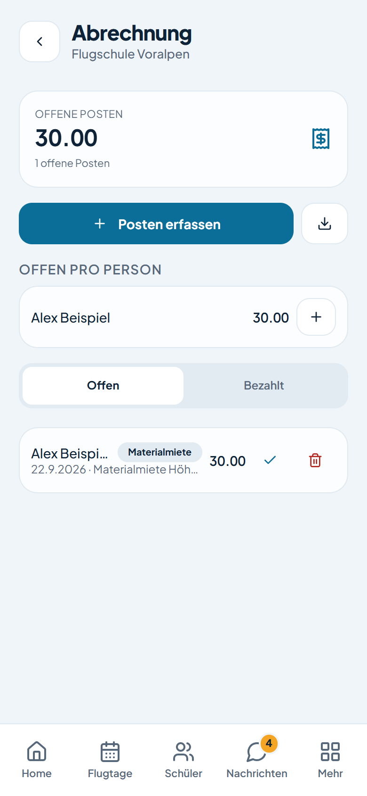

1. **Abrechnung öffnen.** Kontrolliere die richtige Schule im Kopf der Ansicht.
2. **Gesamtsumme lesen.** Oben werden die offenen Posten zusammengefasst.
3. **Person auswählen.** Unter **Offen pro Person** kannst du den Namen antippen, um eine persönliche Aufstellung zu öffnen.
4. **Offen und Bezahlt vergleichen.** Die Reiter trennen die Positionen nach dem gepflegten Zahlungsstatus.
5. **Zahlung markieren.** Verwende die Aktion **Als bezahlt markieren** erst nach der Kontrolle des tatsächlichen Zahlungseingangs. Die Position wechselt anschliessend in die bezahlte Auswahl.
:::

::: schritte Eine neue Abrechnungsposition eingeben
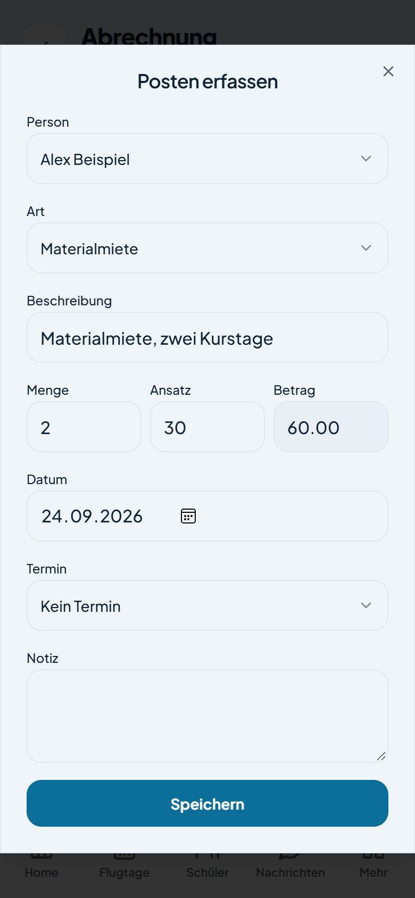

1. **Posten erfassen öffnen.** Wähle die betreffende Person; diese Zuordnung ist erforderlich.
2. **Art wählen.** Unterscheide Fahrtkosten, Materialmiete, Materialkauf, Kursgebühr und Sonstiges.
3. **Leistung beschreiben.** Ergänze einen verständlichen Text. Trage Menge und Ansatz ein und prüfe die berechnete Summe. Beispiel: 2 Tage × 30 CHF = 60 CHF.
4. **Datum und Bezug ergänzen.** Prüfe das Buchungsdatum. Wähle optional einen Termin und ergänze bei Bedarf eine Notiz.
5. **Speichern und abgleichen.** Kontrolliere die neue offene Position. Prüfe vorherige Tagesbuchungen, damit dieselbe Leistung nicht doppelt erfasst wird.
:::

Die App berechnet den Betrag aus Menge und Ansatz. Kontrolliere beide Zahlen, auch wenn ein Ansatz vorgeschlagen wurde. Beim Wechsel der Art kann ein anderer Standardansatz eingesetzt werden. Für Wochenmiete oder individuelle Vereinbarungen passt du den Ansatz in der Position ausdrücklich an.

**Als bezahlt markieren** hinterlegt den Zahlungsstatus mit einem Datum; die App prüft dafür kein Bankkonto. Eine irrtümliche Position kann über die Löschaktion mit Bestätigung entfernt werden. Prüfe vor einer Korrektur, ob sie bereits in einer exportierten Aufstellung verwendet wurde, und halte den Abgleich mit eurer Administration nachvollziehbar.

::: schritte Eine persönliche Aufstellung ausgeben
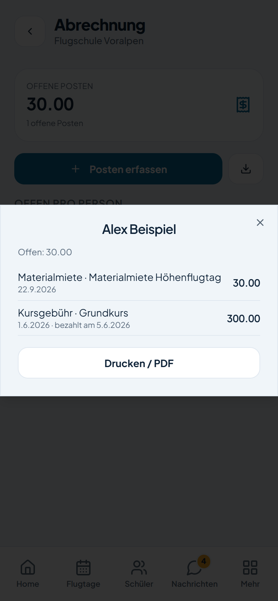

1. **Personenname antippen.** Öffne in der Abrechnungsübersicht die gewünschte Person unter **Offen pro Person**.
2. **Einträge prüfen.** Die Aufstellung enthält deren Positionen und den noch offenen Betrag.
3. **Drucken / PDF wählen.** Es öffnet sich die Druckausgabe des Browsers beziehungsweise Geräts. Wähle dort einen Drucker oder, falls angeboten, die PDF-Ausgabe.
4. **Ausgabe kontrollieren.** Prüfe Person, Zeitraum, Positionen und Summe vor der Weitergabe.
5. **Gesamtexport bei Bedarf nutzen.** Der CSV-Export der Abrechnungsübersicht enthält die vorhandenen Positionen mit Zahlungsdaten und Notizen für die weitere Verarbeitung.
:::

## 24. Startleiter-Guthaben und Auszahlungen

Der Bereich **Guthaben** führt Salden und Buchungen für Einsatztage. Ein Guthaben kann durch die Tagesbuchung oder durch eine manuelle Buchung entstehen. Prüfe daher vor jeder Ergänzung, ob der betreffende Einsatz schon enthalten ist.

::: schritte Einen Saldo nachvollziehen
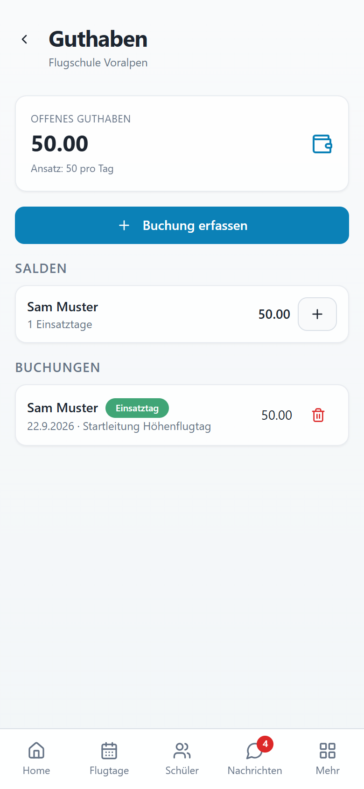

1. **Guthaben öffnen.** Prüfe die Schule und den angezeigten Tagesansatz.
2. **Offenes Guthaben lesen.** Die Gesamtsumme fasst die vorhandenen Salden zusammen.
3. **Person suchen.** Lies den Saldo und die gezählten Einsatztage der betreffenden Person.
4. **Buchungen vergleichen.** Kontrolliere Datum, Art, Betrag und Notiz der Einzelbuchungen.
5. **Fehlende Buchung vorbereiten.** Öffne **Buchung erfassen** oder die Ergänzungsaktion bei der Person. Erfasse keine zweite Gutschrift für einen bereits verbuchten Termin.
:::

::: schritte Einsatz, Auszahlung oder Korrektur buchen
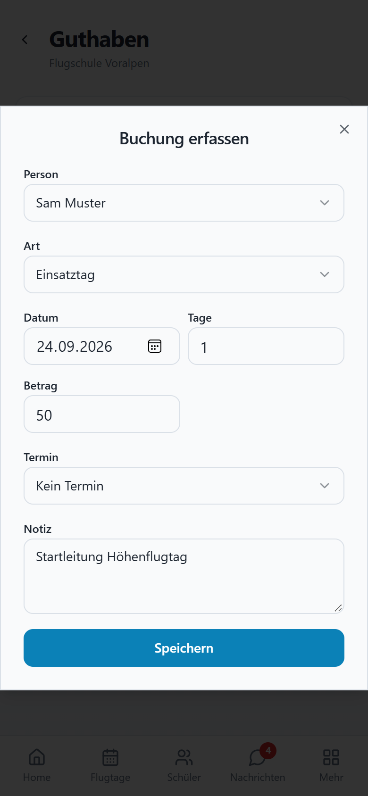

1. **Person auswählen.** Die Person ist eine erforderliche Zuordnung.
2. **Art festlegen.** **Einsatztag** erhöht das Guthaben, **Auszahlung** reduziert es, **Korrektur** erlaubt eine Anpassung.
3. **Datum und Menge prüfen.** Bei Einsatztagen gibst du die Zahl der Tage an. Der Vorschlag für den Betrag kann aus dem Tagesansatz berechnet werden.
4. **Betrag kontrollieren.** Bei einer Auszahlung erfasst du den auszubuchenden Betrag. Bei einer Korrektur bestimmt das Vorzeichen, ob der Saldo steigt oder sinkt.
5. **Termin und Notiz ergänzen.** Ordne die Buchung bei Bedarf einem Termin zu, speichere und prüfe den aktualisierten Saldo.
:::

Eine Auszahlungsbuchung dokumentiert die Auszahlung in Flyary. Sie überweist kein Geld. Führe die tatsächliche Zahlung über euren vorgesehenen Zahlungsweg aus und gleiche danach Betrag und Buchung ab. Eine Änderung des allgemeinen Tagesansatzes berechnet vergangene Einsätze nicht rückwirkend neu.

## 25. Kommunikation, Kanäle und Nachrichten

Der Schulbereich **Kommunikation** bündelt die Kanäle der ausgewählten Schule und die Team-Umfragen. Auch der bisherige Einstieg **Team-Kanal** auf der Startseite führt zu dieser Übersicht. Über **Nachrichten** erreichst du zusätzlich den gemeinsamen Eingang mit Gruppen-, Schul-, Termin- und Direktnachrichten.

::: schritte Den passenden Schulkanal wählen
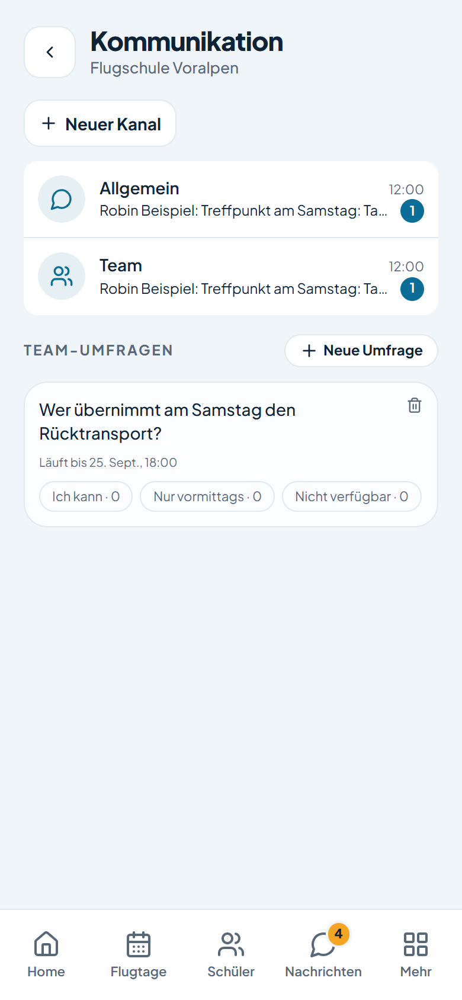

1. **Kommunikation öffnen.** Prüfe die ausgewählte Schule.
2. **Allgemein wählen.** Dieser Kanal richtet sich an die ganze Schulgruppe einschliesslich Schülern.
3. **Team wählen.** Verwende diesen Kanal für interne Absprachen mit Schulleitung, Fluglehrern und Starthelfern.
4. **Weitere Kanäle prüfen.** Lies den Namen und den angegebenen Empfängerkreis, bevor du eine Nachricht schreibst.
5. **Umfragen beachten.** Unterhalb der Kanalliste stehen die Team-Umfragen. Kanalnachrichten und Umfragen sind getrennte Einträge.
:::

::: schritte Einen Kanal für einen Kurs anlegen
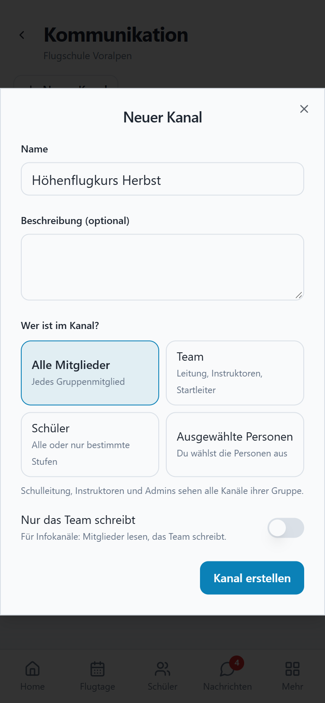

1. **Neuer Kanal wählen.** Die Aktion steht Personen mit Kanalverwaltung zur Verfügung.
2. **Namen eingeben.** Verwende einen eindeutigen Namen, beispielsweise «Höhenflugkurs Herbst», und ergänze bei Bedarf eine Beschreibung.
3. **Empfängerkreis bestimmen.** Wähle alle Mitglieder, das Team, Schüler oder ausgewählte Personen. Bei Schülern kannst du Ausbildungsstufen einschränken; bei ausgewählten Personen markierst du die Namen.
4. **Schreibrecht festlegen.** Mit **Nur das Team schreibt** wird der Kanal zum Informationskanal für die übrigen Mitglieder.
5. **Kanal erstellen.** Prüfe anschliessend den Namen und den angezeigten Empfängerkreis. Über das Zahnrad kannst du die Kanaleinstellungen wieder öffnen.
:::

Schulleitung, Instruktoren und Administratoren sehen alle Gruppenkanäle ihrer Schule, auch Kanäle für ausgewählte Personen. Verwende für ein persönliches Gespräch eine Direktnachricht. Bei den Standardkanälen bleibt der Empfängerkreis fest. **Archivieren** erhält den Verlauf lesbar und verhindert neue Nachrichten; ein eigener Kanal kann über die Einstellungen mit Bestätigung gelöscht werden.

::: schritte Im Team-Kanal schreiben
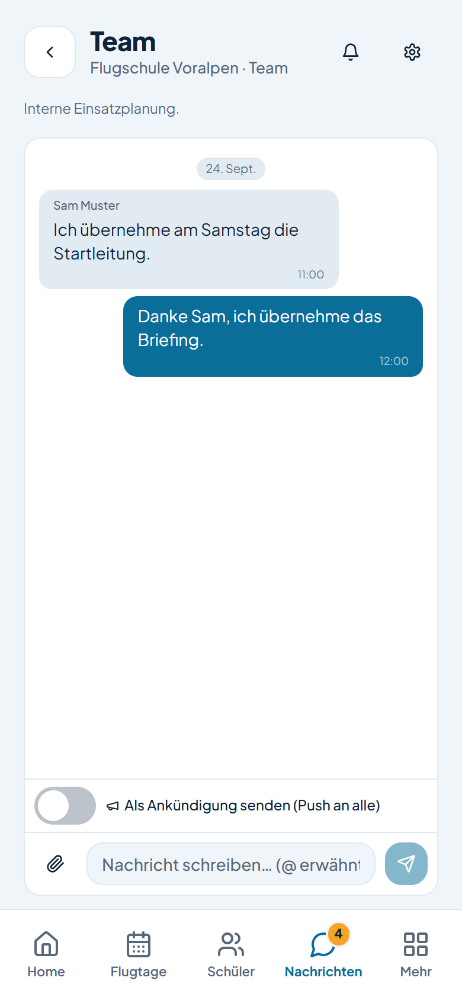

1. **Team öffnen.** Prüfe Kanalname, Schule und Empfängerkreis im Kopf.
2. **Nachricht eingeben.** Halte Absprachen mit Datum und konkreter Aufgabe fest.
3. **Person erwähnen.** Tippe **@** und wähle den Namen aus den Vorschlägen. Prüfe die gewählte Person vor dem Senden.
4. **Anhang bei Bedarf ergänzen.** Über das Anhangsymbol kannst du ein Bild oder eine unterstützte Datei auswählen. Kontrolliere die Vorschau.
5. **Senden und kontrollieren.** Prüfe den Eintrag im Verlauf. Eine Nachricht ändert weder die Teameinteilung noch den Terminstatus automatisch.
:::

::: schritte Eine Ankündigung mit Bestätigung vorbereiten
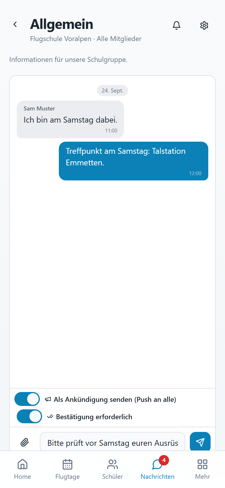

1. **Empfänger prüfen.** Öffne beispielsweise **Allgemein**, wenn die ganze Schulgruppe informiert werden soll.
2. **Text eingeben.** Beschreibe die Information und die erwartete Handlung.
3. **Als Ankündigung senden aktivieren.** Diese Option steht berechtigten Personen zur Verfügung.
4. **Bestätigung erforderlich aktivieren.** Verwende diese zusätzliche Option für eine ausdrückliche Rückmeldung.
5. **Senden und nachverfolgen.** Prüfe im Verlauf die eingegangenen Bestätigungen. Ein Entwurf wurde noch nicht versendet; eine fehlende Bestätigung bedeutet nicht zwingend, dass die Nachricht ungelesen ist.
:::

::: schritte Auf Nachrichten reagieren und eigene Texte korrigieren
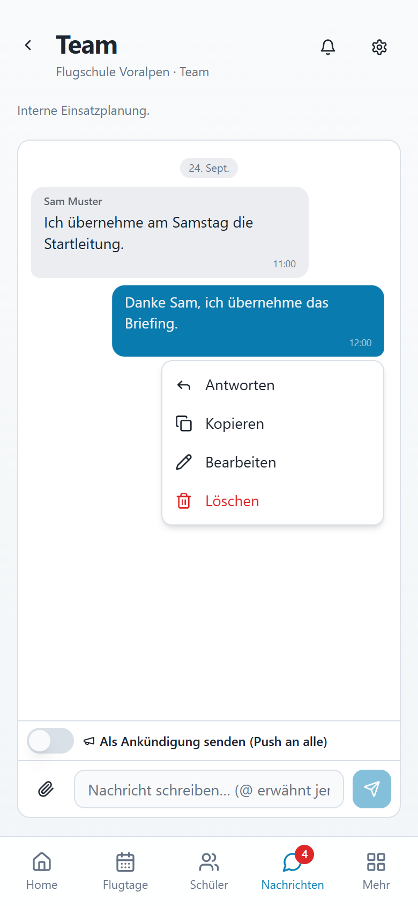

1. **Kurz antippen.** Ein Tipp auf eine Nachrichtenblase öffnet die Emoji-Reaktionen. Eine eigene Reaktion kannst du durch erneute Auswahl entfernen.
2. **Länger drücken.** Halte die Nachricht gedrückt; am Computer öffnet ein Rechtsklick die weiteren Aktionen.
3. **Antworten wählen.** Prüfe das zitierte Original über dem Eingabefeld und schreibe die Antwort. Das Kreuz entfernt den Antwortbezug.
4. **Eigenen Text bearbeiten.** Wähle bei einer eigenen Nachricht **Bearbeiten**, korrigiere den Text und speichere. Der Verlauf kennzeichnet den bearbeiteten Eintrag.
5. **Weitere Aktionen nutzen.** **Kopieren** Übernimmt den Text. **Löschen** ist nur bei entsprechender Berechtigung verfügbar und verlangt eine Bestätigung.
:::

::: schritte Benachrichtigungen je Kanal einstellen
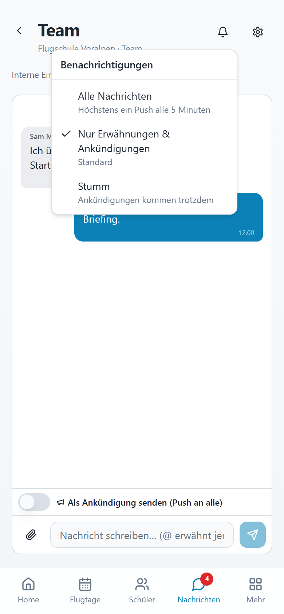

1. **Glocke antippen.** Öffne im Kanal die **Benachrichtigungen**.
2. **Alle Nachrichten wählen.** Diese Einstellung bündelt Push-Mitteilungen auf höchstens eine alle fünf Minuten.
3. **Nur Erwähnungen & Ankündigungen wählen.** Dies ist die Standardeinstellung für Kanäle.
4. **Stumm bei Bedarf wählen.** Gewöhnliche Nachrichten werden stummgeschaltet; Ankündigungen kommen weiterhin.
5. **Einstellung kontrollieren.** Prüfe die Rückmeldung der App. In Direktnachrichten stehen **Alle Nachrichten** und **Stumm** zur Auswahl. Push-Mitteilungen setzen die Freigabe auf dem Gerät voraus.
:::

::: schritte Den Nachrichteneingang nutzen
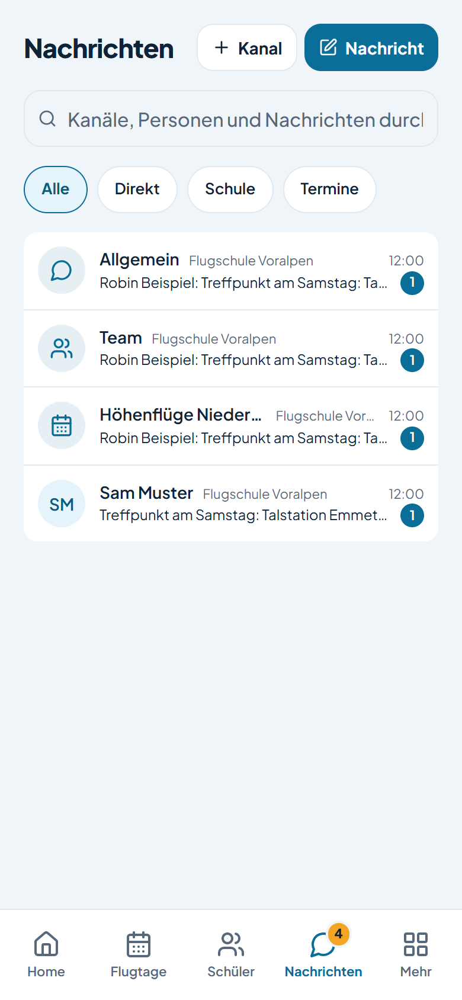

1. **Nachrichten öffnen.** Verwende das Nachrichtensymbol in der Navigation.
2. **Kanal auswählen.** Prüfe Titel, Schule, letzte Nachricht und die Zahl ungelesener Nachrichten.
3. **Nach Typ filtern.** Nutze die angebotenen Filter, etwa für Schule, Termine oder Direktnachrichten.
4. **Verlauf lesen.** Das Öffnen eines Kanals aktualisiert den Ungelesen-Zähler. Dies ersetzt keine angeforderte ausdrückliche Bestätigung.
:::

::: schritte Eine Direktnachricht beginnen
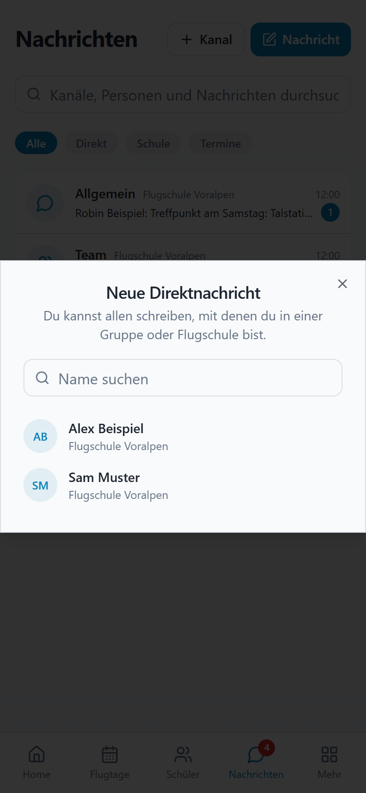

1. **Nachricht wählen.** Öffne im Nachrichteneingang die Schaltfläche **Nachricht**.
2. **Person suchen.** Zur Auswahl stehen Personen, mit denen du eine Gruppe oder Flugschule teilst.
3. **Empfänger öffnen.** Tippe auf den Namen und prüfe ihn im Kopf des persönlichen Chats.
4. **Text senden.** Schreibe die persönliche Nachricht und kontrolliere den Verlauf.
:::

::: schritte Eine ältere Nachricht finden
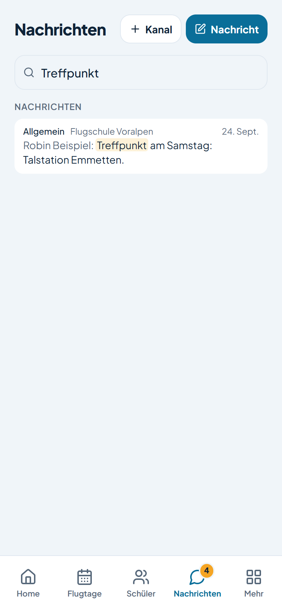

1. **Suchfeld verwenden.** Gib im Nachrichteneingang einen Begriff ein, beispielsweise «Treffpunkt».
2. **Mindestens zwei Zeichen eingeben.** Dann sucht die App auch in den Nachrichten der für dich lesbaren Kanäle.
3. **Treffer prüfen.** Lies Kanal, Verfasser, Datum und Textausschnitt.
4. **Treffer öffnen.** Tippe auf die Nachricht, um den zugehörigen Verlauf zu öffnen. Die aktuelle Kanalansicht lädt bis zu 200 Nachrichten; sehr alte Treffer sind darin möglicherweise nicht direkt sichtbar.
:::

::: schritte Zum konkreten Flugtag kommunizieren
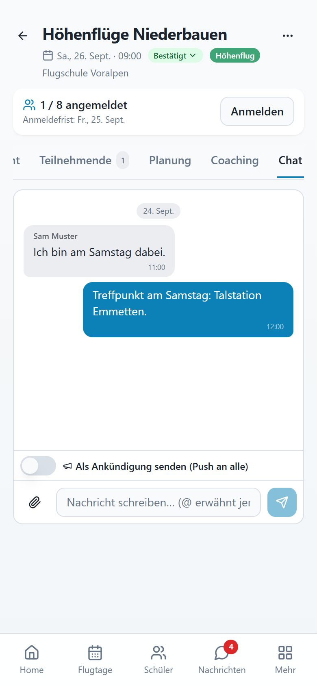

1. **Flugtag öffnen.** Prüfe den richtigen Anlass und das Datum.
2. **Chat wählen.** Verschiebe bei Bedarf die Reiterleiste seitlich.
3. **Terminbezogen schreiben.** Halte Treffpunktänderungen und Absprachen im Chat dieses Anlasses fest.
4. **Ergebnis prüfen.** Der Terminchat ist auch über den Nachrichteneingang erreichbar. Eine Nachricht ändert den offiziellen Terminstatus nicht.
:::

::: schritte Eine Team-Umfrage erstellen
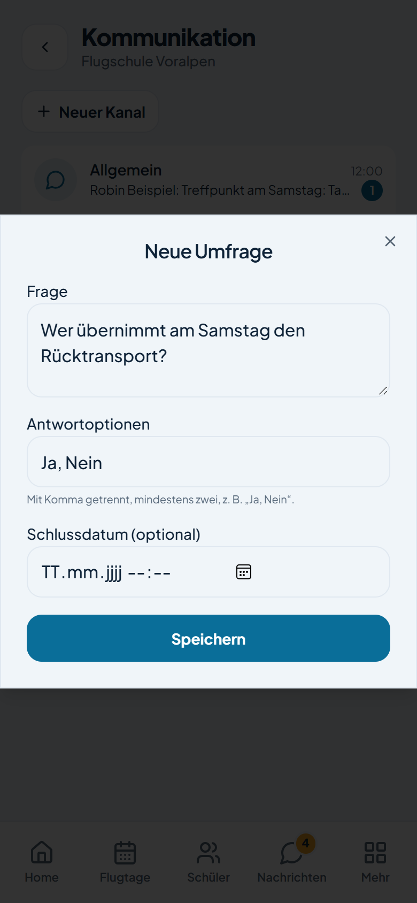

1. **Kommunikation öffnen.** Scrolle unter die Kanalliste und wähle **Neue Umfrage**.
2. **Frage eingeben.** Formuliere eine eindeutige Frage, etwa «Wer übernimmt am Samstag den Rücktransport?».
3. **Antwortoptionen erfassen.** Gib mindestens zwei Optionen ein, durch Kommas getrennt.
4. **Schlussdatum ergänzen.** Ein optionaler Zeitpunkt begrenzt die Antwortfrist. Prüfe Datum und Uhrzeit.
5. **Erstellen und prüfen.** Kontrolliere Frage und Optionen. Übertrage das Ergebnis anschliessend in die konkrete Einteilung. Eine geschlossene Umfrage nimmt keine neuen Antworten an.
:::

## 26. Statistiken und Jahresbericht

Statistiken sind nur so vollständig wie die erfassten Termine, Anmeldungen, Einteilungen und Ausbildungsänderungen. Nutze sie für die Übersicht und prüfe auffällige Werte anhand der zugrunde liegenden Einträge.

::: schritte Schulkennzahlen auswerten
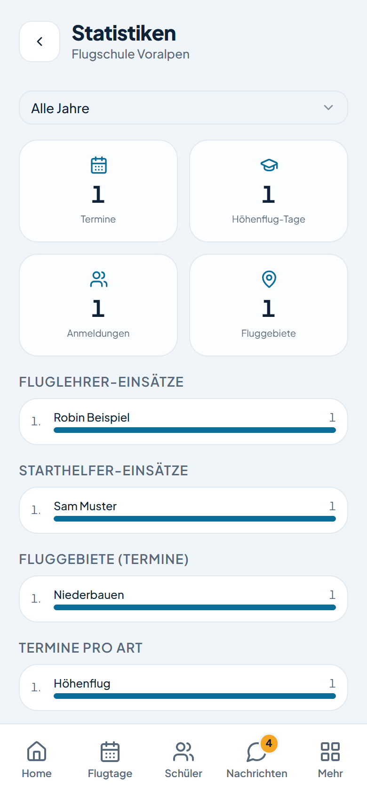

1. **Statistiken öffnen.** Prüfe die ausgewählte Schule.
2. **Jahr wählen.** Verwende **Alle Jahre** oder ein bestimmtes Jahr für die terminbezogenen Kennzahlen.
3. **Termine und Anmeldungen lesen.** Unterscheide Anmeldungen von tatsächlicher Anwesenheit. Die Kennzahlen haben unterschiedliche Datenquellen.
4. **Einsätze und Gebiete prüfen.** Die Ranglisten zeigen die erfassten Einteilungen und Terminzuordnungen. Fehlende strukturierte Einteilungen können die Auswertung verzerren.
5. **Ausbildungserfolg einordnen.** Die Gesamtwerte zu Erfolg und Ausbildungsdauer sind ausdrücklich nicht durch die Jahresauswahl eingeschränkt.
:::

### Grenzen der Jahresauswahl

Abgesagte Termine werden bei den entsprechenden aktiven Terminauswertungen ausgeschlossen. Eine Ausbildung kann über mehrere Jahre dauern; deshalb betrachtet die App den Ausbildungserfolg gesondert über den verfügbaren Verlauf. Abgebrochene Ausbildungen werden in der angezeigten Erfolgsquote nicht einfach als gescheiterte Abschlüsse gezählt. Lies die Erläuterung in der Oberfläche, bevor du Zahlen für externe Vergleiche verwendest.

::: schritte Den Jahresbericht vorbereiten
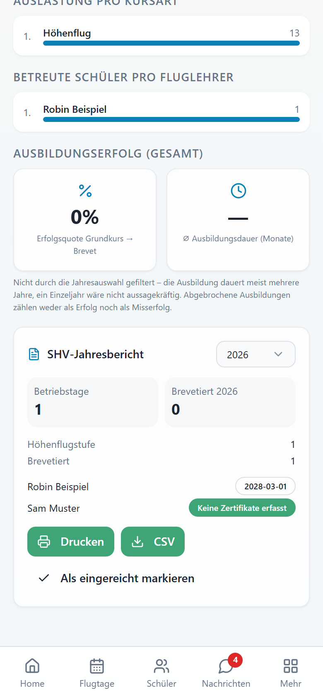

1. **Zum Jahresbericht scrollen.** Öffne innerhalb der Statistik den Abschnitt **SHV-Jahresbericht**.
2. **Berichtsjahr prüfen.** Kontrolliere die zum Bericht gehörende Jahresauswahl und die dargestellten Kennzahlen.
3. **Unbekannte Angaben klären.** Historische Ausbildungsstände können nur aus vorhandenem Änderungsverlauf rekonstruiert werden. Fehlende alte Angaben sind keine Nullwerte.
4. **Ausgabe erstellen.** Verwende **Drucken** oder **CSV** und prüfe die ausgegebenen Daten vor der Weiterverarbeitung.
5. **Einreichung dokumentieren.** **Als eingereicht markieren** setzt den internen Bearbeitungsstatus. Übermittle den Bericht über euren vorgesehenen Weg; die Statusaktion allein versendet ihn nicht.
:::

## 27. Arbeitsroutinen für einen vollständigen Schulbetrieb

Die folgenden Abläufe verbinden die einzelnen Funktionen. Sie eignen sich als Ausgangspunkt für eure interne Aufgabenverteilung. Ergänzt Zuständigkeiten und Zeitpunkte entsprechend eurem Betrieb.

### Vor dem Flugtag

1. Öffne die Schulübersicht und den richtigen Termin. Prüfe Status, Datum, Treffpunkt und die späteste Entscheidung zur Durchführung.
2. Gleiche verfügbare Mitarbeitende mit der strukturierten Einteilung im Termin ab. Pflege Vertretungen direkt im Termin.
3. Kontrolliere Anmeldungen und Kapazität. Beachte ausgeblendete inaktive Schüler und vorhandene Wartelisteneinträge.
4. Lies im Dossier die letzten Lernschritte. Bereite für jede betreute Person ein passendes Tagesziel vor.
5. Prüfe Materialbedarf, Ausleihen, Wartungsstatus und die abgefragte persönliche Ausrüstung. Kläre offene Punkte vor der Übergabe.
6. Kommuniziere die Durchführung und Änderungen über die geeigneten Kanäle. Kontrolliere bei wichtigen Ankündigungen die angeforderten Bestätigungen.

### Am Flugtag

1. Vergleiche die Teilnehmerliste mit den tatsächlich anwesenden Personen und erfasse die Anwesenheit.
2. Halte Materialausgaben am konkreten Inventargegenstand fest. Prüfe Name, Datum und vereinbarte Rückgabe.
3. Erfasse Starts und Landungen im Reiter **Flugtag**. Dokumentiere Manöverbewertungen und Rückmeldungen am jeweiligen Schulflug; trenne interne Notizen und prüfe den Speicherstatus.
4. Aktualisiere Status und Terminangaben bei Änderungen. Informiere die Teilnehmenden im Terminchat. Verwende über **Weitere Aktionen** den Vorfalldialog, wenn ein Ereignis dokumentiert werden muss.
5. Fasse den Tag pro Schüler zusammen und markiere einen konkreten nächsten Lernschritt für die Folgelektion.

### Nach dem Flugtag

1. Kontrolliere Rücknahmen und offene Ausleihen. Erfasse nötige Wartungsaufgaben.
2. Führe **Tag abschliessen** durch: Landungen, Zusammenfassungen, Rückgaben und ausgewählte Buchungen prüfen (Kapitel 15). Erfasse nur die vereinbarten Leistungen und vermeide doppelte Posten.
3. Vergleiche Guthaben mit den eingeteilten Starthelfern. Pflege Auszahlungen nach dem tatsächlichen Zahlungsablauf.
4. Öffne die Dossiers stichprobenartig: Stimmen Tagesnotizen, Sichtbarkeit, Materialzuordnung und Abrechnung?
5. Schliess offene Kommunikations- und Dokumentationsaufgaben ab. Plane den nächsten Termin anhand der festgehaltenen Lernschritte.

### Regelmässige Administration

Kontrolliere offene Forderungen, alte Materialausgaben, bald fällige Wartungen, fehlende Zertifikatsdaten und nicht abgeschlossene Vorfälle. Prüfe Teamfunktionen bei Ein- und Austritten sowie Schülerstatus bei längeren Unterbrüchen. Bereite den Jahresbericht mit genügend Zeit vor, um fehlende historische Angaben zu klären.

## 28. Fehlerhilfe und sichere Ergebniskontrolle

Eine Meldung sollte zuerst im Zusammenhang mit der aktuellen Schule, Person und Aktion geprüft werden. Wiederhole nicht sofort mehrere Schreibaktionen hintereinander: Manche Vorgänge können teilweise erfolgreich gewesen sein.

| Beobachtung | Sinnvolle Prüfung und nächster Schritt |
| --- | --- |
| Schulansicht oder Bereich fehlt | Persönliches Konto, Schulmitgliedschaft und Teamfunktion prüfen. Starthelfer haben bewusst weniger Verwaltungsbereiche. |
| Person fehlt in Team | Such- und Funktionsfilter zurücksetzen; prüfen, ob eine Teamfunktion gesetzt ist. Schüler werden separat betreut. |
| Schüler fehlt in der Liste | Aktiv-Filter auf Alle stellen; Schulzuordnung und Status kontrollieren. |
| Dossier konnte nicht geladen werden | Verbindung prüfen, erneut laden und richtige Schule sowie bestehende Mitgliedschaft kontrollieren. Bleibt der Fehler bestehen, Zeitpunkt und betroffene Ansicht an die zuständige Betreuung weitergeben. |
| Flug fehlt im Dossier | Datum und Schulzuordnung im Flugbucheintrag prüfen. Das Dossier zeigt schulbezogene Flüge, nicht automatisch das gesamte private Flugbuch. |
| Notiz erscheint nicht beim Schüler | Speicherstatus und Freigabe prüfen: nach Tagesabschluss, spätestens am Folgetag um 06:00 Uhr. Interne Texte bleiben im Team. |
| Nichts zu verbuchen | Positive Tagesansätze, Anwesenheit, Starthelfereinteilung und bereits vorhandene Buchungen prüfen. |
| Summe ist unerwartet hoch | Einzelpositionen, Mengen, Ansätze und mögliche Doppelbuchungen nach einer Tagesbuchung prüfen. |
| Wartungsstatus unbekannt | Ladefehler beheben und erneut laden; unbekannt ist nicht gleich mängelfrei. |
| Zertifikate nur teilweise gespeichert | Bereits gespeicherte Änderungen prüfen. Die offen gebliebenen Angaben kontrollieren und dann erneut speichern. |
| Benachrichtigung fehlgeschlagen | Gespeicherten Terminstatus prüfen und die Kommunikation gesondert wiederholen. |
| Alter App-Stand sichtbar | Unter **Mehr** die App-Version prüfen und **App aktualisieren** verwenden. Danach die betroffene Ansicht erneut öffnen. |
| Druckansicht öffnet nicht | Browserfenster beziehungsweise Pop-up-Freigabe für die App prüfen; dann die Ausgabe nochmals öffnen. |

### Ein Ergebnis verlässlich prüfen

Warte auf den Speicherstatus und öffne den Datensatz zur Kontrolle erneut. Prüfe bei Buchungen Betrag, Person und Termin, bei Notizen die Sichtbarkeit und bei Terminen Datum, Uhrzeit und Status. Für Unterstützung notiere Funktion, Zeitpunkt, Fehlermeldung, letzte Arbeitsschritte und betroffene Personen oder Datensätze.

## 29. Schul-Shop einrichten und Anzeigen führen

**Shop** ergänzt den Schulbereich um die Inserate der Flugschule. Die allgemeinen Marktplatzabläufe – Suche, Favoriten, Kontakt, Veröffentlichung, Teilen und Bewertungen – sind im Pilotenhandbuch, Kapitel 26 beschrieben. Käufe, Zahlung und Übergabe erfolgen direkt zwischen den Parteien. Die Marktplatz-Abrechnung dokumentiert einen Posten und zieht kein Geld ein.

::: schritte Den Shop der richtigen Schule öffnen
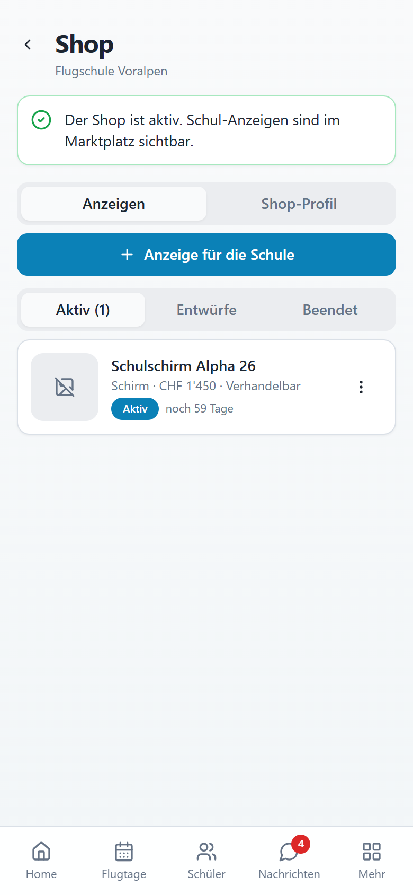

1. Öffne in der Schulansicht **Shop** und prüfe die ausgewählte Schule.
2. Lies, ob der Shop bereits aktiv und bereit für Veröffentlichungen ist.
3. Wähle **Anzeigen** für aktive Inserate, Entwürfe und beendete Anzeigen.
4. Über **Anzeige für die Schule** erstellst du eine Schul-Anzeige. Kontrolliere im Formular **Verkaufen als**, damit sie nicht versehentlich als Privatanzeige angelegt wird.
5. Falls dir der Shop fehlt, lasse Mitgliedschaft und Funktion durch die zuständige Administration prüfen.
:::

Administratoren, Schulleitung und Personen mit Funktion **Shop** führen die Anzeigen. Nur Administratoren und Schulleitung ändern das Shop-Profil. Weise die Funktion im Bereich **Team** ausdrücklich zu. Eine allgemeine Fluglehrerfunktion oder die Verwaltung eigener Privatanzeigen ersetzt diese Berechtigung nicht.

::: schritte Anbieterangaben pflegen
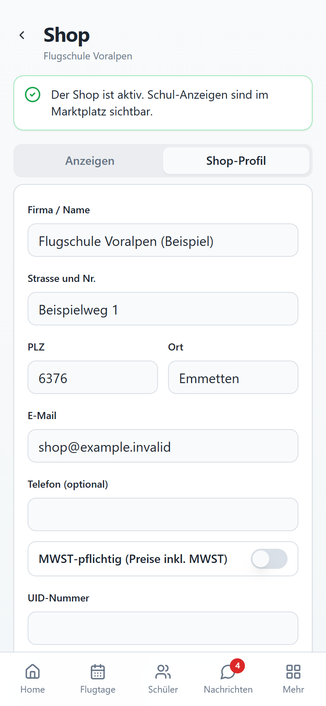

1. Öffne im Shop den Reiter **Shop-Profil**.
2. Erfasse **Firma / Name**, Strasse, PLZ und Ort sowie eine erreichbare E-Mail-Adresse. Telefon ist optional.
3. Kontrolliere, dass diese Angaben zur verkaufenden Schule gehören. Sie erscheinen bei Schulangeboten.
4. Scrolle zu den weiteren Profilfeldern. Speichere erst, wenn die Angaben vollständig geprüft sind.
:::

::: schritte Das Shop-Profil vervollständigen und aktivieren
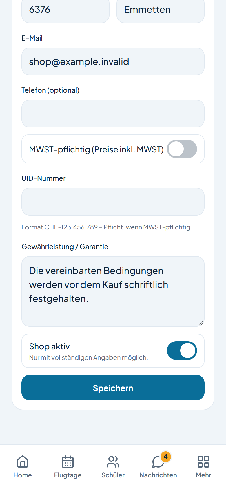

1. Pflege **MWST-pflichtig (Preise inkl. MWST)** entsprechend den Angaben eurer Administration.
2. Bei aktivierter MWST-Pflicht verlangt die App eine UID im Format **CHE-123.456.789**.
3. Trage eure Angaben unter **Gewährleistung / Garantie** ein. Der Formularvorschlag ist keine individuell geprüfte Regelung für euren Betrieb.
4. Aktiviere **Shop aktiv** und wähle **Speichern**. Fehlende oder ungültige Angaben werden angezeigt.
5. Kehre zu **Anzeigen** zurück und kontrolliere die Bereitschaftsmeldung. Vorbereiten von Entwürfen ist auch bei noch nicht aktivem Shop möglich; Veröffentlichen erst danach.
:::

::: schritte Sichtbarkeit und Stückzahl eines Schulangebots festlegen
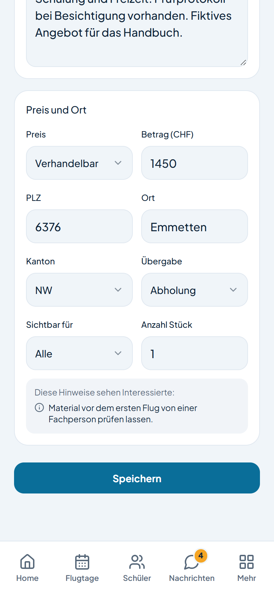

1. Prüfe die verkaufende Schule und erfasse Fotos, Kategorie, Zustand und die fachlichen Merkmale.
2. Lege Preis in CHF, Ort und Übergabe fest.
3. Wähle unter **Sichtbar für** entweder **Alle** oder **Nur unsere Schüler**. Diese Einschränkung gehört zur Schul-Anzeige; Privatangebote sind allgemein sichtbar.
4. Kontrolliere **Anzahl Stück** bei mehreren verfügbaren Exemplaren. Stimme Text, Zustand und Menge aufeinander ab.
5. Speichere beziehungsweise veröffentliche und prüfe die Detailansicht samt Anbieterangaben. Für ein Verkaufsangebot ist mindestens ein Foto erforderlich; die Handbuch-Beispiele zeigen teilweise Platzhalter ohne Produktfoto.
:::

Schulen können bis zu 50 aktive Anzeigen führen. Schul-Neuware läuft nicht automatisch ab; andere Anzeigen haben grundsätzlich 60 Tage Laufzeit und können verlängert werden. **Hochschieben** ist nur einmal innerhalb von sieben Tagen möglich. Prüfe Preise und Verfügbarkeit auch bei dauerhaft laufender Neuware regelmässig.

Inseratchats sind auf ein konkretes Angebot bezogen und werden vom zuständigen Shop-Team beantwortet. Sie sind vom allgemeinen Schul- und Team-Kanal getrennt. Über **Teilen** können allgemein sichtbare aktive oder reservierte Angebote auch ohne Flyary-Anmeldung angesehen werden; eine auf die Schule beschränkte Anzeige wird dadurch nicht öffentlich.

## 30. Schulmaterial verkaufen und abrechnen

Materialinventar, Marktplatzanzeige und Abrechnung sind verknüpft, haben aber unterschiedliche Aufgaben. Prüfe vor dem Inserieren bestehende Ausleihen und den tatsächlichen Materialzustand. Die folgenden Abläufe beziehen sich auf das konkret ausgewählte Inventarstück beziehungsweise die ausgewählte Anzeige.

::: schritte Ein Inventarstück als Occasion anbieten
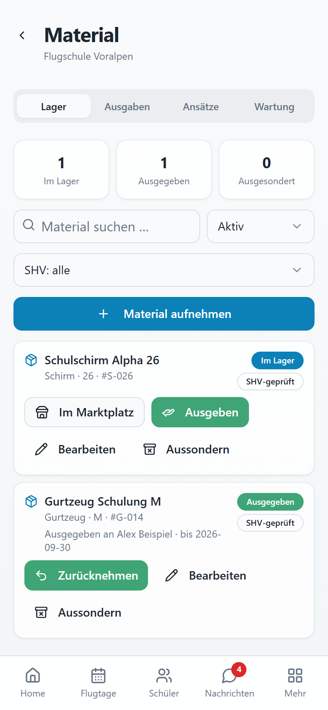

1. Öffne **Material → Lager** und suche den Gegenstand der richtigen Schule.
2. Nutze **Als Occasion verkaufen**, wenn angeboten. Bei bereits verknüpftem Material führt **Im Marktplatz** zur bestehenden Anzeige; lege keine zweite für dasselbe Stück an.
3. Prüfe die übernommenen Angaben: Kategorie, Titel, Grösse, Jahr und allfällige letzte Nachprüfung. Ein aus dem Kaufdatum vorgeschlagenes Jahr muss nicht dem tatsächlichen Baujahr entsprechen.
4. Ergänze Zustand, Preis, Beschreibung und Fotos. Prüfe die verknüpfte Schule und veröffentliche erst nach vollständiger Kontrolle.
:::

Wird eine mit Inventar verknüpfte Anzeige tatsächlich auf **Verkauft** gesetzt, wird das Material automatisch als ausgemustert mit dem Grund **Verkauft (Marktplatz)** geführt. Eine Reservierung oder ein Entwurf ist noch kein Verkauf. Kontrolliere nach dem Abschluss das Inventar und allfällige offene Ausleihen.

::: schritte Eine Schul-Anzeige abschliessen
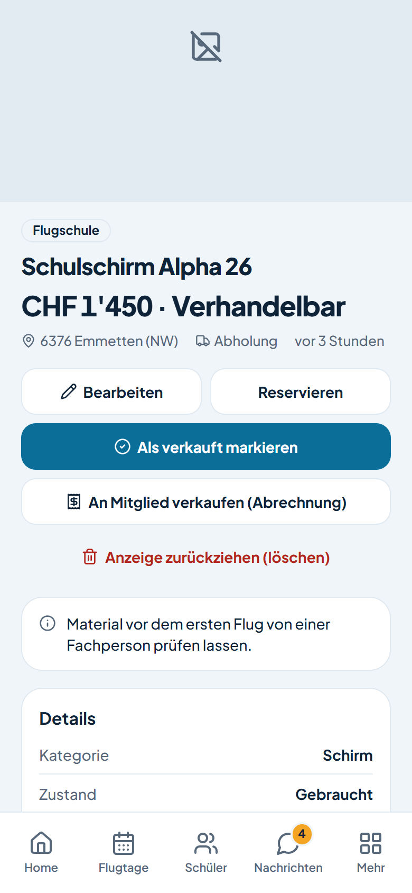

1. Öffne die Schul-Anzeige und kontrolliere Titel, Preis, Bestand und Anbieter.
2. **Reservieren** beziehungsweise **Reservierung aufheben** steuert den Status während der Absprache.
3. **Als verkauft markieren** hält den Abschluss fest. Wähle bei Bedarf die kaufende Person aus dem Inseratchat, damit eine gegenseitige Bewertung möglich wird.
4. Für einen Verkauf an ein Schulmitglied mit Abrechnung verwende stattdessen **An Mitglied verkaufen (Abrechnung)**. Die allgemeine Verkaufsmarkierung legt keinen Abrechnungsposten an.
5. Prüfe danach Status und Restbestand. Bei mehreren Exemplaren reduziert ein Verkaufsabschluss die Menge um ein Stück; erst beim letzten Stück wird die Anzeige beendet.
:::

::: schritte Einen Verkauf auf die Mitgliederabrechnung setzen
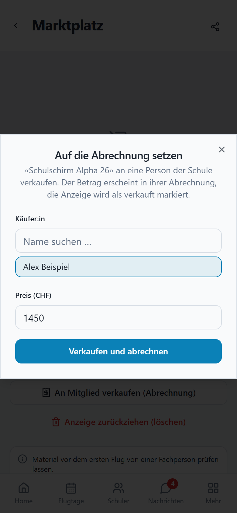

1. Öffne bei einer aktiven oder reservierten Schul-Anzeige **An Mitglied verkaufen (Abrechnung)**.
2. Suche und wähle die richtige Person aus den Mitgliedern dieser Schule.
3. Kontrolliere **Preis (CHF)** und ersetze einen Vorschlag durch den tatsächlich vereinbarten positiven Verkaufspreis.
4. Prüfe Person, Artikel und Betrag, dann wähle **Verkaufen und abrechnen**. Pro Ausführung wird ein Stück verkauft und ein Materialkauf-Posten erstellt.
5. Kontrolliere anschliessend **Abrechnung**, Restbestand beziehungsweise Verkaufsstatus und gegebenenfalls den Inventarstatus. Markiere den Posten erst nach tatsächlichem Zahlungseingang als bezahlt.
:::

Lege für denselben Vorgang keinen zweiten manuellen Materialkauf-Posten an. Bei unklarer Rückmeldung prüfe zuerst Anzeige und Abrechnung, bevor du erneut verkaufst: Bei mehrstückigen Anzeigen kann ein weiterer Aufruf einen weiteren Verkauf erzeugen. Die Abrechnungsaktion ist kein Bank- oder Zahlungsdienst.

### Bewertungen und Moderation

Nach einem Abschluss mit zugeordneter kaufender Person kann eine Bewertung angeboten werden. Sie ist für angemeldete Personen sichtbar und nach Abgabe nicht änderbar. Prüfe Sterne und Kommentar vor dem Absenden. Die Auswahl einer Person aus dem Inseratchat und die Auswahl eines Schulmitglieds für einen Abrechnungsposten sind unterschiedliche Abläufe; kontrolliere die angebotene Bewertungsaktion im konkreten Fall.

Die zusätzliche Funktion **Marktplatz-Moderator** ist eine eigene Zuständigkeit. Berechtigte Personen erreichen über den Marktplatz die **Moderation** und prüfen dort gemeldete Anzeigen. **Ansehen** öffnet das Inserat; **Ausblenden** verlangt eine Begründung, **Wieder freigeben** stellt es wieder her und **Meldung abweisen** schliesst eine unbegründete Meldung. Schul-Moderatoren bearbeiten private Anzeigen; Meldungen zu Schulangeboten gehen an die globale Administration. Sperren und endgültiges Löschen sind weitergehende administrative Aktionen. Eine Shop-Funktion allein macht niemanden zum Moderator.

## 31. Ausbildungsnachweis und persönliches Flugbuch

### Selbst- und Fluglehrerbewertungen vergleichen

Öffne **Schüler → Person → Ausbildung**. Die eigenen Sterne der Person bleiben als Selbsteinschätzung sichtbar. Zusätzlich zeigt **Fluglehrer** den Verlauf der zuletzt erfassten Manöverbewertungen dieser Schule mit Datum (bis zu zehn Bewertungen pro Manöver). Beide Angaben bleiben getrennt; eine Schulbewertung überschreibt keine eigenen Sterne.

In der persönlichen Trainingsansicht sieht der Schüler die neueste freigegebene Fluglehrerbewertung mit Datum. Rückmeldungen zum einzelnen Flug liest er beim vergangenen Termin unter **Feedback**. Ein interner Verlauf im Dossier ist deshalb nicht gleichbedeutend damit, dass alle Angaben bereits für den Schüler sichtbar sind.

### Einen Ausbildungsnachweis ausgeben

1. Öffne in der richtigen Schule **Schüler**, wähle die Person und öffne im Dossier **Nachweis**.
2. Grenze bei Bedarf mit **Von** und **Bis** den Zeitraum ein. Ohne diese Grenzen werden die vorhandenen Schulflüge berücksichtigt.
3. Prüfe **Flüge**, **Fluggebiete**, **Übungshang**, **Höhenflüge** und **Flugtage** sowie die Tagesauflistung mit den zugehörigen Startplätzen. Grundlage sind gelandete Schulflüge; Startabbrüche und noch laufende Flüge zählen nicht.
4. Kontrolliere die Startplätze. Die Anzahl verschiedener erfasster Startplätze bestimmt die Zahl der Fluggebiete; fehlende Startplätze können diese Zahl zu klein ausfallen lassen.
5. Wähle **PDF für den SHV** für die lesbare Ausgabe oder **CSV** für die tabellarische Weiterverarbeitung. Ohne Schulflüge im Zeitraum sind die Exportaktionen deaktiviert.
6. Öffne die Datei und prüfe Person, Schule, Zeitraum und Flugliste. Das PDF enthält ein Feld für Stempel und Unterschrift der Schule; die Ausgabe setzt diese Bestätigung nicht automatisch.

Die Nachweisdaten beginnen mit der Schulflugerfassung im Flugtag-Cockpit am **25. September 2026**. Frühere eigene Einträge stehen im persönlichen Flugbuch. Die Kennzahl **Selbst im Flugbuch erfasst** ist ein separater Vergleichswert aller dieser Schule zugeordneten persönlichen Einträge und folgt derzeit nicht dem Von-/Bis-Filter des Schulnachweises. Addiere sie nicht zu den Schulflügen.

Im Nachweis gelten Grundkursflüge als Übungshang; die übrigen gelandeten Schulflüge werden als Höhenflüge gezählt. Kontrolliere daher auch die Terminart. Der persönliche PDF-Export eines Piloten und der schulische Ausbildungsnachweis verwenden unterschiedliche Datenquellen.

### Ortsnamen und Anzahl Fluggebiete im Nachweis

Der Ausbildungsnachweis verwendet für verknüpfte Plätze den offiziellen Flyary-Namen statt des persönlichen Namens der betrachtenden Person. Mehrere eigene Orte mit derselben offiziellen Platz-ID zählen als ein Fluggebiet. Ohne Katalogverknüpfung bleiben die eigenen Orte getrennt. Prüfe deshalb die Platzzuordnung, wenn der Nachweis unerwartete Namen oder eine unerwartete Anzahl Fluggebiete enthält.

### Schüler bei der Übernahme unterstützen

Nach der Freigabe können Schüler auf **Home**, unter **Flüge** oder im neuen Flugformular **Ins Flugbuch übernehmen** wählen. Ohne passende eigene Einträge erfolgt die Übernahme direkt. Sind bereits Einträge zum Termin oder zur gleichen Schule am gleichen Datum vorhanden, können sie pro Schulflug einen vorhandenen Eintrag verknüpfen oder einen neuen anlegen.

Bitte die Person, die Zuordnung vor **Übernehmen** zu prüfen. Neue Einträge übernehmen Datum, vorhandene Orte und die Schul-/Terminzuordnung; die Dauer entsteht nur bei vorhandener Start- und Landezeit. Vorhandene eigene Angaben und Medien werden beim Verknüpfen nicht überschrieben. Schirm, weitere Werte und Medien kann die Person anschliessend ergänzen.

**Nicht jetzt** blendet die Übernahmekarte für diesen Flugtag dauerhaft aus; derzeit gibt es dafür keine Wiederherstellungsaktion in der Oberfläche. Zum späteren Prüfen sollte die Person die Karte stehen lassen oder den Dialog ohne Übernahme schliessen.

Bearbeiten oder Löschen eines persönlichen Eintrags verändert den Schulflug nicht. Korrekturen des Ausbildungsnachweises erfolgen deshalb an der Schulaufzeichnung. Ebenso ersetzt eine Änderung der Schulaufzeichnung nicht die Kontrolle eines bereits übernommenen persönlichen Eintrags.

### Fehlerhilfe zum Cockpit und Nachweis

| Beobachtung | Prüfung und nächster Schritt |
| --- | --- |
| Reiter Flugtag fehlt | Schulfunktion und Einteilung im konkreten Termin prüfen. |
| Start nicht möglich | Bestätigten Platz, Tagesabschluss und einen bereits laufenden Flug der Person prüfen. |
| Tag lässt sich nicht abschliessen | Noch als in der Luft geführte Flüge mit dem tatsächlichen Ablauf abgleichen. |
| Flugzeit fehlt | Prüfen, ob Start und Landung erfasst wurden; ein nachträglich gezählter Flug hat nicht automatisch eine Startzeit. |
| Zu wenige Fluggebiete | Fehlende oder falsch zugeordnete Startplätze der Schulflüge prüfen. |
| PDF konnte nicht erstellt werden | Verbindung, Schulzugang und Zeitraum prüfen; bleibt der Fehler, die Administration auf den fehlgeschlagenen PDF-Export hinweisen. CSV bleibt ein eigener Exportweg. |
| Nach Wiederöffnen sind Posten noch vorhanden | Das ist vorgesehen. Buchungen gesondert prüfen; Wiederöffnen storniert sie nicht. |
